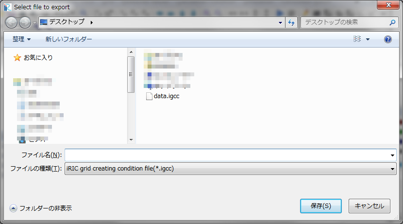

.. _sec_file_export_gridcreatingcond:

格子生成条件 (I)
=====================

格子生成条件をエクスポートします。

格子生成条件は、以下のファイルフォーマットにエクスポートできます。

* iRIC 格子生成条件ファイル (\*.igcc)

エクスポートするファイル名を指定するダイアログ
(:numref:`image_select_file_to_export_dialog_for_gridcreatingcond` 参照)
が表示されますので、エクスポートするファイルを指定して「保存」ボタンを押します。
すると、指定したファイルに格子生成条件がエクスポートされます。

.. _image_select_file_to_export_dialog_for_gridcreatingcond:

   エクスポートするファイル名の選択ダイアログ
