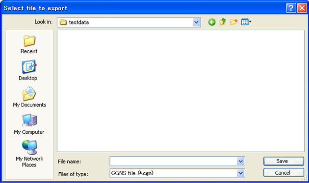

.. _sec_file_export_calc_cond:

[Calculation Conditions] (C)
==============================

**Description**: Exports the calculation conditions.

Calculation condition can be exported to the file formats below:

* CGNS file (\*.cgn)
* YAML file (\*.yml)

When you select [Calculation Conditions], the [Select file to export]
dialog
(:numref:`image_select_file_to_export_dialog_for_calccond`) will open.
Input the file name you want to export and click on [Save].

.. _image_select_file_to_export_dialog_for_calccond:

   The [Select file to export] dialog
