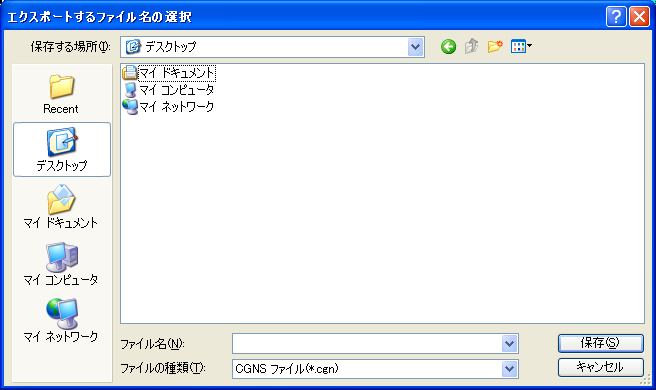

.. _sec_file_export_calc_cond:

計算条件 (C)
============

計算条件をエクスポートします。

計算条件は、以下のファイルフォーマットにエクスポートできます。

* CGNSファイル (\*.cgns)
* YAMLファイル (\*.yml)

エクスポートするファイル名を指定するダイアログ
(:numref:`image_select_file_to_export_dialog_for_calccond` 参照)
が表示されますので、エクスポートするファイルを指定して「保存」ボタンを押します。
すると、指定したファイルに計算条件がエクスポートされます。

エクスポート先の形式としては以下が選択できます。

.. _image_select_file_to_export_dialog_for_calccond:

   エクスポートするファイル名の選択ダイアログ
