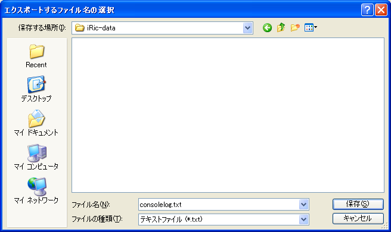

.. _sec_file_export_solver_console_log:

[Solver Console Log]
======================

**Description**: Exports the solver console log.

Solver console log can be exported to the file formats below:

* Text file (\*.txt)

When you select [Solver Console Log], the [Select file to export] dialog
(:numref:`image_select_file_to_export_dialog_for_console_log`) will open.
Input the file name you want to export and click on [Save].

.. _image_select_file_to_export_dialog_for_console_log:

   The [Select file to export] dialog
