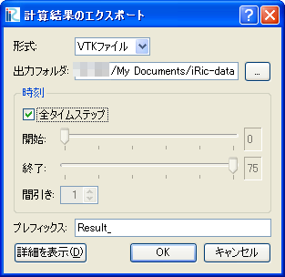
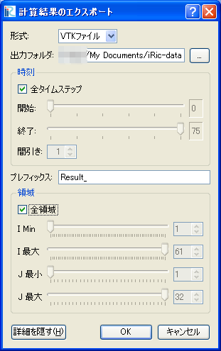

.. _sec_file_export_calc_result:

[Calculation Result] (R)
==========================

**Description**: Exports the calculation result.

Calculation result can be exported to the file formats below:

* VTK files (ASCII) (*.vtk)
* VTK files (Binary) (*.vtk)
* CSV files (*.csv)
* Topography Files (*.tpo)
* ESRI Shape files (*.shp)

When you select [Calculation Result], the [Export Calcutation Result]
dialog (:numref:`image_export_calc_result_dialog`) will open.
Edit the setting and click on [OK] to start exporting.
File names of exported files will be "(Prefix) +
(Number) + (".vtk" or ".csv")".

When you want to export partial data, remove the check on [All
timesteps] and specify the range of timesteps by editing [Start] and
[End], and [Skip rate].

When you want to export partial region of the data, click [Show Detail],
remove the check on [Full region], and specify the range to export
(:numref:`image_export_calc_result_dialog_detail`).

.. _image_export_calc_result_dialog:

   The [Export Calculation Result] dialog

.. _image_export_calc_result_dialog_detail:

   The [Export Calculation Result] dialog after clicking [Show Detail]
