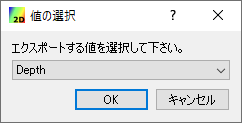
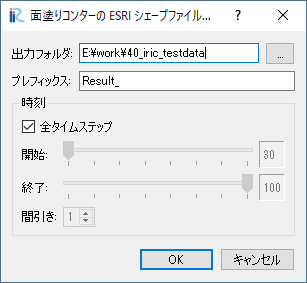

.. _sec_file_export_contourshape:

面塗りコンターをESRIシェープファイルへ (C)
==========================================

二次元可視化ウィンドウで描画した面塗りコンターを、ポリゴンとして
ESRIシェープファイルにエクスポートします。

この機能を利用するには、以下の条件を先に整える必要があります。

* 二次元可視化ウィンドウを開き、アクティブにします。
* 二次元可視化ウィンドウ上で、スカラー (格子点) を描画します。
* :doc:`スカラー (格子点) のプロパティ設定 </02/04_color_function>` で、表示設定を「グラデーションモード」ではなく、「区間別モード」にします。

これらの条件を整えた上でメニューから「面塗りコンターをESRIシェープファイルへ」
を起動すると、:numref:`image_export_contourshape_selectvalue`
に示すダイアログが表示されます。

.. _image_export_contourshape_selectvalue:

   物理量の選択ダイアログ

面塗りコンターをエクスポートしたい物理量を選択して「OK」ボタンをします。
すると、 :numref:`image_export_contourshape_setting` に示す
ダイアログが表示されます。

.. note::
   「区間別モード」のスカラー (格子点)が1つだけ描画されている場合、
   :numref:`image_export_contourshape_selectvalue` に示すダイアログは表示されず
   自動的に描画されているスカラー (格子点)がエクスポート対象となります。

.. _image_export_contourshape_setting:

   面塗りコンターのESRIシェープファイルへのエクスポートダイアログ

「OK」ボタンを押すと、設定に従って各タイムステップごとに面塗りコンター
が ESRIシェープファイルに保存されます。
