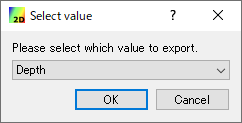
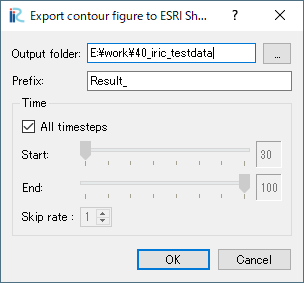

.. _sec_file_export_contourshape:

[Contour figure as ESRI Shape files] (C)
============================================

Exports Contour figures drawn on [2D Post-processing Window] to
ESRI Shape files as polygons.

To use this function, you have to satisfy the following
requirements first:

* Open and activate a [2D Post-processing Window]
* Draw [Scalar (node)] for a calculation result value
* Setup property for [Scalar (node)] to make [Display Setting] to
  [Contour Figure], not [Color Fringe] or [Isolines].

After satisfying the requirments, launch
[Contour figure as ESRI Shape files] menu, and 
dialog in :numref:`image_export_contourshape_selectvalue`
will be shown.

.. _image_export_contourshape_selectvalue:

   [Select Result] dialog

Select the calculation result value that you want to export, 
and click on [OK].
Then, dialog in :numref:`image_export_contourshape_setting`
is shown.

.. _image_export_contourshape_setting:

   [Export contour figure to ESRI Shape files] dialog

When you click on [OK], Contour Figure polygons are saved
into ESRI shape files based on the setting.
