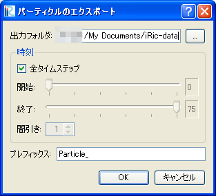

パーティクル (P)
=================

パーティクルをエクスポートします。

パーティクルは、以下のファイルフォーマットにエクスポートできます。

* VTK ファイル (\*.vtk)

パーティクルのエクスポートは、
可視化ウィンドウがアクティブな時にのみ実行できます。

パーティクルのエクスポートダイアログ
(:numref:`image_export_particles_dialog`) が表示されます。
「OK」ボタンを押すと、
出力フォルダにエクスポートファイルが保存されます。ファイル名は、
「(プレフィックス) + (連番の番号) + ".vtk"」となります。

一部のタイムステップのデータのみをエクスポートする時は、
「全タイムステップ」チェックボックスのチェックを外し、
エクスポートする範囲の開始時間、終了時間及び間引きの間隔を設定します。

.. _image_export_particles_dialog:

   パーティクルのエクスポートダイアログ
