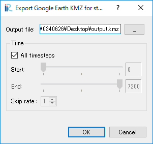

.. _sec_file_export_kml_streetview:

ストリートビュー用 Google Earth KML (G)
=========================================

ストリートビューで、iRIC で計算した水深を表示できる Google Earth 用 KMLファイルを出力します。

ストリートビュー用 Google Earth KML をエクスポートするには、先に以下の条件を整えておく
必要があります。

* 二次元可視化ウィンドウを開き、アクティブにする
* スカラー量として、 Depth について面塗りコンターを描画する
* 面塗りコンターを描画する値の範囲について、「自動」のチェックボックスを外しておく

上記の条件を整えた iRIC の表示例を
:numref:`image_export_streetview_kml_vis2d` に示します。

条件を整えた上でメニューを選択すると、
:numref:`image_export_streetview_kml_dialog`
に示すダイアログが表示されます。
ここで、出力するファイル名と、KMLファイルに計算結果を出力するタイムステップを
選択して「OK」ボタンを押すと、 KML ファイルが出力されます。

.. _image_export_streetview_kml_vis2d:

.. figure:: images/export_streetview_kml_vis2d.png
   :width: 400pt

   水深について面塗りコンターを描画した二次元可視化ウィンドウ

.. _image_export_streetview_kml_dialog:

   ストリートビュー用 Google Earth KML のエクスポートダイアログ

:numref:`image_export_vis_streetview_kml_googleearth1`
に、出力した KML を読み込んだ時の Google Earth の表示例を示します。
ポリゴンが表示されている領域内のストリートビューを表示すると、
:numref:`image_export_vis_streetview_kml_googleearth2`
に示すように、どのあたりまでが水に浸かるのかが分かるように、
ポリゴンが表示されます。

.. _image_export_vis_streetview_kml_googleearth1:

.. figure:: images/export_vis_streetview_kml_googleearth1.png
   :width: 400pt

   Google Earth に KML ファイルを読み込んだ例

.. _image_export_vis_streetview_kml_googleearth2:

   Google Earth に KML ファイルを読み込んでストリートビューを表示した例
