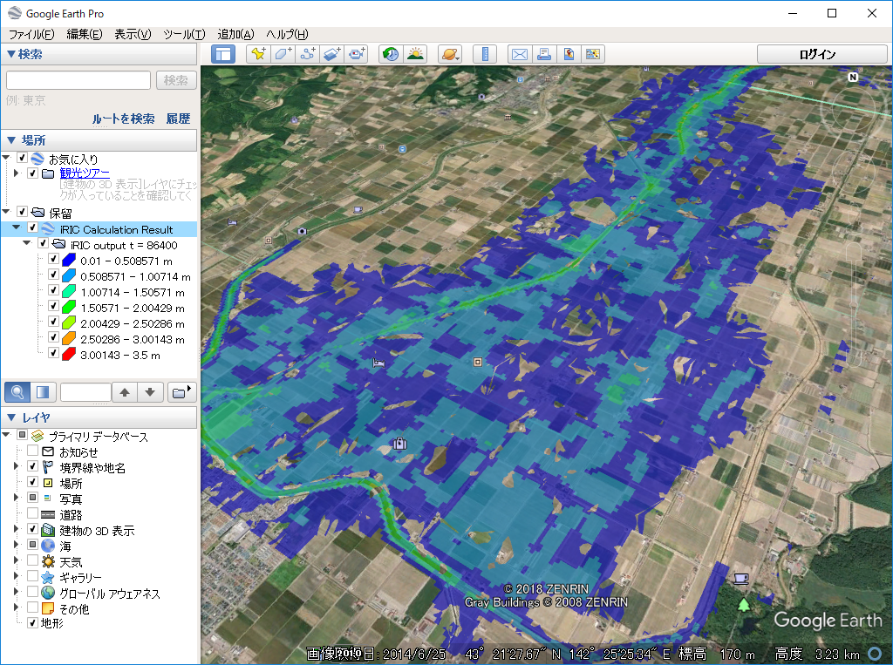

.. _sec_file_export_kmz_streetview:

[Google Earth KMZ for street view] (G)
=========================================

**Description:** Export Google Earth KMZ file with which we can visualize
the water Depth on street view.

To use this function, you have to satisfy the following requirements first:

* Open and activate a [2D Post-processing Window]
* Draw [Scalar (node)] for calculation result value [Depth].
* Setup property for [Scalar (node)] to make [Display Setting] to [Contour Figure],
  not [Color Fringe] or [Isolines], and check off [Automatic] Check box in
  [Value range] group box.

:numref:`image_export_streetview_kml_vis2d` shows an example of iRIC GUI
after satisfying the requirements.

When you launch [Google Earth KMZ for street view] menu,
the dialog in :numref:`image_export_streetview_kml_dialog` is shown.
Please specify the name of file, and select the timesteps
you want to export, and click on [OK]. Then, the KMZ file is exported.

.. _image_export_streetview_kml_vis2d:

   [2D Post-processing window] with [Contour Figure] for depth

.. _image_export_streetview_kml_dialog:

.. figure:: images/export_streetview_kml_dialog.png
   :width: 200pt

   [Google Earth KMZ for street view export] dialog

:numref:`image_export_vis_streetview_kml_googleearth1`
shows an example of Google Earth after loading the exported KMZ.
When you show street view for regions where polygons for depth values exist,
the polygons are shown in the street view so that we can easily see that
the depth, like in :numref:`image_export_vis_streetview_kml_googleearth2`.

.. _image_export_vis_streetview_kml_googleearth1:

   Example of [Google Earth] after loading a KMZ file

.. _image_export_vis_streetview_kml_googleearth2:

.. figure:: images/export_vis_streetview_kml_googleearth2.png
   :width: 400pt

   Example of [Google Earth] showing street view after loading a KMZ file
