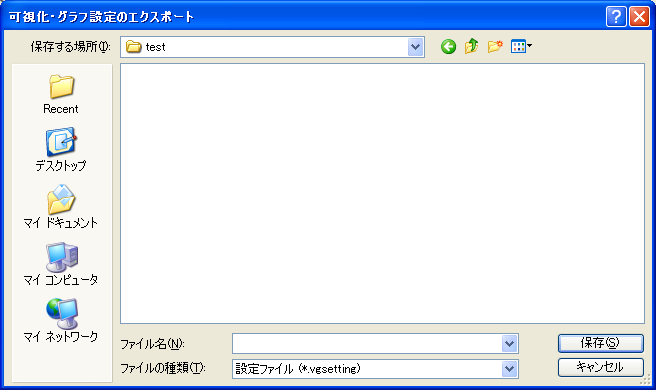

.. _sec_file_export_vis_setting:

可視化・グラフ設定
==================

可視化ウィンドウ・グラフウィンドウの設定をエクスポートします。

可視化ウィンドウ・グラフウィンドウの設定は、以下のファイルフォーマットにエクスポートできます。

* 設定ファイル (\*.vgsetting)

エクスポートするファイル名を指定するダイアログ
(:numref:`image_export_vis_setting_dialog` 参照) が表示されますので、
エクスポートするファイルを指定して「保存」ボタンを押します。
すると、指定したファイルに現在表示されている
可視化ウィンドウ、グラフウィンドウの設定がエクスポートされます。

.. _image_export_vis_setting_dialog:

   エクスポートするファイル名の選択ダイアログ
