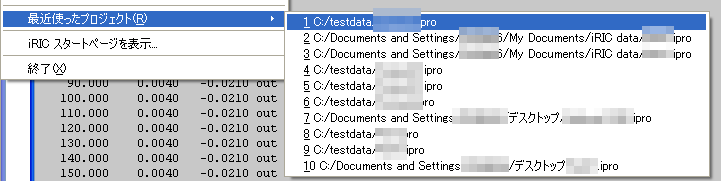

最近使ったプロジェクト (R)
==========================

最近使ったプロジェクトを開きます。

メニューを選択すると、最近使ったプロジェクトの名前のリストが、
:numref:`image_recent_projects_menu`
に示したように表示されます。
ここで開きたいプロジェクトファイル名を選択すると、そのファイルが開きます。

.. _image_recent_projects_menu:

   最近使ったプロジェクトの表示例
