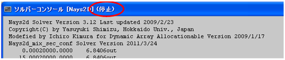

.. _sec_simulation:

計算 (S)
==========

計算メニューに含まれる機能について説明します。

実行 (R)
---------

ソルバーの計算の実行を開始します。

実行開始前には、プロジェクトをファイルに保存するよう促すダイアログが表示されます。
また、既に一度計算を実行している場合、過去に行った計算の結果を削除してよいか、
ダイアログによって確認されます。

計算の実行が開始されると、ソルバーコンソールが表示され、
ソルバーが標準出力、標準エラーに出力したメッセージがソルバーコンソールに
リアルタイムで表示されます。ソルバーコンソールの表示例を
:numref:`image_solver_console_window_sim` に示します。

.. _image_solver_console_window_sim:

.. figure:: images/solver_console_window_sim.png
   :width: 380pt

   ソルバーコンソール

停止 (S)
-----------

実行中のソルバーを停止します。

ソルバーの停止を本当に実行するか確認するダイアログ
(:numref:`image_confirm_solver_term_dialog`) が表示されますので、
「はい(Y)」ボタンを押します。するとソルバーの実行が停止されます。
ソルバーが停止されたことは、ソルバーコンソールのタイトルで確認できます。
ソルバーコンソールのタイトルの表示例を
:numref:`image_solver_console_title` に示します。

.. _image_confirm_solver_term_dialog:

   ソルバーの中止の確認ダイアログ

.. _image_solver_console_title:

   ソルバーコンソールのタイトル

ソルバー情報 (S)
-----------------

現在のプロジェクトで利用しているソルバーの情報を表示します。

ソルバー情報ダイアログの表示例を :numref:`image_solver_info_dialog`
に示します。

.. _image_solver_info_dialog:

.. figure:: images/solver_info_dialog.png
   :width: 300pt

   ソルバー情報ダイアログ

ソルバーログのエクスポート (E)
-----------------------------------

ソルバーが出力したログを、外部ファイルにエクスポートします。

この機能は、ファイルメニューの下のエクスポートメニューの下
のソルバーコンソールと同じです。
:ref:`sec_file_export_solver_console_log` を参照してください。
