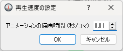

アニメーション (A)
==================

アニメーションメニューに含まれる機能について説明します。

アニメーションメニューは、可視化ウィンドウ、グラフウィンドウが
アクティブな時のみ表示されます。

開始/停止 (S)
----------------

現在表示しているタイムステップから順に次のタイムステップに進んでいきます。

進んでいる間は、ボタンが押されて表示されます。
再生を停止するには、もう一度ボタンを押します。

常に最後のステップを表示 (F)
-----------------------------

このボタンがチェックされている時は、ソルバーの計算の実行中に
新しい計算結果が出力されるたびに、自動的に最後のタイムステップに移動します。

先頭へ (R)
------------

先頭のタイムステップに移動します。

一つ前へ (B)
--------------------

一つ前のタイムステップに移動します。

一つ次へ (F)
-------------------

一つ次のタイムステップに移動します。

最後のステップへ (L)
----------------------------

最後のタイムステップに移動します。

再生速度を設定 (A)
-------------------

「開始」を実行する時の速度を設定します。

アニメーション速度設定ダイアログ (:numref:`animation_speed_dialog` 参照)
が表示されますので、タイムステップ間の描画間隔を設定して「OK」ボタンを押します。

.. _animation_speed_dialog:

   アニメーション速度ダイアログ
