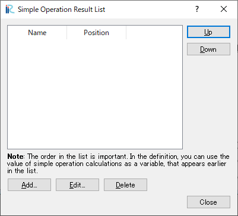

計算結果 (R)
==============

計算結果メニューに含まれる機能について説明します。

新しい 可視化ウィンドウ (2D) を開く
-----------------------------------

新しい可視化ウィンドウ (2D) を開きます。

可視化ウィンドウ (2D) に関しては :ref:`sec_2d_vis_func` を参照
してください。

新しい鳥瞰図可視化ウィンドウ (2D) を開く
----------------------------------------

新しい鳥瞰図可視化ウィンドウ (2D) を開きます。

鳥瞰図可視化ウィンドウ (2D) に関しては :ref:`sec_2dbirdeye_vis_func`
を参照してください。

新しい可視化ウィンドウ (3D) を開く
-----------------------------------

新しい可視化ウィンドウ (3D) を開きます。

可視化ウィンドウ (3D) については :ref:`sec_3d_vis_func` を参照してください。

新しいグラフウィンドウを開く
-----------------------------

新しいグラフウィンドウを開きます。

グラフウィンドウについては :ref:`sec_graph_window` を参照してください。

新しい散布図ウィンドウを開く
----------------------------

新しい散布図ウィンドウを開きます。

散布図ウィンドウについては :ref:`sec_scattered_chart_window_detail`
を参照してください。

実測値と比較
---------------

実測値と比較するダイアログを開きます。

実測値と比較については :ref:`sec_compare_with_measured_data_window` を
参照してください。

再読み込み (R)
------------------

計算結果の再読み込みを行います。

再読み込みを行った結果が、ソルバーが出力した新しい計算結果が見つかると、
アニメーションツールバーの計算結果リストが更新されます。

削除 (D)
----------

計算結果を削除します。

本当に計算結果を削除するか確認するダイアログが表示されますので、
「はい」ボタンを押します。

.. _sec_manage_simple_operation_results:

簡易演算結果の管理 (M)
------------------------------

簡易演算結果を管理します。

簡易演算結果は、計算結果同士の簡単な演算によって得られる値です。

:numref:`image_simple_operation_result_list` に示すダイアログが表示され、
ここから簡易演算結果を管理できます。

.. _image_simple_operation_result_list:

   簡易演算結果一覧 ダイアログ

.. note: 簡易演算結果一覧での順序

   ダイアログ上にも表示されているように、簡易演算結果一覧上での順序は重要です。
   ダイアログで下に表示されている簡易演算結果では、計算結果だけでなく、
   リスト上でそれより上にある簡易演算結果の値も入力として使用することができます。

簡易演算結果の追加と編集
~~~~~~~~~~~~~~~~~~~~~~~~~~

「簡易演算結果の一覧」ダイアログ上で「追加 (A)」もしくは「編集 (E)」ボタンを
押すと、 :numref:`image_simple_operation_result_edit` に示すダイアログが
表示され、簡易演算結果を追加もしくは編集できます。

「名前」には、新しく作成する簡易演算結果の名前を入力します。

「入力として使う計算結果」は、その下の「追加 (A)」「削除 (D)」ボタンにより
追加・削除できます。「入力として使う計算結果」での設定項目の詳細を
:numref:`table_results_for_input` に示します。

「変数の定義」には、簡易演算結果を計算するための処理内容を記述します。
処理内容は、 JavaScript 言語で定義できます。例は
:ref:`sec_simple_operation_result_example` を参照してください。
「入力として使う計算結果」の「変数名」で定義した変数名を入力として
定義してください。

「テスト」ボタンを押すと、「変数の定義」の内容と、「入力として使う計算結果」
の「テスト用の値」によって簡易演算結果の値の計算が行われ、結果が表示されます。
もし「変数の定義」の内容に問題があれば、エラーメッセージが表示されます。

.. _image_simple_operation_result_edit:

   簡易演算結果の編集 ダイアログ

.. list-table:: 入力として使う計算結果 詳細
   :name: table_results_for_input
   :header-rows: 1

   * - 項目名
     - 説明

   * - 計算結果名
     - 入力とする計算結果の名前。コンボボックスから選択する

   * - 変数名
     - 下の「変数の定義」でこの計算結果を参照する時に使用する変数の名前

   * - テスト用の値
     - 下の「テスト」ボタンを押した時、簡易演算結果の値の計算時にこの変数に代入される値

.. _sec_simple_operation_result_example:

簡易演算結果の定義例
~~~~~~~~~~~~~~~~~~~~~~

ここでは、簡易演算結果の定義の例を示します。

簡易演算の結果は、以下のような機能を組み合わせて定義することができます。

* 単純な四則演算 (:numref:`simple_operation_result_operator`)
* JavaScript の組み込み関数 (:numref:`simple_operation_result_js_func`)
* if文、while文などの制御構文 (:numref:`simple_operation_result_js_if_while`)
* 独自に定義した関数 (:numref:`simple_operation_result_my_func`)

JavaScript言語の仕様についての説明は 以下のページなどを参照してください。

https://developer.mozilla.org/ja/docs/Web/JavaScript

.. code-block:: JavaScript
   :name: simple_operation_result_operator
   :caption: 簡易演算結果の定義例 (単純な四則演算)

   return D * D;

.. code-block:: JavaScript
   :name: simple_operation_result_js_func
   :caption: 簡易演算結果の定義例 (組み込み関数)

   return Math.sqrt(D);

.. code-block:: JavaScript
   :name: simple_operation_result_js_if_while
   :caption: 簡易演算結果の定義例 (制御構文)

   var d2 = D;
   while (d2 < 1000) {
     d2 = d2 * 2;
   }
   if (d2 > 1500) {
     d2 = 1500;
   }

   return d2;

.. code-block:: JavaScript
   :name: simple_operation_result_my_func
   :caption: 簡易演算結果の定義例 (独自に定義した関数)

   function f1(d) {
     return d * d;
   }

   function f2(d, e) {
     if (d < e) {
       return e;
     } else {
       return d;
     }
   }

   return f1(D) * f2(D, E);

インポート (I)
----------------

計算結果をインポートします。

この機能は、ファイルメニューの下のインポートメニューのに含まれる「計算結果」
と同じです。:ref:`sec_file_import_calc_result` を参照してください。

エクスポート (E)
------------------

計算結果をエクスポートします。

この機能は、ファイルメニューの下のエクスポートメニューに含まれる「計算結果」
と同じです。:ref:`sec_file_export_calc_result` を参照してください。

可視化・グラフ設定のインポート
----------------------------------------

可視化ウィンドウ・グラフウィンドウの設定をインポートします。

この機能は、ファイルメニューの下のインポートメニューに含まれる
「可視化・グラフ設定」と同じです。
:ref:`sec_file_import_vis_setting` を参照してください。

可視化・グラフ設定のエクスポート
---------------------------------------

可視化ウィンドウ・グラフウィンドウの設定をエクスポートします。

この機能は、ファイルメニューの下のエクスポートメニューに含まれる
「可視化・グラフ設定」と同じです。
:ref:`sec_file_export_vis_setting` を参照してください。
