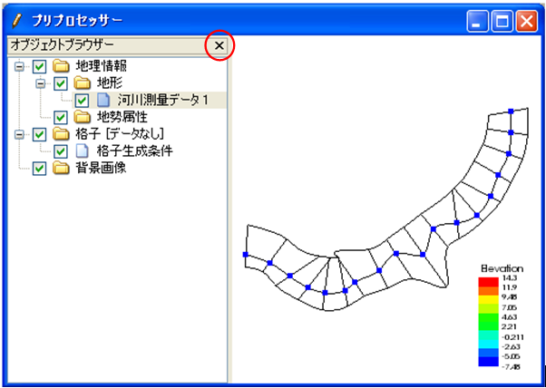
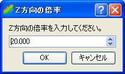
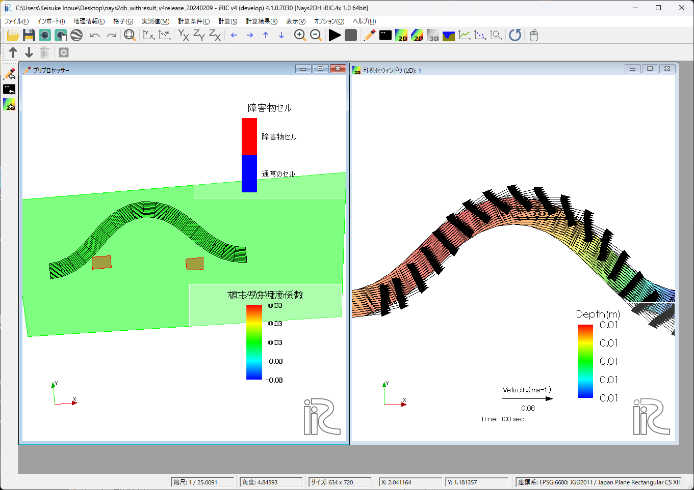

表示 (V)
==========

表示メニューに含まれる機能について説明します。

ツールバー (T)
--------------

ツールバーの表示・非表示を切り替えます。

ツールバーが表示されている時は、メニューの横にチェックが付いています。

オブジェクトブラウザー (O)
---------------------------

現在アクティブなウィンドウでのオブジェクトブラウザーの表示・非表示を切り替えます。

オブジェクトブラウザーが表示されている時は、メニューの横にチェックが付いています。

なお、表示されているオブジェクトブラウザーを非表示にする操作は、
オブジェクトブラウザーのラベルにある×ボタン
(:numref:`image_object_browser_of_pre_window`) でも行えます。

.. _image_object_browser_of_pre_window:

   プリプロセッサーでのオブジェクトブラウザー表示例

属性ブラウザー
----------------

現在アクティブなウィンドウで属性ブラウザーの表示・非表示を切り替えます。

属性ブラウザーが表示されている時は、メニューの横にチェックが付いています。

なお、表示されている属性ブラウザーを非表示にする操作は、
属性ブラウザーのラベルにある×ボタン
(:numref:`image_att_browser_of_pre_window` 参照) でも行えます。

.. _image_att_browser_of_pre_window:

   プリプロセッサーでの属性ブラウザー表示例

ステータスバー (S)
---------------------

ステータスバーの表示・非表示を切り替えます。

ステータスバーが表示されている時は、メニューの横にチェックが付いています。

起動時には、ステータスバーは表示されています。ステータスバーを非表示にした時のiRIC
の表示例を :numref:`image_iric_without_status_bar` に示します。

.. _image_iric_without_status_bar:

.. figure:: images/iric_without_status_bar.png
   :width: 380pt

   iRIC 表示例

.. _sec_view_background_color:

背景色 (B)
------------

現在アクティブなウィンドウの描画領域の背景色を変更します。

色を選択するダイアログ (:numref:`image_background_color_dialog` 参照)
が表示されますので、設定したい背景色を選んで「OK」ボタンを押します。

.. _image_background_color_dialog:

.. figure:: images/background_color_dialog.png
   :width: 300pt

   背景色設定ダイアログ

.. _sec_view_z_scale:

Z方向の倍率 (Z)
----------------

Z方向の表示の倍率を変更します。

この機能は、鳥瞰図ウィンドウ、鳥瞰図可視化ウィンドウ(2D)、可視化ウィンドウ
(3D)のみで利用できます。

:numref:`image_z-dir_scale_dialog`
に示すダイアログが表示されますので、値を入力して「OK」ボタンを押します。

鳥瞰図ウィンドウでの操作例を
:numref:`image_example_zdir_scale_birdseye` に示します。

.. _image_z-dir_scale_dialog:

   Z方向の倍率ダイアログ

.. _image_example_zdir_scale_birdseye:

   Z方向の倍率 操作例

投影法の変更 (P)
----------------

投影法を、平行投影と透視投影の間で切り替えます。

この機能は、鳥瞰図ウィンドウ、鳥瞰図可視化ウィンドウ(2D)、可視化ウィンドウ
(3D)のみで利用できます。

並行投影では、近くにあるものも遠くにあるものも同じ大きさで表示されます。
透視投影では、近くにあるものは遠くにあるものより大きく表示されます。

ウィンドウの整列 (A)
-----------------------------

現在表示されているウィンドウを整列します。

ウィンドウの整列ダイアログの表示例を
:numref:`image_align_windows_dialog` に、整列後の表示例を :numref:`image_align_windows_example` に示します。

設定項目について以下に説明します。

整列方法
    ウィンドウの整列方法を指定します。

条件
    整列方法で「格子状」を選択した時のみ有効です。格子状に整列する時の列の数もしくは行の数を指定します。

全体のサイズ
    複数のウィンドウを整列した後の全体のサイズを指定します。

    この機能でウィンドウを整列した後で :ref:`sec_continuous_snapshot` でスナップショットを保存すると、
    ここで指定したサイズの画像・動画が出力されます。

ウィンドウ間の余白
    ウィンドウを整列する時に、各ウィンドウのスナップショット保存対象領域同士の余白を指定します。

    デフォルト値は、ちょうどウィンドウの枠同士が重ならない程度の値に設定されています。

オブジェクトブラウザを隠す
    チェックすると、オブジェクトブラウザを非表示にします。

    :ref:`sec_continuous_snapshot` でスナップショットを保存したい場合などはオブジェクトブラウザを隠して整列すると便利です。

.. _image_align_windows_dialog:

   ウィンドウの整列ダイアログ

.. _image_align_windows_example:

   ウィンドウ整列後の表示例

カメラ設定のコピー (C)
-----------------------------

現在アクティブなウィンドウでのカメラ設定を他の画面にコピーします。

カメラ設定のコピーダイアログの表示例を
:numref:`image_copy_camera_dialog` に、整列後の表示例を :numref:`image_copy_camera_example` に示します。

.. _image_copy_camera_dialog:

   カメラ設定のコピーダイアログ

.. _image_copy_camera_example:

   カメラ設定のコピー後の表示例

