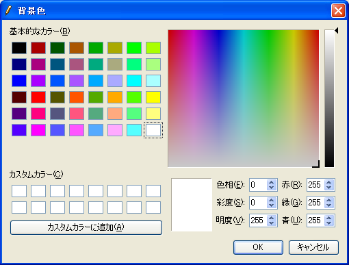

表示 (V)
==========

表示メニューに含まれる機能について説明します。

ツールバー (T)
--------------

ツールバーの表示・非表示を切り替えます。

ツールバーが表示されている時は、メニューの横にチェックが付いています。

オブジェクトブラウザー (O)
---------------------------

現在アクティブなウィンドウでのオブジェクトブラウザーの表示・非表示を切り替えます。

オブジェクトブラウザーが表示されている時は、メニューの横にチェックが付いています。

なお、表示されているオブジェクトブラウザーを非表示にする操作は、
オブジェクトブラウザーのラベルにある×ボタン
(:numref:`image_object_browser_of_pre_window`) でも行えます。

.. _image_object_browser_of_pre_window:

.. figure:: images/object_browser_of_pre_window.png

   プリプロセッサーでのオブジェクトブラウザー表示例

属性ブラウザー
----------------

現在アクティブなウィンドウで属性ブラウザーの表示・非表示を切り替えます。

属性ブラウザーが表示されている時は、メニューの横にチェックが付いています。

なお、表示されている属性ブラウザーを非表示にする操作は、
属性ブラウザーのラベルにある×ボタン
(:numref:`image_att_browser_of_pre_window` 参照) でも行えます。

.. _image_att_browser_of_pre_window:

.. figure:: images/att_browser_of_pre_window.png

   プリプロセッサーでの属性ブラウザー表示例

ステータスバー (S)
---------------------

ステータスバーの表示・非表示を切り替えます。

ステータスバーが表示されている時は、メニューの横にチェックが付いています。

起動時には、ステータスバーは表示されています。ステータスバーを非表示にした時のiRIC
の表示例を :numref:`image_iric_without_status_bar` に示します。

.. _image_iric_without_status_bar:

.. figure:: images/iric_without_status_bar.png

   iRIC 表示例

.. _sec_view_background_color:

背景色 (B)
------------

現在アクティブなウィンドウの描画領域の背景色を変更します。

色を選択するダイアログ (:numref:`image_background_color_dialog` 参照)
が表示されますので、設定したい背景色を選んで「OK」ボタンを押します。

.. _image_background_color_dialog:

   背景色設定ダイアログ

.. _sec_view_z_scale:

Z方向の倍率 (Z)
----------------

Z方向の表示の倍率を変更します。

この機能は、鳥瞰図ウィンドウ、鳥瞰図可視化ウィンドウ(2D)、可視化ウィンドウ
(3D)のみで利用できます。

:numref:`image_z-dir_scale_dialog`
に示すダイアログが表示されますので、値を入力して「OK」ボタンを押します。

鳥瞰図ウィンドウでの操作例を
:numref:`image_example_zdir_scale_birdseye` に示します。

.. _image_z-dir_scale_dialog:

.. figure:: images/z-dir_scale_dialog.png

   Z方向の倍率ダイアログ

.. _image_example_zdir_scale_birdseye:

.. figure:: images/example_zdir_scale_birdseye.png

   Z方向の倍率 操作例

ウィンドウを並べて表示 (T)
-----------------------------

現在表示されているウィンドウを、タイル状に並べて表示します。

最近アクティブにしたウィンドウほど、左上に配置されます。

ウィンドウを並べて表示した後のiRIC の表示例を
:numref:`image_tiled_windows` に示します。

.. _image_tiled_windows:

.. figure:: images/tiled_windows.png

   ウィンドウを並べて表示した後の iRIC 表示例

ウィンドウを重ねて表示 (C)
----------------------------

現在表示されているウィンドウを、重ねて表示します。

最近アクティブにしたウィンドウほど、左上に配置されます。

ウィンドウを重ねて表示した後のiRIC の表示例を
:numref:`image_cascaded_windows` に示します。

.. _image_cascaded_windows:

.. figure:: images/cascaded_windows.png

   ウィンドウを重ねて表示した後の iRIC 表示例
