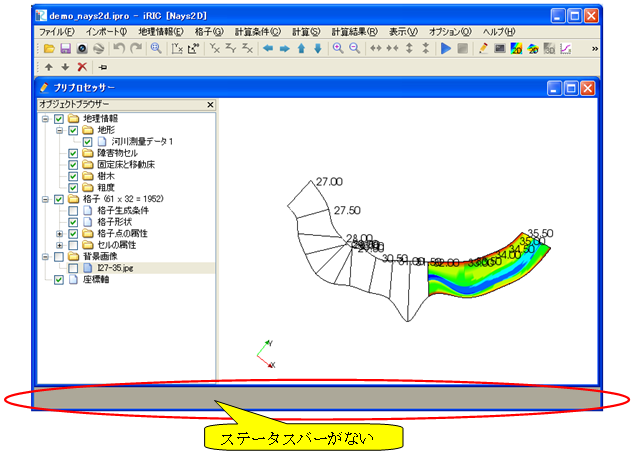

[View] (V)
==========

The functions of the items under the [View] menu are explained in the
following sections.

[Toolbar] (T)
--------------

**Description**: Shows/hides the Toolbar.

When the Toolbar is shown, the item is checked.

[Object Browser] (O)
-----------------------

**Description**: Shows/hides [Object Browser] in the active subwindow.

When the [Object Browser] is shown, the item is checked.

You can also hide the [Object Browser] by clicking on X button in label
of [Object Browser] (:numref:`image_object_browser_of_pre_window`).

.. _image_object_browser_of_pre_window:

.. figure:: images/object_browser_of_pre_window.png
   :width: 240pt

   The [Object Browser] window of the [Pre-processing Window]

[Attribute Browser]
---------------------

**Description**: Shows/hides [Attribute Browser] in the active subwindow.

When the [Attribute Browser] is shown, the item is checked.

You can also hide the [Attribute Browser] by clicking on X button in
label of [Attribute Browser] (:numref:`image_att_browser_of_pre_window`).

.. _image_att_browser_of_pre_window:

.. figure:: images/att_browser_of_pre_window.png
   :width: 380pt

   The [Attribute Browser] window of the [Pre-processing Window]

[Status Bar] (S)
-------------------

**Description**: Shows/hides [Status Bar].

When the [Status Bar] is shown, the item is checked.

When iRIC is launched, the [Status Bar] is shown as default.
:numref:`image_iric_without_status_bar` shows iRIC window
after hiding [Status Bar].

.. _image_iric_without_status_bar:

   iRIC window after hiding [Status Bar]

.. _sec_view_background_color:

[Background Color] (B)
-----------------------

**Description**: Changes the background color of the currently active
subwindow's canvas region.

When you select [Background Color], the [Background Color] dialog
(:numref:`image_background_color_dialog`) will open.
Select the color you want to use for background and click on [OK].

.. _image_background_color_dialog:

.. figure:: images/background_color_dialog.png
   :width: 300pt

   The [Background Color] dialog

.. _sec_view_z_scale:

[Z-direction scale] (Z)
-------------------------

**Description**: Changes the scale factor in the Z-direction.

This function is available only when the active subwindow is either of
[Bird's Eye Grid Window], [Bird's eye 2D Post-processing Window], or [3D
Post-processing Window].

When you select [Z-direction scale], the [Z-direction Scale] dialog
(:numref:`image_z-dir_scale_dialog`) will open.
Input new Z-direction scale, and click on [OK].

Example of [Bird's Eye 2D Post-processing Window] before and after
changing Z-direction scale is shown in
:numref:`image_example_zdir_scale_birdseye`.

.. _image_z-dir_scale_dialog:

.. figure:: images/z-dir_scale_dialog.png
   :width: 140pt

   The [Z-direction Scale] Dialog

.. _image_example_zdir_scale_birdseye:

.. figure:: images/example_zdir_scale_birdseye.png
   :width: 400pt

   Example of editing Z-direction scale in [Bird's Eye 2D Post-processing Window]

Set Projection to (P)
-----------------------

Switch Projection between Parallel projection and 
Perspective projection.

This function is available only when the active subwindow is either of
[Bird's Eye Grid Window], [Bird's eye 2D Post-processing Window], or [3D
Post-processing Window].

[Tile Windows] (T)
-----------------------

**Description**: Tiles subwindows.

The most recently activated window is at the top left.

:numref:`image_tiled_windows` shows an example of iRIC window
after the subwindows are tiled.

.. _image_tiled_windows:

.. figure:: images/tiled_windows.png
   :width: 380pt

   iRIC window after the subwindows are tiled

[Cascade Windows] (C)
------------------------

**Description**: Cascades subwindows.

The most recently activated window is at the top left.

:numref:`image_cascaded_windows` shows an example of iRIC window
after the windows are cascaded.

.. _image_cascaded_windows:

.. figure:: images/cascaded_windows.png
   :width: 380pt

   iRIC window after the subwindows are cascaded
