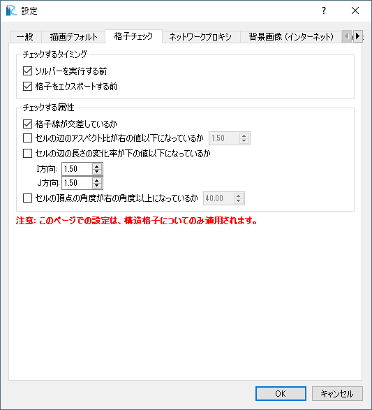

[Preferences] (P)
-----------------

**Description**: Displays the [Preferences] dialog (:numref:`image_pref_dialog_general`
to :numref:`image_pref_dialog_bg_grid`).
Set the preference settings and click on [OK].

[General] Tab
~~~~~~~~~~~~~~~

General settings about iRIC GUI is specified in this tab.

* If you check on "Check for update periodically", a dialog to ask you
  to check for iRIC online update is shown, with the specified interval.

.. _image_pref_dialog_general:

.. figure:: images/pref_dialog_general.png
   :width: 320pt

   The [Preferences] dialog [General] tab

[Graphics Default] tab
~~~~~~~~~~~~~~~~~~~~~~~~~~~~

Default settings about graphics is specified in this tab.
Settings in this tab is used for pre-processor window and visualization
windows.

.. _image_pref_dialog_graphics_default:

.. figure:: images/pref_dialog_graphics_default.png
   :width: 320pt

   The [Preferences] dialog [Graphics Default] tab

[Grid Checking] tab
~~~~~~~~~~~~~~~~~~~~~~~~~~~~

Setting about grid checking is specified in this tab.

As shown on the dialog, grid checking is applied only to structured grids.

.. _image_pref_dialog_graphics_grid_checking:

   The [Preferences] dialog [Grid Checking] tab

[Network Proxy] tab
~~~~~~~~~~~~~~~~~~~~~~~~~~~~

Setting about Network Proxy is specified in this tab. The setting is
used when iRIC GUI tries to access internet, for example to get
background images from web, and download and import elevation data
from web.

If you need to use proxy server to access Internet, please specify
setting here.

When [Use system proxy setting] is selected, the setting used for
Internet Explorer is used.

.. _image_pref_dialog_proxy:

   The [Preferences] dialog [Network Proxy] tab

.. _pref_bgimg_internet_tab:

[Background Images (Internet)] tab
~~~~~~~~~~~~~~~~~~~~~~~~~~~~~~~~~~~~~

Setting about Background Images (Internet) can be specified here.

When you edit the setting, the new setting is applied to Pre-processing
Window and 2D Post-processing Windows.

.. _image_pref_dialog_bg_image:

.. figure:: images/pref_dialog_bg_image.png
   :width: 320pt

   The [Preferences] dialog [Background Images (Internet)] tab

In 2018, Google migrated Google Maps into Google Maps Platform, and now we need to input 
API key to use Google Maps images as Backgound Images on iRIC. Input API key
from "Input Google Maps API key" button.

Please refer the following URL to know how to get a API key:

https://cloud.google.com/maps-platform/?hl=en

[Web Elevation Data] tab
~~~~~~~~~~~~~~~~~~~~~~~~~~~~

Setting about importing Geographic data from web is specified here.

When you edit the setting, the new setting is applied to the
[Source] combo box on the [Zoom Level Setting] dialog for
[Geographic Data (from web)].

Please refer to :ref:`sec_file_import_geo_data_from_web` for detail.

.. _pref_dialog_web_elevation:

   The [Preferences] dialog [Web Elevation Data] tab

[Background Grid] tab
~~~~~~~~~~~~~~~~~~~~~~~~~~~~

Setting about Background Grid is specified here.

The setting here is applied when you use River survey data as geographic data,
and create grids and map the elevation from the river survey data,
with grid creating algorithm other than [Create grid from river survey data].

.. _image_pref_dialog_bg_grid:

   The [Preferences] dialog [Background Grid] tab
