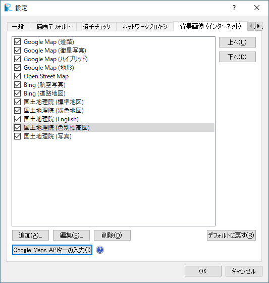

設定 (P)
-------------

設定ダイアログ (:numref:`image_pref_dialog_general`
～ :numref:`image_pref_dialog_bg_grid` 参照)
を表示します。設定を行って「OK」ボタンを押します。

一般 タブ
~~~~~~~~~~

iRIC GUI に関する一般的な設定を行います。

* 「定期的に更新を確認する」をチェックすると、 指定した間隔おきに、
  iRIC 起動時に、iRIC に新しい更新があるか確認するダイアログが表示されます。

.. _image_pref_dialog_general:

.. figure:: images/pref_dialog_general.png
   :width: 320pt

   設定ダイアログ（一般）

描画デフォルト タブ
~~~~~~~~~~~~~~~~~~~~

描画のデフォルトに関する設定を行います。

このタブでの設定内容は、プリプロセッサや可視化ウィンドウで使用されます。

.. _image_pref_dialog_graphics_default:

.. figure:: images/pref_dialog_graphics_default.png
   :width: 320pt

   設定ダイアログ（描画デフォルト）

格子チェック タブ
~~~~~~~~~~~~~~~~~~

格子のチェックに関する設定を行います。

ダイアログ上にも表示されているように、格子のチェックは構造格子のみを対象に行われます。

.. _image_pref_dialog_grid_checking:

.. figure:: images/pref_dialog_grid_checking.png
   :width: 320pt

   設定ダイアログ（格子チェック）

.. _sec_option_pref_riversurvey:

河川測量データ タブ
~~~~~~~~~~~~~~~~~~~~~~~~

河川測量データの編集に関する設定を行います。

河川測量データの横断線を編集する際に選択される法勾配のリストを編集します。

河川測量データの横断線の編集機能に関する詳細は、
:ref:`sec_geodata_rivdata_edit_from_point` を参照してください。

.. _image_pref_dialog_riversurvey:

   設定ダイアログ（河川測量データ）

ネットワークプロキシ タブ
~~~~~~~~~~~~~~~~~~~~~~~~~~

ネットワークプロキシに関する設定を行います。

ここで行った設定は、 iRIC GUI がインターネットに接続する時、例えば
背景画像を取得したり、標高データをダウンロードしてインポートしたりする際に
使用されます。

もしあなたがインターネットへのアクセス時にプロキシサーバを経由する必要が
ある場合は、ここで設定を行って下さい。

.. _image_pref_dialog_proxy:

.. figure:: images/pref_dialog_proxy.png
   :width: 320pt

   設定ダイアログ（ネットワークプロキシ）

「システムのプロキシ設定を使用する」を選択した場合、システムで設定されている内容が使用されます。
（画像はプロキシを使用していない環境のものです。）

.. _image_system_proxy_setting:

   システムのプロキシ設定

.. _pref_bgimg_internet_tab:

背景画像（インターネット） タブ
~~~~~~~~~~~~~~~~~~~~~~~~~~~~~~~~~~~~~

背景画像（インターネット）に関する設定を行います。

設定を変更すると、プリプロセッサウィンドウと二次元可視化ウィンドウに設定内容が
反映されます。

.. _image_pref_dialog_bg_image:

   設定ダイアログ（背景画像（インターネット））

2018年、 Google は Google Maps サービスを Google Maps Platform に移行し、 iRIC上で背景画像として Google Maps
の画像を利用するためには、APIキーを入力することが必要になりました。APIキーを、 "Google Maps APIキーの入力" ボタンから
入力してください。

APIキーを取得する方法については、以下の URL を参照してください。

https://cloud.google.com/maps-platform/?hl=jp

Web 標高データ タブ
~~~~~~~~~~~~~~~~~~~~~~

地理情報 (webから) のインポートの設定を行います。

設定を編集すると、新しい設定内容は、「地理情報 (webから)」のインポートでの、
「ズームレベル設定」ダイアログでの「ソース」コンボボックスの内容に反映されます。

詳細は、:ref:`sec_file_import_geo_data_from_web` を参照して下さい。

.. _pref_dialog_web_elevation:

.. figure:: images/pref_dialog_web_elevation.png
   :width: 320pt

   設定ダイアログ（Web 標高データ）

.. _sec_pref_background_grid:

背景格子 タブ
~~~~~~~~~~~~~~

背景格子に関する設定を行います。

ここでの設定は、河川測量データを地理情報として利用し、「河川測量データから生成」
以外の格子生成アルゴリズムを利用して格子を生成して、標高を河川測量データを使って
マッピングする際に使用されます。

.. _image_pref_dialog_bg_grid:

.. figure:: images/pref_dialog_bg_grid.png
   :width: 320pt

   設定ダイアログ（背景格子）
