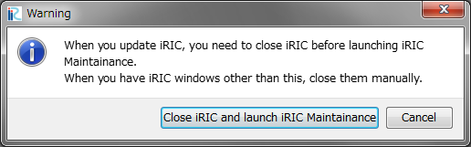
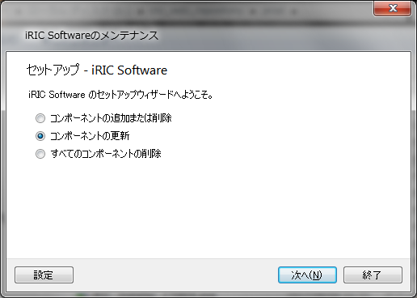
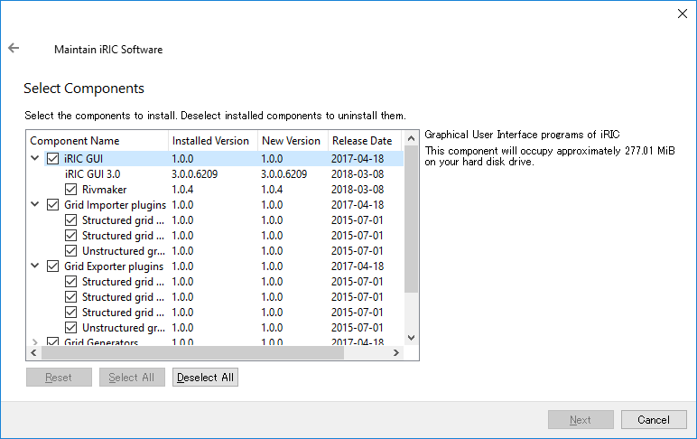
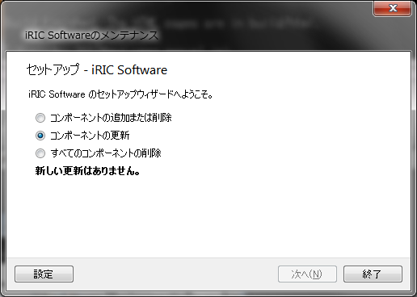
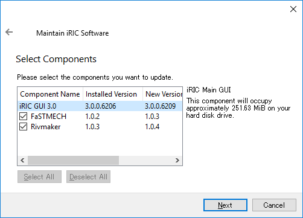
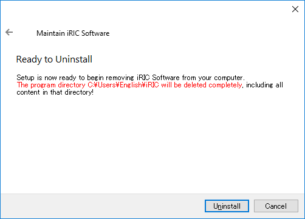
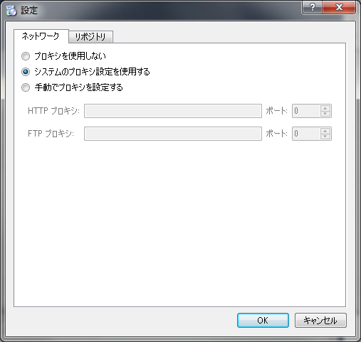

メンテナンス (M)
============================

iRIC、iRIC から起動できるソルバのメンテナンスを行います。

メンテナンスを起動すると、 :numref:`image_maintainance_warning`
に示すダイアログが表示されます。
「iRICを閉じて iRIC Maintainance を起動」ボタンを押すと、
iRIC GUI が終了して、
:numref:`image_maintainance_main` に示す iRIC メンテナンスが起動します。

.. _image_maintainance_warning:

   メンテナンスに関する警告ダイアログ

.. _image_maintainance_main:

   iRIC メンテナンスメインダイアログ

以下では、 iRIC メンテナンスダイアログの機能について説明します。

コンポーネントの追加または削除
------------------------------

iRIC、iRIC から起動するソルバなどのコンポーネントを追加または削除します。

「コンポーネントの追加または削除」の横のラジオボタンをチェックして「次へ」
ボタンを押すと、
:numref:`image_maintainance_add_delete_select_comps`
に示す画面が表示されます。

* 追加したいコンポーネントの横のチェックボックスをON にします。
* 削除したいコンポーネントの横のチェックボックスをOFF にします。

上記操作を行った後、「次へ」ボタン、「更新」ボタンを順番に押すと、
コンポーネントの追加と削除が実行されます。

.. _image_maintainance_add_delete_select_comps:

   コンポーネントの選択画面

コンポーネントの更新
-----------------------

iRIC、iRIC から起動するソルバなどのコンポーネントを更新します。

「コンポーネントの更新」の横のラジオボタンをチェックして「次へ」ボタンを押すと、
サーバから、コンポーネントの更新に関する情報がダウンロードされます。

新しい更新がない場合は、:numref:`image_maintainance_update_nodata`
に示すメッセージが表示されます。

.. _image_maintainance_update_nodata:

   コンポーネントの更新がない場合の画面

新しい更新があった場合は、 :numref:`image_maintainance_update_select_comps`
に示すダイアログが表示されます。更新したいコンポーネントのチェックをONにした状態で
「次へ」「更新」ボタンを順番に押すと、コンポーネントの更新が実行されます。

.. _image_maintainance_update_select_comps:

   更新するコンポーネントの選択画面

すべてのコンポーネントの削除
------------------------------

iRIC に関連する全てのコンポーネントを削除します。

:numref:`image_maintainance_uninstall` に示す画面が表示されますので、
表示内容を確認の上で「アンインストール」ボタンを押すと、全てのコンポーネントが
削除されます。

.. _image_maintainance_uninstall:

   アンインストール画面

設定
-------

iRIC メンテナンスに関する設定を行います。

:numref:`image_maintainance_setting` に示すダイアログが表示されますので、
お使いの環境に合わせたプロキシの設定を行い、「OK」ボタンを押して下さい。

.. _image_maintainance_setting:

   設定画面
