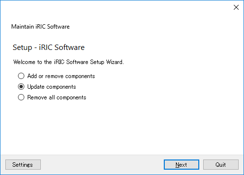
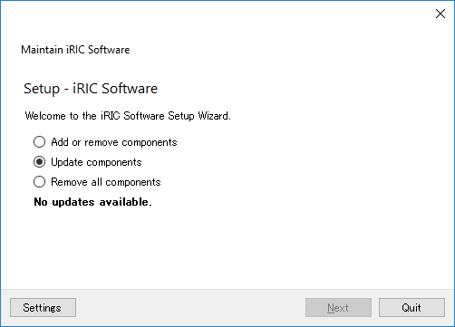

[Maintainance] (M)
============================

Shows Maintainance menu about iRIC GUI and Solvers launched from iRIC.

When you select [Maintainance], dialog in 
:numref:`image_maintainance_warning` is shown.
「iRICを閉じて iRIC Maintainance を起動」ボタンを押すと、
iRIC GUI が終了して、
:numref:`image_maintainance_main` に示す iRIC メンテナンスが起動します。

.. _image_maintainance_warning:

   [Warning] dialog about launching [iRIC Maintainance]

.. _image_maintainance_main:

   iRIC Maintainance main dialog

Function about iRIC Maintainance is described in the following subsections.

[Add or Remove components]
------------------------------

Add or remove components like iRIC GUI, solvers launched from iRIC GUI, etc.

When you check on the radio button next to [Add or Remove components] and
click on [Next], page in 
:numref:`image_maintainance_add_delete_select_comps` is shown.

* Check on the checkbox next to the component you want to add
* Check off the checkbox next to the component you want to remove

After doing the operation above, click on [Next], then [Update] button,
to add or remove components.

.. _image_maintainance_add_delete_select_comps:

   Page to select components to add or remove

[Update components]
-----------------------

Update components like iRIC GUI, solvers launched from iRIC GUI, etc.

When you check on the radio button next to [Update components] and
click on [Next], downloading the information about component updates
starts.

If there is not update, message is shown like in 
`image_maintainance_update_nodata`.

.. _image_maintainance_update_nodata:

   Page with message when there is no component update

If there are updates available, dialog in
:numref:`image_maintainance_update_select_comps` is shown.
Check on the checkboxes next to components you want to update,
click on [Next], then [Update] button, to update components.

.. _image_maintainance_update_select_comps:

   Page to select components to update

Remove all components
------------------------------

Remove all the components related to iRIC.

Dialog in :numref:`image_maintainance_uninstall` is shown.
When you click on [Uninstall] button, all components are removed.

.. _image_maintainance_uninstall:

.. figure:: images/maintainance_uninstall.png

   Page to uninstall

Settings
----------

Edit settings about iRIC Maintainance.

Dialog in :numref:`image_maintainance_setting` is shown.
Edit the setting to match your environment, and click on [OK]. 

.. _image_maintainance_setting:

.. figure:: images/maintainance_setting.png

   [Setting] dialog
