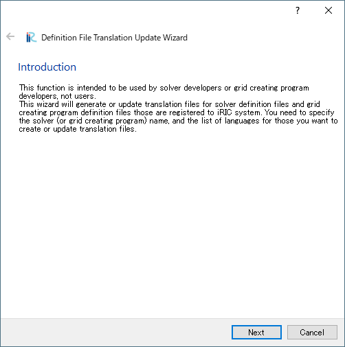
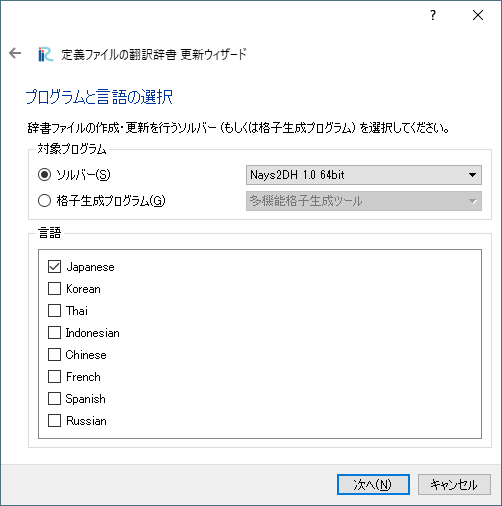
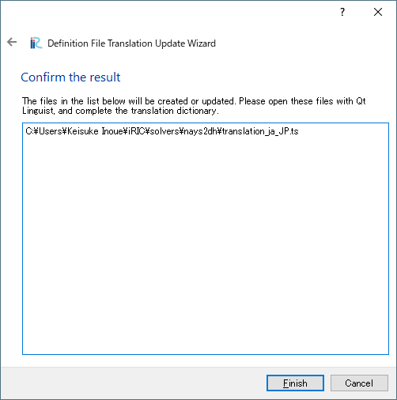

[Create/Update Translation Files] (C)
-------------------------------------

**Description**: Displays the [Definition File Translation Update Wizard]
dialog (:numref:`image_translation_wizard_intro` to
:numref:`image_translation_wizard_confirm`).

This function is for the solver developers. It makes/update dictionary
files for solvers. Using this function, solver developers can create
dictionary files that can be used for solver internationalization.

.. _image_translation_wizard_intro:

   [Introduction] page

.. _image_translation_wizard_select:

   [Select Program and Languages] page

.. _image_translation_wizard_confirm:

   [Confirm the result] page

The dictionary created by this Wizard can be edited using Linguist.
Linguist is a program bundled with Qt. Qt is a program library that is
distributed for free as open source product. Download it at the
following URL:

http://qt-project.org/downloads
