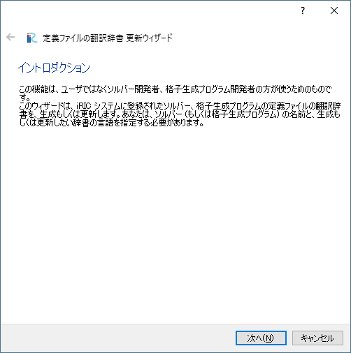

辞書ファイルの作成・更新 (C)
----------------------------

辞書ファイルの作成・更新ウィザードを表示します。
ウィザードの画面表示例を :numref:`image_translation_wizard_intro` から
:numref:`image_translation_wizard_confirm` に示します。

この機能は、ソルバー開発者の方のための機能です。
ソルバー開発者の方が用意するソルバー定義ファイルを多言語に
対応させるための辞書ファイルを作成・更新します。

.. _image_translation_wizard_intro:

   イントロダクション　ページ

.. _image_translation_wizard_select:

   プログラムと言語の選択 ページ

.. _image_translation_wizard_confirm:

.. figure:: images/translation_wizard_confirm.png

   結果の確認 ページ

このウィザードによって作成・更新された辞書ファイルは、Qtに同梱された
Linguist で開いて編集し、翻訳後の単語を登録することができます。Qt
は、オープンソースのプログラムライブラリで、以下の URL
からダウンロードして利用することができます。

http://qt-project.org/downloads
