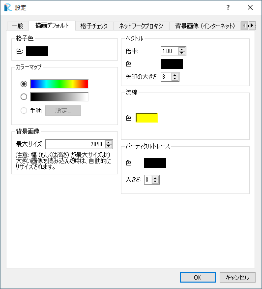

オプション (O)
=================

オプションメニューに含まれる機能について説明します。

設定 (P)
-------------

設定ダイアログ (:numref:`image_pref_dialog_general`
～ :numref:`image_pref_dialog_graphics_grid_checking` 参照)
を表示します。設定を行って「OK」ボタンを押します。

.. _image_pref_dialog_general:

.. figure:: images/pref_dialog_general.png

   設定ダイアログ（一般）

.. _image_pref_dialog_graphics_default:

   設定ダイアログ（描画デフォルト）

.. _image_pref_dialog_graphics_grid_checking:

.. figure:: images/pref_dialog_graphics_grid_checking.png

   設定ダイアログ（格子チェック）

.. TODO: tabs like background image are missing

辞書ファイルの作成・更新 (C)
----------------------------

辞書ファイルの作成・更新ウィザードを表示します。

この機能は、ソルバー開発者の方のための機能です。
ソルバー開発者の方が用意するソルバー定義ファイルを多言語に
対応させるための辞書ファイルを作成・更新します。

ウィザードの画面表示例を :numref:`image_translation_wizard` に示します。

.. _image_translation_wizard:

.. figure:: images/translation_wizard.png

   ソルバー定義ファイル辞書作成・更新ウィザードの表示例

このウィザードによって作成・更新された辞書ファイルは、Qtに同梱された
Linguist で開いて編集し、翻訳後の単語を登録することができます。Qt
は、オープンソースのプログラムライブラリで、以下の URL
からダウンロードして利用することができます。

http://qt-project.org/downloads
