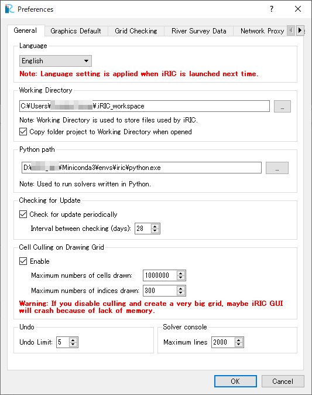

[Option] (O)
==============

The functions of the items under the [Option] menu are explained in the
following sections.

[Preferences] (P)
-----------------

**Description**: Displays the [Preferences] dialog (:numref:`image_pref_dialog_general`
to :numref:`image_pref_dialog_graphics_grid_checking`).
Set the preference settings and click on [OK].

.. _image_pref_dialog_general:

   The [Preferences] dialog [General] tab

.. _image_pref_dialog_graphics_default:

.. figure:: images/pref_dialog_graphics_default.png

   The [Preferences] dialog [Graphics Default] tab

.. _image_pref_dialog_graphics_grid_checking:

.. figure:: images/pref_dialog_graphics_grid_checking.png

   The [Preferences] dialog [Grid Checking] tab

.. TODO: tabs like background image are missing

[Create/Update Translation Files] (C)
-------------------------------------

**Description**: Displays the [Definition File Translation Update Wizard]
dialog (:numref:`image_translation_wizard`).

This function is for the solver developers. It makes/update dictionary
files for solvers. Using this function, solver developers can create
dictionary files that can be used for solver internationalization.

.. _image_translation_wizard:

.. figure:: images/translation_wizard.png

   Example of the [Solver Definition File Translation Update Wizard] display

The dictionary created by this Wizard can be edited using Linguist.
Linguist is a program bundled with Qt. Qt is a program library that is
distributed for free as open source product. Download it at the
following URL:

http://qt-project.org/downloads
