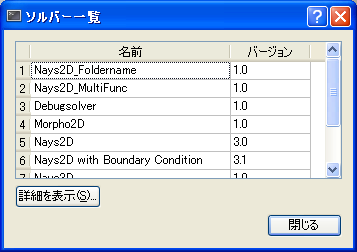
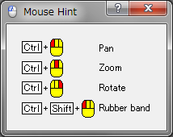

ヘルプ (H)
==========

ヘルプメニューに含まれる機能について説明します。

ヘルプ (H)
-----------

ヘルプを表示します。

ヘルプの PDF ファイルが開いて表示されます。

ソルバー一覧 (S)
------------------

iRIC に同梱されているソルバーの一覧を表示します。

ソルバー一覧ダイアログの表示例を :numref:`image_solver_list_dialog`
に示します。
このダイアログでソルバーの名前をクリックして選択し、
「詳細を表示」ボタンを押すと、ソルバー情報ダイアログ
(:numref:`image_help_solver_info_dialog` 参照) が表示されます。

.. _image_solver_list_dialog:

   ソルバー一覧ダイアログ

.. _image_help_solver_info_dialog:

.. figure:: images/solver_info_dialog.png

   ソルバー情報ダイアログ

マウスヒント (M)
------------------

表示操作に関するマウス操作方法を示すダイアログ
(:numref:`image_help_mouse_hint_dialog` 参照)
を表示します。

.. _image_help_mouse_hint_dialog:

   マウスヒントダイアログ

iRIC について (A)
-------------------

iRIC についての情報を表示するダイアログ (:numref:`about_iric_dialog`)
を表示します。

.. _about_iric_dialog:

.. figure:: images/about_iric_dialog.png

   iRIC についてダイアログ
