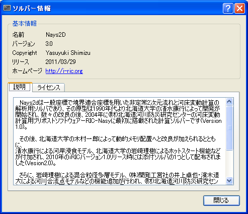
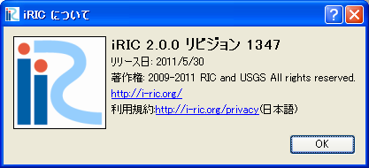

[Help] (H)
==========

The functions of the items under the [Help] menu are explained in the
following sections.

[Help] (H)
----------

**Description**: Displays the [Help] window.

When you select [Help], the PDF help document will open.

[Solver List] (S)
-----------------

**Description**: Displays the list of solvers bundled with iRIC.

When you select [Solver List], the [Solver List] dialog
(:numref:`image_solver_list_dialog`) will open.
When you select solver name and click on [Show Detail], the
[Solver Information] dialog (:numref:`image_help_solver_info_dialog`)
will open.

.. _image_solver_list_dialog:

.. figure:: images/solver_list_dialog.png
   :width: 220pt

   The [Solver List] dialog

.. _image_help_solver_info_dialog:

   The [Solver Information] dialog

[Mouse Hint] (M)
----------------

**Description**: Displays the [Mouse Hint] dialog
(:numref:`image_help_mouse_hint_dialog`), that explains how
the mouse can be used to change view setting in the canvas area.

.. _image_help_mouse_hint_dialog:

   The [Mouse Hint] dialog

[About] (A)
-----------

**Description**: Displays the [About iRIC] (:numref:`about_iric_dialog`).

.. _about_iric_dialog:

   The [About iRIC] dialog
