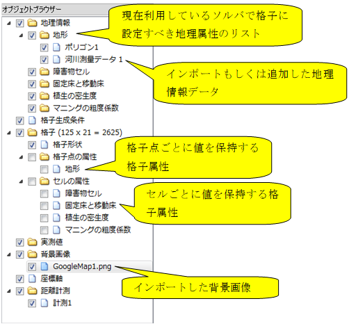
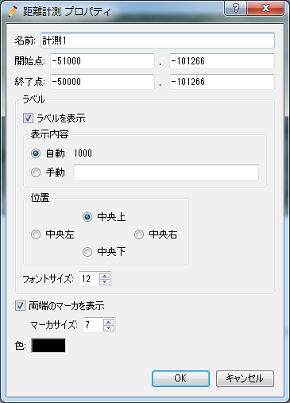

オブジェクトブラウザー
=======================

プリプロセッサーのオブジェクトブラウザーの表示例を
:numref:`image_ob_of_pre_window` に示します。

.. _image_ob_of_pre_window:

   プリプロセッサーのオブジェクトブラウザー

以下に、オブジェクトブラウザーから操作できるオブジェクトについて説明します。

地理情報
----------

格子属性の補間に使用する地理情報のインポート、編集を行う際に使用します。
地理情報に関連する操作については、:ref:`sec_pre_geodata`
を参照して下さい。

格子生成条件
-------------

格子生成アルゴリズムの選択と、格子生成条件の設定を行う際に使用します。
格子生成条件に関する操作については、
:ref:`sec_pre_grid_creating_func`
を参照して下さい。

格子
------

格子の編集を行う際に使用します。格子に関する操作については、
:ref:`sec_pre_grid` を参照して下さい。

実測値
---------

実測値をインポートして表示する際に使用します。実測値に関する操作については、
:ref:`sec_pre_measured_data`
を参照して下さい。

背景画像
-----------

背景画像をインポートして表示する際に使用します。
背景画像に関する操作については、
:ref:`sec_pre_bg_image_data` を参照して下さい。

.. _sec_pre_ob_bg_internet:

背景画像 (インターネット)
-------------------------

インターネットからリアルタイムでダウンロードした背景画像を表示します。

「Google Map (道路)」 などの横のチェックボックスをチェックすると、選択した
地図が背景画像として表示されます。

この機能を利用するには、先にプロジェクトの座標系を指定する必要があります。
座標系の指定方法については :ref:`sec_file_property` を参照して下さい。

ここで表示できる地図は、自分で追加・削除することができます。また、 Google Maps
の画像を背景画像として表示するには、 Google にアカウントを作成して取得した API Key を
入力する必要があります。それら設定については、
:ref:`pref_bgimg_internet_tab` を参照して下さい。

.. _sec_pre_axes:

座標軸
--------

描画ウィンドウに、座標軸を表示します。座標軸の表示例を
:numref:`image_example_of_axes` に示します。

オブジェクトブラウザーで座標軸を選択している時は、
座標軸の位置や大きさを描画ウィンドウ内でのマウス操作により変更することができます。

.. _image_example_of_axes:

   座標軸

.. _sec_pre_distance_measures:

距離計測
---------

描画ウィンドウに、距離計測用の線を描画できます。

距離計測用の線は、「距離計測」グループを選択して、右クリックメニューから
「計測の追加」を選択することで追加することができます。

距離計測オブジェクト (「計測1」など)
を選択して描画ウィンドウで左ドラッグ操作を行うと、
ドラッグ開始点から終了点までの距離を計測する線が描画されます。
距離計測線の表示例を
:numref:`example_of_distance_measure` に示します。

.. _example_of_distance_measure:

.. figure:: images/example_of_distance_measure.png
   :width: 160pt

   距離計測線

距離計測線は、線の色、線の開始点・終了点の位置などをプロパティダイアログから
設定できます。プロパティダイアログの表示例を
:numref:`distance_measure_prop_dialog` に示します。

.. _distance_measure_prop_dialog:

   距離計測 プロパティダイアログ
