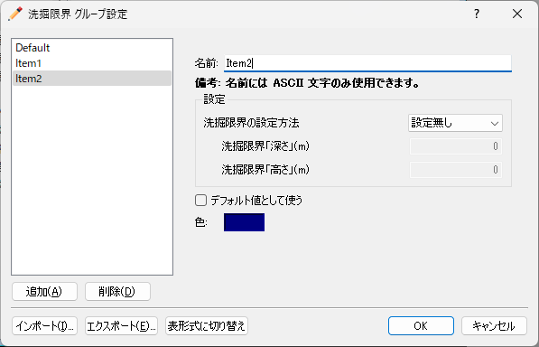
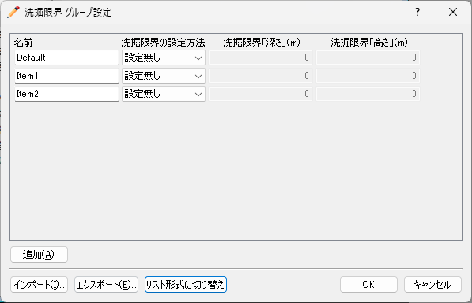

.. _sec_geo_common_functions:

共通機能
============

地理情報で、データ型に関わらず共通で利用できる機能について説明します。

グループの編集
--------------------

複合型の格子属性のグループの追加・編集・削除を行います。

複合型の格子属性を選択した時のみ有効な機能です。

グループ設定ダイアログの例を :numref:`image_complex_group_edit_dialog` に示します。ダイアログに表示される設定項目は、ソルバやグループごとに異なります。

このダイアログで利用可能な機能を以下に示します。

追加(A)
    新しいグループを追加します。

削除(D)
    現在選択しているグループを削除します。

インポート(I)
    グループの定義を CSV ファイルからインポートします。

    一度エクスポート機能で CSV ファイルをエクスポートした上で、値を編集したり、行を追加・削除したりしてインポートするのが便利です。

エクスポート(E)
    グループの定義を CSV ファイルにエクスポートします。

表形式に切り替え
    ダイアログでの表示形式を「表形式」に切り替え、すべてのグループの設定項目の値を一度に表示します。
    表形式に切り替えた後の表示例を :numref:`image_complex_group_edit_dialog_table` に示します。

.. _image_complex_group_edit_dialog:

   グループ設定ダイアログ

.. _image_complex_group_edit_dialog_table:

   グループ設定ダイアログ (表形式)

.. _sec_geo_common_color_setting:

表示色設定
------------

地理情報の種類ごとの表示色を設定します。

表示色設定ダイアログが表示されますので、設定を行って「OK」ボタンを押します。
ダイアログの内容は、地理情報が実数値の場合と、整数値 (複数の候補値から選択) の場合で異なります。

.. _sec_geo_common_color_setting_real:

実数値の場合
~~~~~~~~~~~~~~~~~~~

:numref:`image_geo_color_setting_dialog_real` に示すダイアログが表示されます。

.. _image_geo_color_setting_dialog_real:

.. figure:: images/color_setting_dialog_real.png
   :width: 440pt

   表示色設定ダイアログ (実数値)

詳細は、 :ref:`sec_colormap_basic_real` を参照してください。 

.. _sec_geo_common_color_setting_int:

整数値の場合
~~~~~~~~~~~~~~~~

:numref:`image_geo_color_setting_dialog_int` に示すダイアログが表示されます。

.. _image_geo_color_setting_dialog_int:

.. figure:: images/color_setting_dialog_int.png
   :width: 440pt

   表示色設定ダイアログ (整数)

詳細は、 :ref:`sec_colormap_basic_real` を参照してください。 

.. note:: 
   iRIC ver4からはプリプロセッサーウィンドウで追加した地理情報は可視化ウィンドウでも確認ができるようになっています。主な仕様は以下です。

   表示設定について

   - 可視化ウィンドウでの地理情報の表示設定は、可視化ウィンドウを開いた時点でのプリプロセッサーウィンドウで設定していたものが引き継がれます。
   - 既に開かれている可視化ウィンドウでの表示設定は、プリプロセッサーウィンドウで表示設定を変更しても変更されません。
   - 可視化ウィンドウで表示設定を変更してもプリプロセッサーウィンドウでの表示設定には影響しません。

   地理情報の値、座標等について

   - 可視化ウィンドウ上からは地理情報の編集はできません。
   - プリプロセッサーウィンドウで地理情報を編集(値の変更、位置の変更)した場合、可視化ウィンドウにも反映されます。
   - ラインデータ、ポリゴンデータが選択されて編集モードになっている間、可視化ウィンドウでは選択されたライン・ポリゴンは表示されません。

名前の変更 (N)
---------------

地理情報の名前を変更します。

プリプロセッサーのオブジェクトブラウザーで、
名前を変更したい地理情報を選択した状態で以下の操作を行います。

**メニュー:** 地理情報 (E) --> (選択している地理情報の種類) --> 名前の編集 (N)

すると、オブジェクトブラウザーで、選択した地理情報の名前が編集できる状態になります
(:numref:`image_object_browser_name_edit` 参照) ので、
新しい名前を入力して改行キーを押します。

.. _image_object_browser_name_edit:

.. figure:: images/object_browser_name_edit.png
   :width: 150pt

   名前編集中のオブジェクトブラウザー

削除 (D)
------------

プリプロセッサーのオブジェクトブラウザーで、削除したい地理情報を選択した状態で
以下の操作を行います。

**メニュー：**  地理情報 (E) --> (選択している地理情報の種類) --> 削除(D)

すると、:numref:`image_delete_item_dialog_for_pre`
に示すダイアログが表示されますので、「はい」ボタンを押します。

.. _image_delete_item_dialog_for_pre:

.. figure:: images/delete_item_dialog_for_pre.png
   :width: 180pt

   項目の削除 確認ダイアログ

インポート (I)
--------------

地理情報をインポートします。

この機能は、ファイルメニューの下のインポートメニューに
含まれるものと同じです。:ref:`sec_file_import_geo_data`
を参照してください。

エクスポート (E)
--------------------

地理情報をエクスポートします。

この機能は、ファイルメニューの下のエクスポートメニューに含まれるものと
同じです。:ref:`sec_file_export_geo_data` を参照してください。

選択して削除 (S)
----------------

プリプロセッサーのオブジェクトブラウザーで、
削除したい（複数の項目が含まれている）地理情報を選択した状態で
以下の操作を行います。

(選択している地理情報) --> マウス右クリック --> 選択して削除(S)

:numref:`image_delete_selected_item_dialog`
に示すダイアログが表示されますので、削除したいデータにチェックを付けて、「OK」ボタンを押します。

.. _image_delete_selected_item_dialog:

.. figure:: images/delete_selected_item_dialog.png
   :width: 220pt

   選択した地理情報の削除ダイアログ

すべて削除 (A)
----------------

プリプロセッサーのオブジェクトブラウザーで、
削除したい（複数の項目が含まれている）地理情報を選択した状態で
以下の操作を行います。

(選択している地理情報) --> マウス右クリック --> すべて削除(A)

:numref:`image_delete_all_item_dialog`
に示すダイアログが表示されますので、「はい」ボタンを押します。

.. _image_delete_all_item_dialog:

.. figure:: images/delete_all_item_dialog.png
   :width: 280pt

   項目の全削除 確認ダイアログ

すべてのポリゴンをエクスポート
----------------------------------

（複数のポリゴンが含まれている）地理情報をエクスポートします。

プリプロセッサーのオブジェクトブラウザーで、エクスポートしたい
（複数の項目が含まれている）地理情報を選択した状態で以下の操作を行います。

(選択している地理情報) --> マウス右クリック --> すべてのポリゴンをエクスポート…

ポリゴンのエクスポートダイアログ (:numref:`image_export_polygons_dialog` 参照)
が表示されますので、エクスポートするファイルを指定して「保存」ボタンを押します。
すると、指定したファイルにポリゴンがエクスポートされます。

.. _image_export_polygons_dialog:

.. figure:: images/export_polygons_dialog.png
   :width: 380pt

   ポリゴンのエクスポートダイアログ
