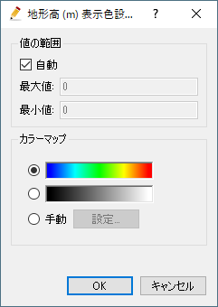
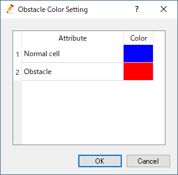
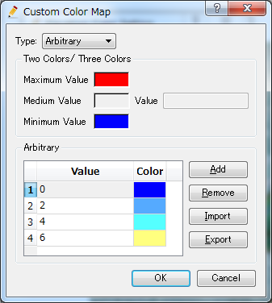

.. _sec_geo_common_functions:

共通機能
============

地理情報で、データ型に関わらず共通で利用できる機能について説明します。

.. _sec_geo_common_color_setting:

表示色設定
------------

地理情報の種類ごとの表示色を設定します。

表示色設定ダイアログ (
:numref:`image_color_setting_dialog1`、
:numref:`image_color_setting_dialog2` 参照)
が表示されますので、設定を行って「OK」ボタンを押します。
ダイアログの内容は、地理情報によって異なります。

.. _image_color_setting_dialog1:

   表示色設定ダイアログ

.. _image_color_setting_dialog2:

   表示色設定ダイアログ

:numref:`image_color_setting_dialog1`
で示したダイアログで、カラーマップとして「手動」を選択し、「設定」ボタンを押すと
:numref:`image_custom_color_map_dialog`
に示すダイアログが表示されます。このダイアログを使用すると、
以下の3種類のカラーマップを手動で設定することができます。

- 2色: 最小値と最大値での色を指定します。
- 3色: 最小値と最大値での色に加え、中間の値とその値での色を指定します。
- 任意: 任意の数の値と、その値での色を指定します。

.. _image_custom_color_map_dialog:

   表示色設定 カスタムカラーマップダイアログ

名前の変更 (N)
---------------

地理情報の名前を変更します。

プリプロセッサーのオブジェクトブラウザーで、
名前を変更したい地理情報を選択した状態で以下の操作を行います。

**メニュー:** 地理情報 (E) --> (選択している地理情報の種類) --> 名前の編集 (N)

すると、オブジェクトブラウザーで、選択した地理情報の名前が編集できる状態になります
(:numref:`image_object_browser_name_edit` 参照) ので、
新しい名前を入力して改行キーを押します。

.. _image_object_browser_name_edit:

.. figure:: images/object_browser_name_edit.png
   :width: 150pt

   名前編集中のオブジェクトブラウザー

削除 (D)
------------

プリプロセッサーのオブジェクトブラウザーで、削除したい地理情報を選択した状態で
以下の操作を行います。

**メニュー：**  地理情報 (E) --> (選択している地理情報の種類) --> 削除(D)

すると、:numref:`image_delete_item_dialog_for_pre`
に示すダイアログが表示されますので、「はい」ボタンを押します。

.. _image_delete_item_dialog_for_pre:

.. figure:: images/delete_item_dialog_for_pre.png
   :width: 180pt

   項目の削除 確認ダイアログ

インポート (I)
--------------

地理情報をインポートします。

この機能は、ファイルメニューの下のインポートメニューに
含まれるものと同じです。:ref:`sec_file_import_geo_data`
を参照してください。

エクスポート (E)
--------------------

地理情報をエクスポートします。

この機能は、ファイルメニューの下のエクスポートメニューに含まれるものと
同じです。:ref:`sec_file_export_geo_data` を参照してください。

選択して削除 (S)
----------------

プリプロセッサーのオブジェクトブラウザーで、
削除したい（複数の項目が含まれている）地理情報を選択した状態で
以下の操作を行います。

(選択している地理情報) --> マウス右クリック --> 選択して削除(S)

:numref:`image_delete_selected_item_dialog`
に示すダイアログが表示されますので、削除したいデータにチェックを付けて、「OK」ボタンを押します。

.. _image_delete_selected_item_dialog:

.. figure:: images/delete_selected_item_dialog.png
   :width: 220pt

   選択した地理情報の削除ダイアログ

すべて削除 (A)
----------------

プリプロセッサーのオブジェクトブラウザーで、
削除したい（複数の項目が含まれている）地理情報を選択した状態で
以下の操作を行います。

(選択している地理情報) --> マウス右クリック --> すべて削除(A)

:numref:`image_delete_all_item_dialog`
に示すダイアログが表示されますので、「はい」ボタンを押します。

.. _image_delete_all_item_dialog:

.. figure:: images/delete_all_item_dialog.png
   :width: 280pt

   項目の全削除 確認ダイアログ

すべてのポリゴンをエクスポート
----------------------------------

（複数のポリゴンが含まれている）地理情報をエクスポートします。

プリプロセッサーのオブジェクトブラウザーで、エクスポートしたい
（複数の項目が含まれている）地理情報を選択した状態で以下の操作を行います。

(選択している地理情報) --> マウス右クリック --> すべてのポリゴンをエクスポート…

ポリゴンのエクスポートダイアログ (:numref:`image_export_polygons_dialog` 参照)
が表示されますので、エクスポートするファイルを指定して「保存」ボタンを押します。
すると、指定したファイルにポリゴンがエクスポートされます。

.. _image_export_polygons_dialog:

.. figure:: images/export_polygons_dialog.png
   :width: 380pt

   ポリゴンのエクスポートダイアログ
