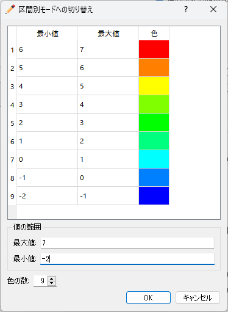
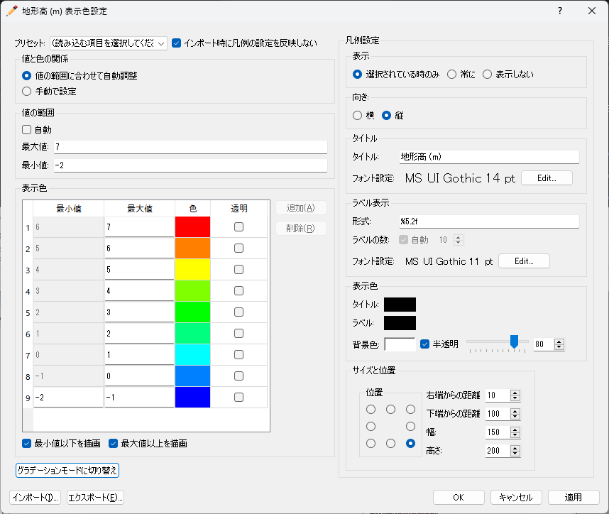
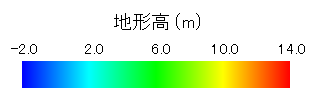
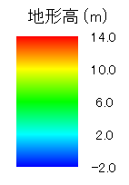

.. _sec_geo_common_functions:

共通機能
============

地理情報で、データ型に関わらず共通で利用できる機能について説明します。

.. _sec_geo_common_color_setting:

表示色設定
------------

地理情報の種類ごとの表示色を設定します。

表示色設定ダイアログが表示されますので、設定を行って「OK」ボタンを押します。
ダイアログの内容は、地理情報が実数値の場合と、整数値 (複数の候補値から選択) の場合で異なります。

.. _sec_geo_common_color_setting_real:

実数値の場合
~~~~~~~~~~~~~~~~~~~

:numref:`image_color_setting_dialog_real` に示すダイアログが表示されます。

.. _image_color_setting_dialog_real:

.. figure:: images/color_setting_dialog_real.png
   :width: 440pt

   表示色設定ダイアログ (実数値)

設定項目について以下で説明します。

プリセット
   あらかじめ定義されたカラーマップ設定をコンボボックスから読み込みます。

   以下のフォルダに保存された設定ファイルから拡張子 (.cmsetting) を除いた文字列のリストが候補として表示されます。コンボボックスで項目を選択すると、選択したファイルから設定がインポートされます。

   * colormaps (iRICのインストーラに同梱された設定)
   * private/colormaps (ユーザが保存した設定)

値と色の関係
   以下のいずれかから選択します。

   * **値の範囲に合わせて自動調整**: 「値の範囲」の「最大値」と「最小値」を指定すると、その下の「表示色」において「色」に対応する「値」が自動で調整されます。
   * **手動で設定**: 「値の範囲」の設定項目がなくなり、「表示色」で色に対応する値を手動で設定します。

値の範囲
   表示色における値の最小値、最大値を設定します。「値と色の関係」として「値の範囲に合わせて自動調整」を選択している時のみ表示されます。

   「自動」をチェックすると、最小値、最大値は、データの値の範囲に自動で設定されます。

表示色
   値と色の対応関係を指定します。

最小値以下を描画
   チェックを外すと、表示色における最小値以下の領域は描画されなくなります。

最大値以上を描画
   チェックを外すと、表示色における最大値以上の領域は描画されなくなります。

区間別モードに切り替え
   表示色設定を「区間別モード」に切り替えます。

   ボタンを押すと、 :numref:`color_setting_switch_to_discrete_dialog` に示す
   ダイアログが表示されます。最小値、最大値、色の数を指定すると、
   :numref:`image_color_setting_dialog_real_discrete` に示すようにダイアログが
   変化し、値の区間ごとに色を指定するモードになります。区間別モードになるとこのボタンは
   「グラデーションモードに切り替え」に変化します。

.. _color_setting_switch_to_discrete_dialog:

   区間別モードへの切り替えダイアログ

.. _image_color_setting_dialog_real_discrete:

   表示色設定ダイアログ (実数値) (区間別モード)

インポート・エクスポート
   設定内容をファイルからインポートしたりエクスポートしたりします。

   エクスポートする際は、 iRIC がインストールされたフォルダの下の private/colormaps フォルダに保存することを推奨します。ここに保存すると、「プリセット」から簡単に呼び出せるようになります。

凡例設定
   凡例の表示に関する設定を行います。

   表示
      以下のいずれかを指定します。

      * **選択されている時のみ**: オブジェクトブラウザで該当する項目が選択されている時のみ、凡例を表示します。
      * **常に**: 常に凡例を表示します。
      * **表示しない**: 常に凡例を非表示にします。
   
   向き
      凡例の向きを横・縦から指定します。横向き、縦向きの凡例の例をそれぞれ :numref:`color_setting_legend_horizontal` 、 :numref:`color_setting_legend_vertical` に示します。
   
   タイトル
      タイトルとそのフォント設定を指定します。
   
   ラベル表示
      ラベルの数字の形式、ラベルの数、ラベルのフォント設定を指定します。
      
      ラベルの数は、グラデーションモードの場合は「自動」チェックボックスを外して任意の数を指定できます。区間別モードに切り替えると、ラベルの数は常に自動設定となります。

   表示色
      タイトル、ラベル、背景の色を指定します。
   
   サイズと位置
      凡例を指定するサイズと位置を指定します。「位置」のラジオボタンにより、凡例の表示位置を、左上、上、右上など8つのいずれかから指定できます。

.. _color_setting_legend_horizontal:

   凡例 表示例 (横)

.. _color_setting_legend_vertical:

   凡例 表示例 (縦)

.. _sec_geo_common_color_setting_int:

整数値の場合
~~~~~~~~~~~~~~~~

:numref:`image_color_setting_dialog_int` に示すダイアログが表示されます。

.. _image_color_setting_dialog_int:

.. figure:: images/color_setting_dialog_int.png
   :width: 440pt

   表示色設定ダイアログ (整数)

設定項目について以下で説明します。

表示色
   値と色の対応関係を指定します。
   
   「透明」をチェックすると、ポリゴンなどは枠線のみが表示され、塗りつぶし領域は透明になります。

インポート・エクスポート
   設定内容をファイルからインポートしたりエクスポートしたりします。

凡例設定
   凡例の表示に関する設定を行います。

   表示
      以下のいずれかを指定します。

      * **選択されている時のみ**: オブジェクトブラウザで該当する項目が選択されている時のみ、凡例を表示します。
      * **常に**: 常に凡例を表示します。
      * **表示しない**: 常に凡例を非表示にします。
      
   タイトル
      タイトルとそのフォント設定を指定します。
   
   ラベル表示
      ラベルのフォント設定を指定します。

   表示色
      タイトル、ラベル、背景の色を指定します。
   
   サイズと位置
      凡例を指定するサイズと位置を指定します。「位置」のラジオボタンにより、凡例の表示位置を、左上、上、右上など8つのいずれかから指定できます。

名前の変更 (N)
---------------

地理情報の名前を変更します。

プリプロセッサーのオブジェクトブラウザーで、
名前を変更したい地理情報を選択した状態で以下の操作を行います。

**メニュー:** 地理情報 (E) --> (選択している地理情報の種類) --> 名前の編集 (N)

すると、オブジェクトブラウザーで、選択した地理情報の名前が編集できる状態になります
(:numref:`image_object_browser_name_edit` 参照) ので、
新しい名前を入力して改行キーを押します。

.. _image_object_browser_name_edit:

.. figure:: images/object_browser_name_edit.png
   :width: 150pt

   名前編集中のオブジェクトブラウザー

削除 (D)
------------

プリプロセッサーのオブジェクトブラウザーで、削除したい地理情報を選択した状態で
以下の操作を行います。

**メニュー：**  地理情報 (E) --> (選択している地理情報の種類) --> 削除(D)

すると、:numref:`image_delete_item_dialog_for_pre`
に示すダイアログが表示されますので、「はい」ボタンを押します。

.. _image_delete_item_dialog_for_pre:

.. figure:: images/delete_item_dialog_for_pre.png
   :width: 180pt

   項目の削除 確認ダイアログ

インポート (I)
--------------

地理情報をインポートします。

この機能は、ファイルメニューの下のインポートメニューに
含まれるものと同じです。:ref:`sec_file_import_geo_data`
を参照してください。

エクスポート (E)
--------------------

地理情報をエクスポートします。

この機能は、ファイルメニューの下のエクスポートメニューに含まれるものと
同じです。:ref:`sec_file_export_geo_data` を参照してください。

選択して削除 (S)
----------------

プリプロセッサーのオブジェクトブラウザーで、
削除したい（複数の項目が含まれている）地理情報を選択した状態で
以下の操作を行います。

(選択している地理情報) --> マウス右クリック --> 選択して削除(S)

:numref:`image_delete_selected_item_dialog`
に示すダイアログが表示されますので、削除したいデータにチェックを付けて、「OK」ボタンを押します。

.. _image_delete_selected_item_dialog:

.. figure:: images/delete_selected_item_dialog.png
   :width: 220pt

   選択した地理情報の削除ダイアログ

すべて削除 (A)
----------------

プリプロセッサーのオブジェクトブラウザーで、
削除したい（複数の項目が含まれている）地理情報を選択した状態で
以下の操作を行います。

(選択している地理情報) --> マウス右クリック --> すべて削除(A)

:numref:`image_delete_all_item_dialog`
に示すダイアログが表示されますので、「はい」ボタンを押します。

.. _image_delete_all_item_dialog:

.. figure:: images/delete_all_item_dialog.png
   :width: 280pt

   項目の全削除 確認ダイアログ

すべてのポリゴンをエクスポート
----------------------------------

（複数のポリゴンが含まれている）地理情報をエクスポートします。

プリプロセッサーのオブジェクトブラウザーで、エクスポートしたい
（複数の項目が含まれている）地理情報を選択した状態で以下の操作を行います。

(選択している地理情報) --> マウス右クリック --> すべてのポリゴンをエクスポート…

ポリゴンのエクスポートダイアログ (:numref:`image_export_polygons_dialog` 参照)
が表示されますので、エクスポートするファイルを指定して「保存」ボタンを押します。
すると、指定したファイルにポリゴンがエクスポートされます。

.. _image_export_polygons_dialog:

.. figure:: images/export_polygons_dialog.png
   :width: 380pt

   ポリゴンのエクスポートダイアログ
