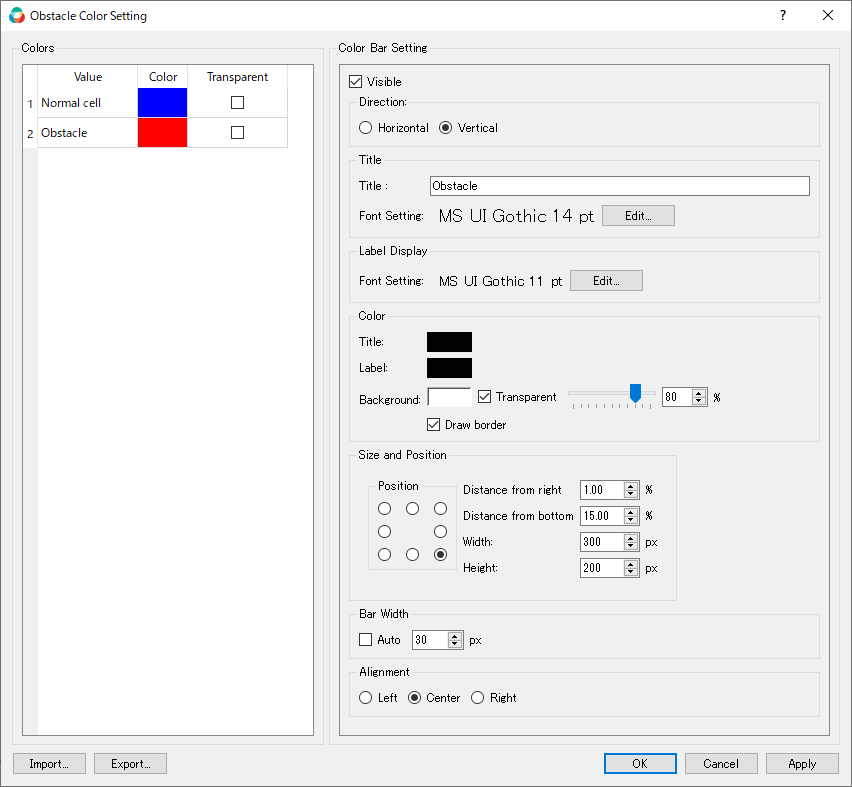
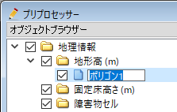

.. _sec_geo_common_functions:

Common functions
================

The functions available commonly for all types of [Geographic Data] are
explained in the following sections.

.. _sec_geo_common_color_setting:

[Color Setting]
---------------

**Description**: Edits the colormap for each type of geographic data.

When you select [Color Setting], the [Color Setting] dialog will open.
Change the setting and click on [OK].
The content of the dialog varies depending on whether the geographic information is a real or integer(selected from multiple candidate values).

.. _sec_geo_common_color_setting_real:

For Real Values
~~~~~~~~~~~~~~~~~~~

The dialog shown in :numref:`image_geo_color_setting_dialog_real` will appear.

.. _image_geo_color_setting_dialog_real:

.. figure:: images/color_setting_dialog_real.png
   :width: 440pt

   The [Color Setting] dialog

.. _sec_geo_common_color_setting_int:

For Integer Values
~~~~~~~~~~~~~~~~~~~

The dialog shown in :numref:`image_color_setting_dialog_int` will appear.

.. _image_color_setting_dialog_int:

   The [Color Setting] dialog

.. note:: 
   In iRIC ver4, geographic data added in the preprocessor window can also be viewed in the Post-processing window. The main specifications of the color settings are as follows.

   - The color settings for geographic information in the Post-processing window are inherited from the settings in the preprocessor window at the time the Post-processing window is opened.
   - If the Post-processing window is already opened, color settings for post-processing window will not be changed even if the color settings are changed in the preprocessor window.
   - When changing the color settings in the post-processing window, the color settings for preprocessor window will not be changed.

[Edit Name] (N)
---------------

**Description**: Edits the name of [Geographic Data].

Select the geographic data in [Object Browser] that you want edit name,
and perform the following:

**Menu bar:** [Geographic Data] (E) --> (Type of geographic data selected) -->
[Edit Name] (N)

[Object Browser] changes and now you can edit the name of the selected
geographic data (:numref:`image_object_browser_name_edit`).
Input the new name and press Enter key.

.. _image_object_browser_name_edit:

   The [Object Browser] while the name of [Geographic Data] is being edited

[Delete] (D)
------------

**Description**: Deletes geographic data.

Select the geographic data in [Object Browser] you want to delete, and
perform the following:

**Menu bar**: [Geographic Data] (E) --> (Type of geographic data selected) --> [Delete] (D)

The [Delete item] dialog (:numref:`image_delete_item_dialog_for_pre`) will open.
Select [Yes].

.. _image_delete_item_dialog_for_pre:

.. figure:: images/delete_item_dialog_for_pre.png
   :width: 180pt

   The [Delete item] dialog

[Import] (I)
------------

**Description**: Imports [Geographic Data].

The function of this item is the same to [Geographic Data] under
[Import] menu under [File] menu. Refer to :ref:`sec_file_import_geo_data`.

[Export] (E)
----------------

**Description**: Exports geographic data.

The function of this item is the same to [Geographic Data] under
[Export] menu under [File] menu. Refer to :ref:`sec_file_export_geo_data`

[Delete Selected] (S)
-------------------------

**Description**: Deletes multiple geographic data at once.

In [Object Browser], select the geographic data group that contains the
data you want to delete, and perform the following:

(Selected geograhic data) --> Right-clicking menu --> [Delete Selected] (S)

The [Delete selected geographic data] dialog
(:numref:`image_delete_selected_item_dialog`) will open. Check on the 
items that you want to delete, and click on [OK] button.

.. _image_delete_selected_item_dialog:

.. figure:: images/delete_selected_item_dialog.png
   :width: 220pt

   The [Delete Selected item] dialog

[Delete All] (A)
----------------

**Description**: Deletes all geographic data in the group.

Select the geographic data (including more than 2 items) in [Object
Browser] you want to delete, and perform the following:

**Menu bar**: [Geographic Data] (E) --> [Delete All] (A)

The [Delete All item] dialog (:numref:`image_delete_all_item_dialog`)
will open. Select [Yes].

.. _image_delete_all_item_dialog:

.. figure:: images/delete_all_item_dialog.png
   :width: 280pt

   The [Delete All item] dialog

[Export All Polygons]
-----------------------

**Description**: Exports geographic data (including more than 2 polygons).

Select the geographic data (including more than 2 items) in [Object
Browser] you want to export, and perform the following:

**Menu bar**: [Geographic Data] (E) --> [Export All Polygons]

The [Export Polygons] dialog (:numref:`image_export_polygons_dialog`) will open.
Input file name and click on [Save].

.. _image_export_polygons_dialog:

.. figure:: images/export_polygons_dialog.png
   :width: 380pt

   The [Export Polygons] dialog
