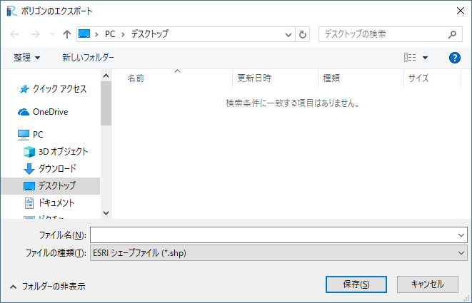

.. _sec_geo_common_functions:

Common functions
================

The functions available commonly for all types of [Geographic Data] are
explained in the following sections.

.. _sec_geo_common_color_setting:

[Color Setting]
---------------

**Description**: Edits the colormap for each type of geographic data.

When you select [Color Setting], the [Color Setting] dialog
(:numref:`image_color_setting_dialog1` or
:numref:`image_color_setting_dialog2`) will open.
Change the setting and click on [OK].

.. _image_color_setting_dialog1:

.. figure:: images/color_setting_dialog1.png

   The [Color Setting] dialog

.. _image_color_setting_dialog2:

.. figure:: images/color_setting_dialog2.png

   The [Color Setting] dialog

When you select [Custom] as [Colormap] value in the dialog shown in
:numref:`image_color_setting_dialog1`, and click on [Setting] button,
the dialog in :numref:`image_custom_color_map_dialog` is shown.
You can specify color maps of the three types below:

- Two Colors: Specify the colors at the minimum value and the maximum value
- Three Colors: Specify the colors at the minimum value, maximum value,
  and the medium value and the color at medium value.
- Arbitrary: Specify arbitrary number of values and the colors at those values

.. _image_custom_color_map_dialog:

.. figure:: images/custom_color_map_dialog.png

   The [Custom Color Map] dialog

[Edit Name] (N)
---------------

**Description**: Edits the name of [Geographic Data].

Select the geographic data in [Object Browser] that you want edit name,
and perform the following:

**Menu bar:** [Geographic Data] (E) --> (Type of geographic data selected) -->
[Edit Name] (N)

[Object Browser] changes and now you can edit the name of the selected
geographic data (:numref:`image_object_browser_name_edit`).
Input the new name and press Enter key.

.. _image_object_browser_name_edit:

.. figure:: images/object_browser_name_edit.png

   The [Object Browser] while the name of [Geographic Data] is being edited

[Delete] (D)
------------

**Description**: Deletes geographic data.

Select the geographic data in [Object Browser] you want to delete, and
perform the following:

**Menu bar**: [Geographic Data] (E) --> (Type of geographic data selected) --> [Delete] (D)

The [Delete item] dialog (:numref:`image_delete_item_dialog_for_pre`) will open.
Select [Yes].

.. _image_delete_item_dialog_for_pre:

.. figure:: images/delete_item_dialog_for_pre.png

   The [Delete item] dialog

[Import] (I)
------------

**Description**: Imports [Geographic Data].

The function of this item is the same to [Geographic Data] under
[Import] menu under [File] menu. Refer to :ref:`sec_file_import_geo_data`.

[Export] (E)
----------------

**Description**: Exports geographic data.

The function of this item is the same to [Geographic Data] under
[Export] menu under [File] menu. Refer to :ref:`sec_file_export_geo_data`

[Delete All] (A)
----------------

**Description**: Deletes geographic data (including more than 2 items).

Select the geographic data (including more than 2 items) in [Object
Browser] you want to delete, and perform the following:

**Menu bar**: [Geographic Data] (E) --> [Delete All] (A)

The [Delete All item] dialog (:numref:`image_delete_all_item_dialog`)
will open. Select [Yes].

.. _image_delete_all_item_dialog:

.. figure:: images/delete_all_item_dialog.png

   The [Delete All item] dialog

[Export All Polygons]
-----------------------

**Description**: Exports geographic data (including more than 2 polygons).

Select the geographic data (including more than 2 items) in [Object
Browser] you want to export, and perform the following:

**Menu bar**: [Geographic Data] (E) --> [Export All Polygons]

The [Export Polygons] dialog (:numref:`image_export_polygons_dialog`) will open.
Input file name and click on [Save].

.. _image_export_polygons_dialog:

   The [Export Polygons] dialog
