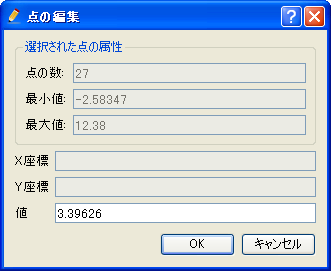
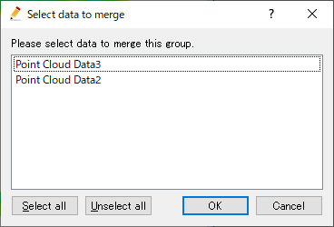
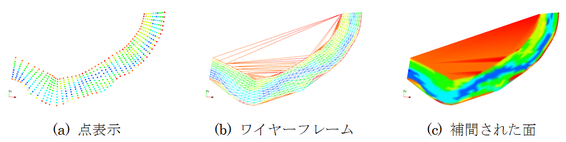

.. _sec_pointset_data:

点群データ編集機能
===================

点群データは、点の座標と、その点での地理情報の値の集合からなるデータです。

点群データの表示例を :numref:`image_example_pointset_data` に示します。

.. _image_example_pointset_data:

   点群データ表示例

メニュー構成
--------------

点群データ編集機能に関連するメニューは、プリプロセッサーがアクティブで、
オブジェクトブラウザーで点群データが選択されていた時、
以下からアクセスできます。

**メニュー**: 地理情報 (E) --> 点群データ (O)

点群データ 以下のサブメニューの構成を
:numref:`geo_pointset_menuitems_table` に示します。

.. _geo_pointset_menuitems_table:

.. list-table:: 点群データメニューの構成
   :header-rows: 1

   * - メニュー
     - 説明
   * - 名前の編集 (N)
     - オブジェクトブラウザー上に表示される名前を編集します
   * - ポリゴン領域で点を選択 (P)
     - ポリゴン領域を指定し、その内側にある点を選択します
   * - 選択された点の編集 (E)
     - 選択中の点の値を編集します
   * - 選択された点のエクスポート (X)
     - 選択中の点の点群データをエクスポートします
   * - 新しい点の追加 (A)
     - 点群データに新しい点を追加します
   * - 点の補間追加 (I)
     - 既存の点に対する補間点を追加します
   * - 選択された点の削除 (O)
     - 選択中の点を削除します
   * - 選択された点のうち、指定した値以下の点を削除 (L)
     - 選択中の点のうち、指定した値以下の点を削除します
   * - 選択された点のうち、指定した値以上の点を削除 (G)
     - 選択中の点のうち、指定した値以上の点を削除します
   * - 分割線の追加 (B)
     - 分割線を追加します
   * - 分割線の削除 (R)
     - 分割線を削除します
   * - 全分割線の削除 (O)
     - すべての分割線を削除します
   * - TINの再生成 (T)
     - TINを再生成します
   * - マージ
     - 他の点群データをこのデータにマージします
   * - 長い辺を持つ三角形を削除 (W)
     - 長い辺を持つ三角形を削除します
   * - 表示設定 (S)
     - 点群データの表示方法を設定します
   * - 削除 (D)
     - 点群データを削除します

ポリゴン領域で点を選択(P)
-------------------------

ポリゴン領域を指定し、その内側にある点を選択します。

まず、描画領域で、左クリックによってポリゴンの頂点を順に指定します。
最後にダブルクリックするか、改行キーを押すと、
指定したポリゴンの内側にある点が選択されます。
操作中の表示例を :numref:`image_pre_window_defining_poly_region`
に、選択後の表示例を :numref:`image_pre_window_after_sel_poly_region`
に示します。

.. _image_pre_window_defining_poly_region:

.. figure:: images/pre_window_defining_poly_region.png
   :width: 300pt

   ポリゴン領域で点を選択中の表示例

.. _image_pre_window_after_sel_poly_region:

.. figure:: images/pre_window_after_sel_poly_region.png
   :width: 300pt

   ポリゴン領域で点を選択後の表示例

なお、通常時の点の選択は、左ドラッグで矩形領域を指定することにより行います。

選択された点の編集 (E)
--------------------------

現在選択している点の値を編集します。

点の編集ダイアログ (:numref:`image_pre_edit_points_dialog` 参照)
が表示されますので、新しい値を入力して「OK」ボタンを押します。

.. _image_pre_edit_points_dialog:

   選択された点の編集ダイアログ

選択された点のエクスポート (X)
------------------------------

点群データのうち、選択中の点をエクスポートします。

エクスポートするファイル名を指定するダイアログ
(:numref:`image_pointset_select_file_to_export_dialog` 参照)
が表示されますので、エクスポートするファイルを指定して「保存」ボタンを押します。
すると、指定したファイルに選択中の点の点群データがエクスポートされます。

.. _image_pointset_select_file_to_export_dialog:

.. figure:: images/pointset_select_file_to_export_dialog.png
   :width: 380pt

   エクスポートするファイル名の選択ダイアログ

新しい点の追加 (A)
------------------

点群データに新しい点を追加します。

まず、既に存在する点を選択します。
この点の値が、新しく追加する点のデフォルト値になります。
次に、新しく点を追加したい場所をクリックしていきます。
最後にダブルクリックするか、リターンキーを押すと、
:numref:`image_pointset_add_points_dialog`
で示すダイアログが表示されますので、「OK」ボタンを押します。

点の追加操作中の表示例を
:numref:`image_example_adding_new_points` に示します。

.. _image_pointset_add_points_dialog:

.. figure:: images/pointset_add_points_dialog.png
   :width: 160pt

   点の追加ダイアログ

.. _image_example_adding_new_points:

   点の追加操作 表示例

点の補間追加 (I)
----------------

既に存在する点を複数選択し、それらの補間点を追加します。

既存の点を複数選択し、最後にダブルクリックするか、リターンキーを押すと、
:numref:`image_pointset_interpolate_settiing_dialog`
で示すダイアログが表示されます。条件を設定して「OK」ボタンを押すと、
補間点が追加されます。

操作例を :numref:`image_example_pointset_interpolate_points` に示します。

.. _image_pointset_interpolate_settiing_dialog:

.. figure:: images/pointset_interpolate_settiing_dialog.png
   :width: 200pt

   補間条件設定ダイアログ

.. _image_example_pointset_interpolate_points:

   点の補間追加 操作例

選択された点の削除 (O)
-----------------------

選択中の点を削除します。

操作例を
:numref:`image_example_pointset_delete_points`
に示します。

.. _image_example_pointset_delete_points:

.. figure:: images/example_pointset_delete_points.png
   :width: 220pt

   選択された点の削除 操作例

選択された点のうち、指定した値以下の点を削除 (L)
-------------------------------------------------

選択中の点のうち、指定した値以下の点を削除します。

:numref:`image_pointset_delete_points_dialog_less_than`
で示すダイアログが表示されますので、値を指定して、「OK」ボタンを押します。
操作例を :numref:`image_pointset_example_delete_points_less_than`
に示します。

.. _image_pointset_delete_points_dialog_less_than:

   選択された点のうち、指定した値以下の点を削除ダイアログ

.. _image_pointset_example_delete_points_less_than:

   選択された点のうち、指定した値以下の点を削除 操作例

選択された点のうち、指定した値以上の点を削除 (G)
---------------------------------------------------

現在選択している点のうち、指定した値以上の点を削除します。

:numref:`image_pointset_delete_points_dialog_greater_than`
で示すダイアログが表示されますので、値を指定して、「OK」ボタンを押します。操作例を
:numref:`image_pointset_example_delete_points_greater_than`
に示します。

.. _image_pointset_delete_points_dialog_greater_than:

.. figure:: images/pointset_delete_points_dialog_greater_than.png
   :width: 200pt

   選択された点のうち、指定した値以上の点を削除ダイアログ

.. _image_pointset_example_delete_points_greater_than:

   選択された点のうち、指定した値以上の点を削除 操作例

分割線の追加 (B)
--------------------

分割線を追加します。

分割線が通る点を順にクリックし、
最後にダブルクリックするか、リターンキーを押すと、分割線が追加されます。

TINを再生成すると、分割線がTINの境界線になるように再生成されます。
分割線の表示例を
:numref:`image_pointset_example_tin_boundarys_after_add_breakline`
に示します。

.. _image_pointset_example_tin_boundarys_after_add_breakline:

.. figure:: images/pointset_example_tin_boundarys_after_add_breakline.png
   :width: 300pt

   分割線 表示例

分割線の削除 (R)
------------------

分割線を削除します。

削除したい分割線をクリックすると、本当に削除するか確認するダイアログ
(:numref:`image_pointset_remove_breakline_warning_dialog` 参照)
が表示されますので、「はい(Y)」ボタンを押します。

.. _image_pointset_remove_breakline_warning_dialog:

.. figure:: images/pointset_remove_breakline_warning_dialog.png
   :width: 170pt

   分割線の削除ダイアログ

全分割線の削除 (O)
------------------

全ての分割線を削除します。

本当に削除するか確認するダイアログ
(:numref:`image_pointset_remove_all_breaklines_warning_dialog` 参照)
が表示されますので、「はい(Y)」ボタンを押します。

.. _image_pointset_remove_all_breaklines_warning_dialog:

   全分割線の削除ダイアログ

TINの再生成 (T)
-----------------

分割線や点の追加・削除を反映したTINを再生成します。

分割線を設定している場合、分割線がTINの境界線になるように再生成されます。
操作例を :numref:`image_pointset_example_remesh_tin`
に示します。

.. _image_pointset_example_remesh_tin:

   TINの再生成 操作例

長い辺を持つ三角形を削除 (W)
------------------------------

TINから、長い辺を持つ三角形を削除します。

TIN を生成する時、点がない領域について、長い辺を持つ三角形が生成される
ことがあります。この機能を使うことで、そのような三角形を削除できます。

:numref:`image_pointset_removetri_dialog` に示すダイアログが表示されます。
しきい値とする辺の長さを指定し、「適用」ボタンを押します。

しきい値の長さ以上を持つ三角形が灰色で塗られて表示されるので、必要に応じて
辺の長さを調整してから、「OK」ボタンを押します。

本機能を用いて三角形を削除する前の点群データの表示例を
:numref:`image_pointset_removetri_before` に、「適用」ボタンを
押した時の表示例を :numref:`image_pointset_removetri_apply`
に、「OK」ボタンを押して三角形を削除した後の点群データの表示例を
:numref:`image_pointset_removetri_after` にそれぞれ示します。

.. _image_pointset_removetri_dialog:

   長い辺を持つ三角形の削除 ダイアログ

.. _image_pointset_removetri_before:

   三角形を削除する前の点群データの例

.. _image_pointset_removetri_apply:

   「適用」ボタンを押した時の表示例

.. _image_pointset_removetri_after:

   三角形を削除した後の点群データの例

マージ
-------

他の点群データをこのデータにマージします。

:numref:`image_pointset_merge_dialog` に示すダイアログが表示されます。
このデータにマージしたい点群データを選択し、「OK」ボタンを押すと、
点群データがマージされ、TIN の再生成が行われます。

隣り合った領域の点群データをそれぞれ別のデータとしてインポートした場合、
格子にマッピングした時、点群データ同士の境界にうまくマッピングできない格子点・セル
が生じる場合があります。その場合、この機能を使って点群データをマージして一つに
することで、問題が解消します。

.. _image_pointset_merge_dialog:

   マージするデータの選択ダイアログ

表示設定 (S)
-------------

点群データの表示方法を切り替えます。

TINの表示方法には、点、ワイヤーフレーム、補間された面の3種類があります。表示例を
:numref:`image_pointset_display_methods`
に示します。

.. _image_pointset_display_methods:

   点群データ 表示方法ごとの表示例

表示設定ダイアログ
(:numref:`image_pointset_display_setting_dialog` 参照)
が表示されます。「表示方法」で選択した方法で点群データが表示されます。

.. _image_pointset_display_setting_dialog:

   点群データ 表示設定ダイアログ

.. note:: 
   iRIC ver4からはプリプロセッサーウィンドウで追加した地理情報は可視化ウィンドウでも確認ができるようになっています。主な仕様は以下です。

   表示設定について

   - 可視化ウィンドウでの地理情報の表示設定は、可視化ウィンドウを開いた時点でのプリプロセッサーウィンドウで設定していたものが引き継がれます。
   - 既に開かれている可視化ウィンドウでの表示設定は、プリプロセッサーウィンドウで表示設定を変更しても変更されません。
   - 可視化ウィンドウで表示設定を変更してもプリプロセッサーウィンドウでの表示設定には影響しません。

   地理情報の値、座標等について
   
   - 可視化ウィンドウ上からは地理情報の編集はできません。
   - プリプロセッサーウィンドウで地理情報を編集(値の変更、位置の変更)した場合、可視化ウィンドウにも反映されます。