.. _sec_riv_data:

河川測量データ編集機能
===========================

河川測量データは、河川での横断測量データに基づいた地理情報です。
通常、河川とその周辺での標高情報を取り扱うために利用します。

河川測量データの表示例を :numref:`image_riv_data` に示します。

.. _image_riv_data:

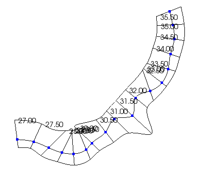

   河川測量データ

メニュー構成
--------------

河川測量データ編集機能に関連するメニューは、プリプロセッサーがアクティブで、
オブジェクトブラウザーで河川測量データが選択されていた時、以下からアクセスできます。

**メニュー：** --> 地理情報 (E) --> 河川測量データ (R)

河川測量データ (R) 以下のサブメニューの構成を
:numref:`geo_river_data_menuitems_table` に示します。

.. _geo_river_data_menuitems_table:

.. list-table:: 河川測量データメニューの構成
   :header-rows: 1

   * - メニュー
     - 説明
   * - 名前の編集 (N)
     - オブジェクトブラウザー上に表示される名前を編集します
   * - 横断面の表示 (C)
     - 河川横断面ウィンドウを新しく開きます
   * - 上流側に挿入 (B)
     - 上流側に、新しい河川横断線を挿入します
   * - 下流側に挿入 (A)
     - 下流側に、新しい河川横断線を挿入します
   * - 移動 (M)
     - 河川横断線を移動します
   * - 回転 (R)
     - 河川横断線を回転します
   * - 中心点のシフト (H)
     - 河川横断線の中心点をシフトします
   * - 左右への伸縮 (X)
     - 河川横断線を左右に伸縮します
   * - 横断線の削除 (T)
     - 河川横断線を削除します
   * - 横断線の名前の変更 (E)
     - 河川横断線の名前を変更します
   * - 左岸延長線追加 (K)
     - 河川横断線に、左岸延長線を追加します
   * - 右岸延長線追加 (I)
     - 河川横断線に、右岸延長線を追加します
   * - 左岸延長線削除 (L)
     - 河川横断線から、左岸延長線を削除します
   * - 右岸延長線削除 (J)
     - 河川横断線から、右岸延長線を削除します
   * - 表示設定 (S)
     - 河川測量データの背景色、断面形状を設定します
   * - 削除 (D)
     - 河川測量データを削除します
   * - 補間モード
     - 横断線間の補間モードを切り替えます

河川横断線の選択操作
---------------------

この節以降で説明する操作は、表示設定及び削除を除いて、
河川横断線の選択を行ってから行います。
ここでは、河川横断線の選択操作の方法について説明します。

河川横断線の選択は、描画領域での左ドラッグ操作によって行います。

描画領域で左ドラッグを開始すると、
:numref:`image_pre_window_left_dragging`
に示すように黒い四角が表示されます。左ボタンを離してドラッグを完了すると、
:numref:`image_pre_window_select_river_lines` に示すように、
黒い四角の中に河川中心点 (青い点)
が含まれていた河川横断線がすべて選択されます。
選択された横断線は、太い黒線で表示されます。

.. _image_pre_window_left_dragging:

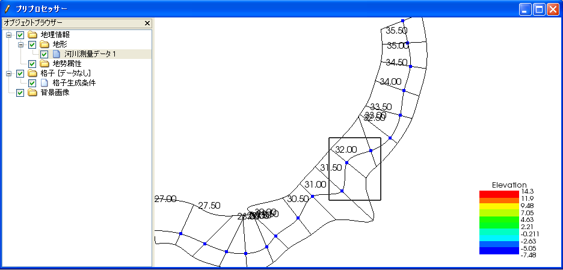

   ドラッグ中のプリプロセッサーの表示例

.. _image_pre_window_select_river_lines:

.. figure:: images/pre_window_select_river_lines.png

   ドラッグ完了時のプリプロセッサーの表示例

横断面の表示 (C)
------------------

横断面ウィンドウを表示します。

この操作は、横断面ウィンドウを表示したい河川横断線を選択してから行います。

表示される河川横断面ウィンドウの表示例を :numref:`image_xsec_window`
に示します。

.. _image_xsec_window:

.. figure:: images/xsec_window.png

   河川横断面ウィンドウ

なお、河川横断面ウィンドウでの操作については
:ref:`sec_pre_riv_crosssection_window`
を参照してください。

上流側に挿入(B) / 下流側に挿入(A)
---------------------------------

選択した河川横断線の上流側 (もしくは下流側)
に新たな河川横断線を挿入します。

河川横断線を1つ選択している時のみ可能です。

河川横断線の挿入ダイアログ (:numref:`image_riv_insert_line_dialog` 参照)
が表示されるので、河川中心点座標と断面情報を設定して「OK」ボタンを押します。

-  河川中心点座標：

  -  「マウスクリック」を選択した時は、描画領域でのクリックで座標を指定します。
  -  「座標値」を選択した時は、テキストボックスで座標を指定します。
  -  「前後との比率」を選択した時は、比率を 0 ～ 1
     の間で指定することで、前後の点を滑らかにつないだスプライン曲線上に中心点を配置します。

-  断面情報の設定：

  -  「標高 0 の点を3つ定義」を選択した時は、適当な幅となるように、
      中心点、左岸、右岸の3点からなる断面情報を設定します。

  -  「次の河川横断線の情報をコピー」を選択した時は、コンボボックスで指定した
     横断線の断面情報をコピーします。

  -  「前後の横断面を元に構成」を選択した時は、前後の横断線の断面データから補間して
     断面データを生成します。

.. _image_riv_insert_line_dialog:

.. figure:: images/riv_insert_line_dialog.png

   横断線の挿入ダイアログ

移動 (M)
----------

選択した河川横断線を移動します。例を
:numref:`image_exampleriv_move_line` に示します。

複数の河川横断線について、同時に行えます。

.. _image_exampleriv_move_line:

.. figure:: images/exampleriv_move_line.png

   河川横断線の移動操作例

横断線の移動ダイアログ (:numref:`image_riv_move_line_dialog` 参照)
が表示されますので、新しい中心点座標もしくは移動量を指定して「OK」ボタンを押します。

.. _image_riv_move_line_dialog:

.. figure:: images/riv_move_line_dialog.png

   横断線の移動ダイアログ

なお、河川横断線の移動は、描画領域でのマウス操作によっても行えます。
選択した河川横断線の河川中心点付近にマウスカーソルを移動すると、
マウスカーソルが
:numref:`image_cursor_move_riv_line`
で示したものに変化します。この状態で左ドラッグすると選択した河川横断線を移動できます。

.. _image_cursor_move_riv_line:

.. figure:: images/cursor_move_riv_line.png

   横断線の移動時のマウスカーソル

回転 (R)
---------

選択した河川横断線を回転します。

河川横断線を1つ選択した時のみ行えます。例を
:numref:`image_example_riv_rotate_line` に示します。

.. _image_example_riv_rotate_line:

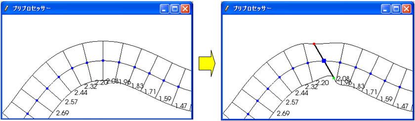

   河川横断線の回転操作例

横断線の回転ダイアログ (:numref:`image_riv_rotate_line_dialog` 参照)
が表示されるので、河川中心線となす角または角度の変化量を指定して
「OK」ボタンを押します。(反時計回りを正。単位は弧度法)

なお、河川横断線の回転は、描画領域でのマウス操作によっても行えます。
選択した河川横断線の左岸(または右岸) にマウスカーソルを移動すると、
マウスカーソルが :numref:`image_cursor_rotate_riv_line`
で示したものに変化します。この状態で左ドラッグすると、
選択した河川横断線を回転できます。

.. _image_riv_rotate_line_dialog:

.. figure:: images/riv_rotate_line_dialog.png

   横断線の回転ダイアログ

.. _image_cursor_rotate_riv_line:

.. figure:: images/cursor_rotate_riv_line.png

   横断線の回転時のマウスカーソル

中心点のシフト(H)
-------------------

選択した河川横断線の中心点を、左岸側もしくは右岸側にシフトします。
この操作では中心点の位置がシフトするだけで、断面情報は変化しません。
例を
:numref:`image_example_riv_shift_center` に示します。

複数の河川横断線について、同時に行えます。

.. _image_example_riv_shift_center:

.. figure:: images/example_riv_shift_center.png

   中心点のシフト操作例

河川中心点のシフトダイアログ (図 4‑23 参照)
が表示されるので、移動量を指定して「OK」ボタンを押します。

なお、河川中心線のシフト、描画領域でのマウス操作によっても行えます。
シフトキーを押しながら選択した河川横断線の中心点にマウスカーソルを移動すると、
マウスカーソルが
:numref:`image_cursor_shift_riv_center`
で示したものに変化します。この状態で左ドラッグすると、
選択した河川横断線の中心点をシフトできます。

河川中心点のシフトダイアログ (:numref:`image_shift_river_center_dialog` 参照)
が表示されるので、移動量を指定して「OK」ボタンを押します。

.. _image_shift_river_center_dialog:

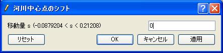

   河川中心点のシフトダイアログ

.. _image_cursor_shift_riv_center:

.. figure:: images/cursor_shift_riv_center.png

   河川中心点のシフト時のマウスカーソル

左右への伸縮 (X)
------------------

選択した河川横断線を、左右に伸縮します。例を
:numref:`image_example_extend_riv_line` に示します。

複数の河川横断線について、同時に行えます。

.. _image_example_extend_riv_line:

.. figure:: images/example_extend_riv_line.png

   河川横断線の左右への伸縮操作例

河川横断線の伸縮ダイアログ (図 4‑26 参照)
が表示されますので、中心点と左岸間の距離、増分、伸縮率の
いずれかを指定して「OK」ボタンを押します。

.. _image_extend_riv_line_dialog:

.. figure:: images/extend_riv_line_dialog.png

   河川横断線の伸縮ダイアログ

横断線の削除 (T)
-----------------

選択した河川横断線を削除します。例を
:numref:`image_example_del_riv_line` に示します。

複数の河川横断線について、同時に行えます。

.. _image_example_del_riv_line:

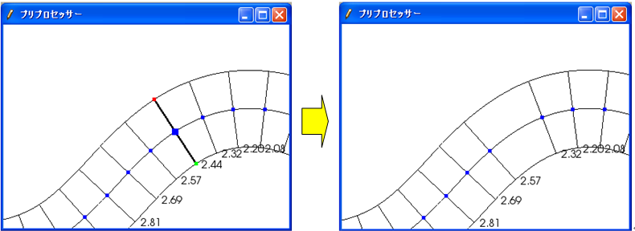

   河川横断線の削除操作例

横断線の名前の変更 (E)
------------------------

選択した河川横断線の名前を変更します。

河川横断線を1つ選択した時のみ行えます。

横断線の名前変更ダイアログ (:numref:`image_rename_riv_line_dialog` 参照)
が表示されますので、新しい名前を入力して「OK」ボタンを押します。

.. _image_rename_riv_line_dialog:

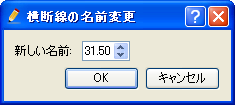

   横断線の名前変更ダイアログ

左岸延長線追加 (K) / 右岸延長線追加 (I)
---------------------------------------

選択した河川横断線に、左岸延長線 (もしくは右岸延長線) を追加します。例を
:numref:`image_example_adding_riv_extension_line` に示します。

河川横断線を1つ選択した時のみ行えます。

.. _image_example_adding_riv_extension_line:

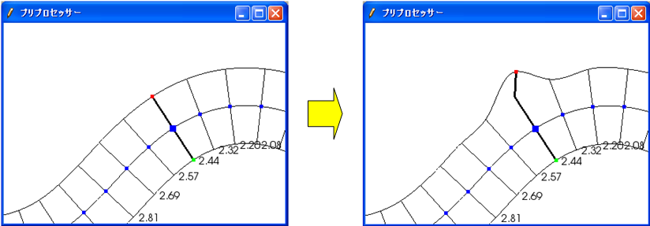

   左岸延長線追加 操作例

延長線の追加ダイアログ (:numref:`image_riv_add_extension_line_dialog` 参照)
が表示されます。「マウスクリック」を選択した時は描画領域でのマウスクリックで、
「座標」を選択した時はテキストボックスで延長線の端点の座標を指定して、
「OK」ボタンを押します。

.. _image_riv_add_extension_line_dialog:

.. figure:: images/riv_add_extension_line_dialog.png

   左岸延長線 (もしくは右岸延長線) 追加ダイアログ

左岸延長線削除(L) / 右岸延長線削除(J)
-------------------------------------

選択した河川横断線の左岸延長線 (もしくは右岸延長線) を削除します。例を
:numref:`image_example_del_extension_line` に示します。

河川横断線を1つ選択した時のみ行えます。また、左岸延長線
(もしくは右岸延長線) を追加した横断線に対してのみ行えます。

.. _image_example_del_extension_line:

.. figure:: images/example_del_extension_line.png

   左岸延長線削除 操作例

表示設定 (S)
--------------

背景色、断面形状の表示を設定します。例を
:numref:`image_example_riv_disp_setting` に示します。

.. _image_example_riv_disp_setting:

.. figure:: images/example_riv_disp_setting.png

   背景色、断面形状の表示 操作例

表示設定ダイアログ (:numref:`image_riv_display_setting_dialog` 参照)
が表示されます。背景色で「表示」をチェックすると、
標高に従って背景色が表示されます。「半透明」をチェックし、
数値を調整することで、カラーマップ表示を半透明にすることができます。
断面形状で「表示」をチェックすると、各河川横断線に断面形状のグラフが表示されます。

.. _image_riv_display_setting_dialog:

.. figure:: images/riv_display_setting_dialog.png

   表示設定ダイアログ

補間モード
------------

補間モード（スプライン補間、線形補間）を設定します。

スプライン補間に設定した場合の表示例を
:numref:`image_example_riv_interpolation_mode_spline`
に、線形補間に設定した場合の表示例を
:numref:`image_example_riv_interpolation_mode_linear`
に示します。

.. _image_example_riv_interpolation_mode_spline:

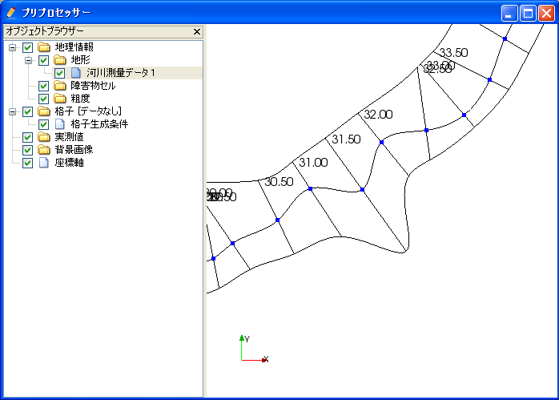

   補間モード (スプライン補間)

.. _image_example_riv_interpolation_mode_linear:

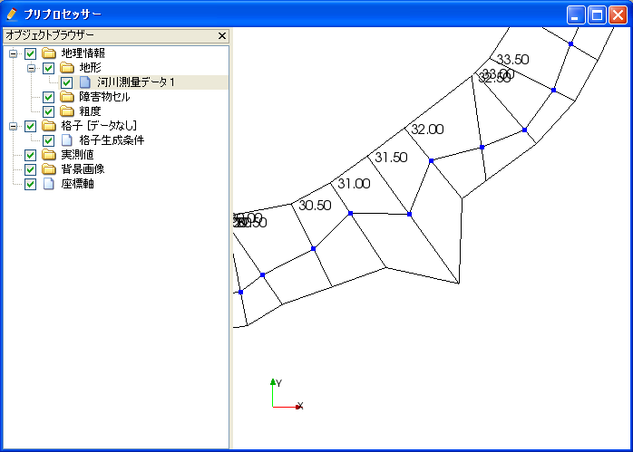

   補間モード (線形補間)

.. _sec_pre_riv_crosssection_window:

河川横断面ウィンドウでの操作
-------------------------------

河川横断面ウィンドウは、河川横断線の横断面を表示し、
標高情報を編集するための画面です。
河川横断面ウィンドウの表示例を
:numref:`image_example_riv_xsec_window`
に示します。

.. _image_example_riv_xsec_window:

.. figure:: images/example_riv_xsec_window.png

   河川横断面ウィンドウ

メニュー構成
~~~~~~~~~~~~~~~

河川横断面ウィンドウ固有のメニュー構成を、
:numref:`geo_river_data_xsec_window_menuitems_table`
に示します。
:numref:`geo_river_data_xsec_window_menuitems_table`
に示すメニューは、河川横断面ウィンドウがアクティブな時、
「インポート」メニューと「計算」メニューの間に表示されます。

.. _geo_river_data_xsec_window_menuitems_table:

.. list-table:: 河川横断面ウィンドウ固有のメニューの構成
   :header-rows: 1

   * - メニュー
     -
     - 説明
   * - 標高点 (A)
     - 有効化 (A)
     - 選択した標高点を有効にします
   * -
     - 無効化 (I)
     - 選択した標高点を無効にします
   * -
     - 移動 (M)
     - 選択した標高点を移動します
   * -
     - 削除 (D)
     - 選択した標高点を削除します

有効化(A)
~~~~~~~~~~~

選択した標高点を有効にします。操作例を
:numref:`image_example_activating_xsec_point` に示します。

.. _image_example_activating_xsec_point:

.. figure:: images/example_activating_xsec_point.png

   標高点の有効化 操作例

無効化 (I)
~~~~~~~~~~~

選択した標高点を無効にします。操作例を
:numref:`image_example_inactivating_xsec_point`
に示します。

.. _image_example_inactivating_xsec_point:

.. figure:: images/example_inactivating_xsec_point.png

   標高点の無効化 操作例

水位に基づいて無効化
~~~~~~~~~~~~~~~~~~~~~

河川中心点から左岸、右岸方向に見て、初めて水位を超えた点から先の
標高点を無効にします。操作例を
:numref:`image_example_inactivating_xsec_point_with_wse`
に示します。

.. _image_example_inactivating_xsec_point_with_wse:

.. figure:: images/example_inactivating_xsec_point_with_wse.png

   水位に基づいて無効化 操作例

移動 (M)
~~~~~~~~~

選択した標高点を移動します。操作例を
:numref:`image_example_moving_xsec_point`
に示します。

標高点の移動ダイアログ
(:numref:`image_move_elevation_point_dialog` 参照)
が表示されますので、移動量を入力して「OK」ボタンを押します。

.. _image_example_moving_xsec_point:

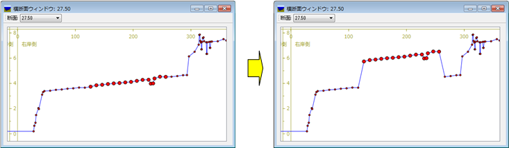

   標高点の移動 操作例

.. _image_move_elevation_point_dialog:

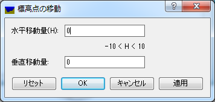

   標高点の移動ダイアログ

なお、標高点の移動はマウス操作によっても行えます。
選択した標高点の上にマウスカーソルを移動すると開いた
手の形のカーソルに変わりますので、左ドラッグで移動します。

削除 (D)
~~~~~~~~~~

選択した標高点を削除します。操作例を
:numref:`image_example_deleting_xsec_point` に示します。

.. _image_example_deleting_xsec_point:

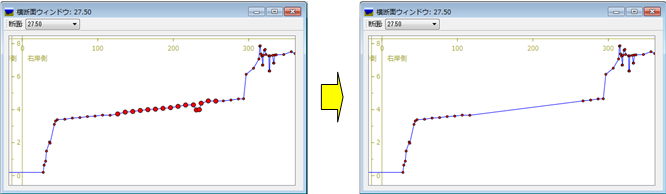

   標高点の削除 操作例
