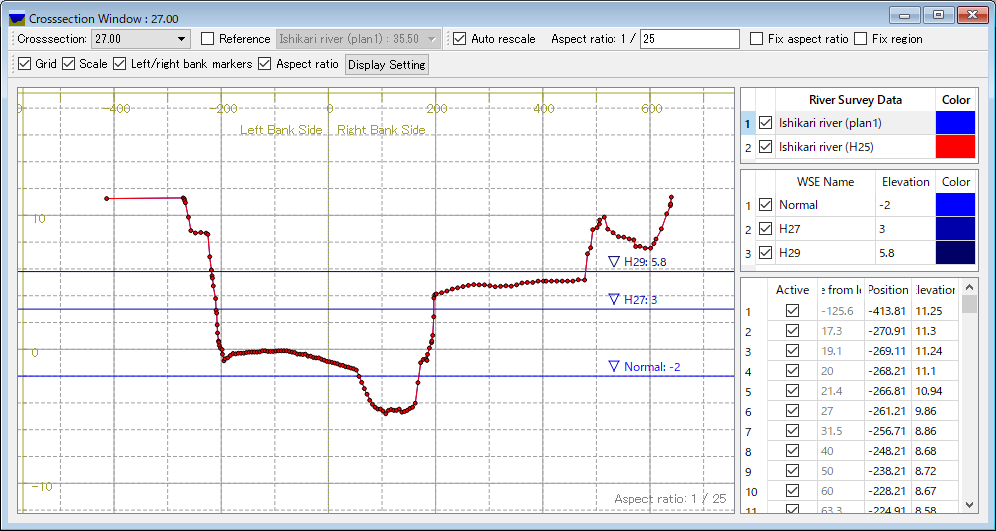
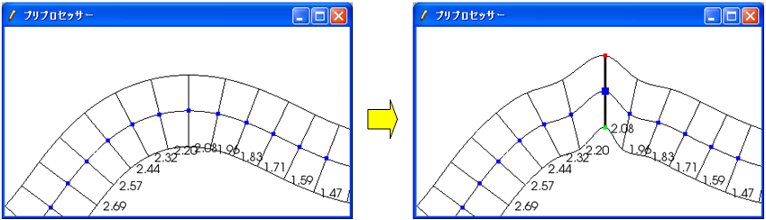
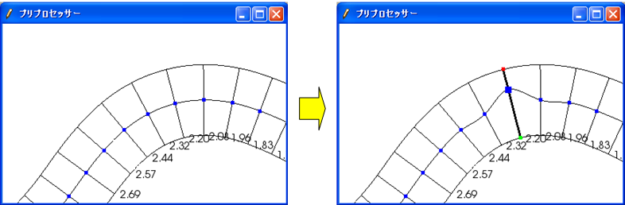
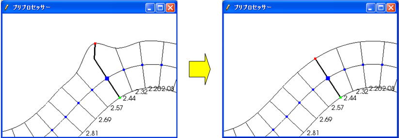
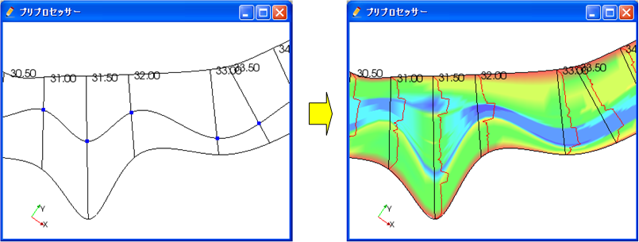
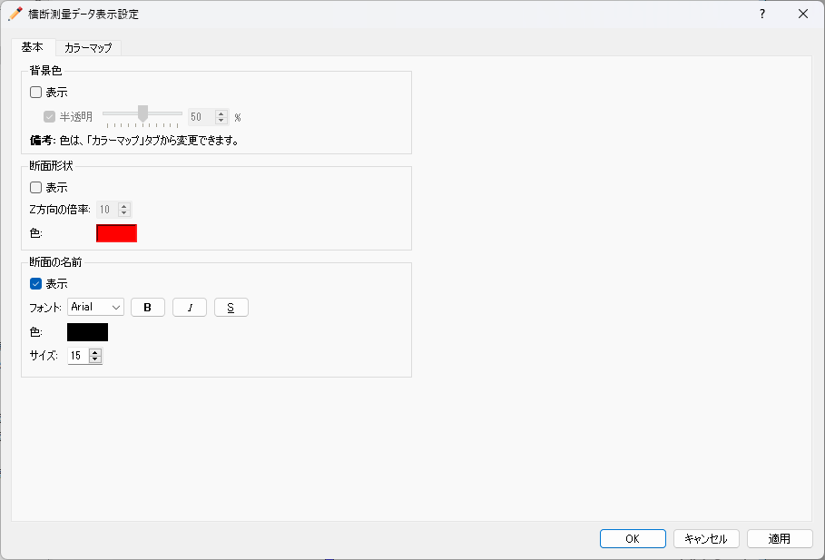
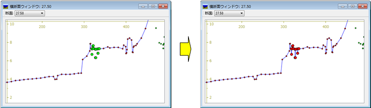
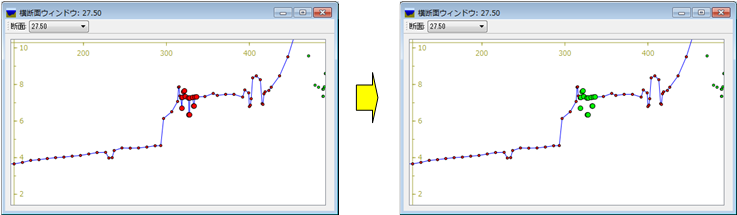
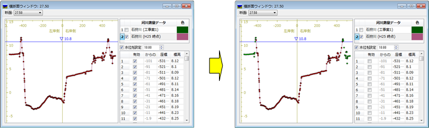
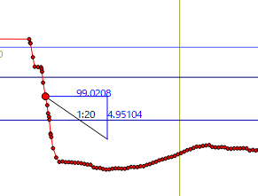

.. _sec_riv_data:

Editing [River Survey Data]
===========================

[River Survey Data] is a type of Geographic Data] that is based on
actual cross-sectional survey data of a river. Generally, [River Survey
Data] is used as the elevation information for a river and its environs.

:numref:`image_riv_data` shows an example of [River Survey Data].

.. _image_riv_data:

.. figure:: images/riv_data.png
   :width: 220pt

   [River Survey Data]

Menu items
----------

When the [Pre-processing Window] is active and [River Survey Data] is
selected in [Object Browser], you can access menu items related to
operations on [River Survey Data] under the following:

**Menu bar**: [Geographic Data] (E) --> [River Survey Data] (R)

:numref:`geo_river_data_menuitems_table` shows the menu items under
[River Survey Data] (R).

.. _geo_river_data_menuitems_table:

.. list-table:: The menu items under [River Survey Data] (R)
   :header-rows: 1

   * - Menu item
     - Description
   * - [Edit Name] (N)
     - Edits the name shown in [Object Browser].
   * - [Display Cross-section] (C)
     - Opens a new river cross-section window.
   * - [Insert Upstream Side] (B)
     - Inserts a new river transverse line on the upstream side.
   * - [Insert Downstream Side] (A)
     - Insert a new river transverse line on the downstream side.
   * - [Move] (M)
     - Moves the river transverse line.
   * - [Rotate] (R)
     - Rotates the river transverse line.
   * - [Shift Center] (H)
     - Shifts the center point of the transverse line.
   * - [Extend Horizontally] (X)
     - Extends or shortens the river traverse line to the left/right.
   * - [Delete Cross Section] (T)
     - Deletes the river transverse line.
   * - [Rename Cross Section] (E)
     - Renames the river transverse line.
   * - [Add Extension Line] (L)
     - Adds a left bank extension line to the river transverse line.
   * - [Add Extension Line] (R)
     - Adds a river bank extension line to the river transverse line.
   * - [Remove Left Bank Extension Line] (V)
     - Removes the left bank extension line from the river transverse line.
   * - [Remove Right Bank Extension Line] (O)
     - Removes the right bank extension line from the river transverse line.
   * - [Display Setting] (S)
     - Displays elevation colormap based on River Survey Data.
   * - [Delete] (D)
     - Deletes River Survey Data.
   * - [Interpolation Mode]
     - Switch interpolation mode between river transverse lines.

Selecting the river transverse line
-----------------------------------

The river transverse lines need to be selected prior to any operations
explained in the following sections, except for displaying elevation
colormap. In this section, the operation to select the river transverse
line is explained.

To select river transverse lines, left drag on the canvas to make a
rectangle (black line) (:numref:`image_pre_window_left_dragging`).
When you releasing the mouse left
button, the river transverse lines whose river center point (blue dot)
is in the rectangle (:numref:`image_pre_window_select_river_lines`) are
selected. The selected river
transverse lines are drawn with thicker line.

.. _image_pre_window_left_dragging:

.. figure:: images/pre_window_left_dragging.png
   :width: 400pt

   The [Pre-processing Window] when a user is left dragging

.. _image_pre_window_select_river_lines:

.. figure:: images/pre_window_select_river_lines.png
   :width: 400pt

   The [Pre-processing Window] after selecting river transverse lines

[Display Cross-section] (C)
---------------------------

**Description**: Displays the cross-section window.

Prior to this operation, you need to select the river transverse line
for which you want to open cross-section window.
:numref:`image_xsec_window` shows an example of the cross-section window.

.. _image_xsec_window:

   The river cross-section window

For operations in the cross-section window, refer to
:ref:`sec_pre_riv_crosssection_window`.

[Insert Upstream Side] (B) / [Insert Downstream Side] (A)
---------------------------------------------------------

**Description**: Inserts a new river transverse line upstream (or
downstream) from the selected river transverse line.

Prior to this operation, you need to select a river transverse line.

When you select one of these, the [Insert Transverse Line] dialog
(:numref:`image_riv_insert_line_dialog`) will open.
Set [River Center Point Coordinates] and
[Cross-section Information] and click on [OK].

-  [Center Point Coordinates]:

  -  If you have chosen [Mouse Click], click on the canvas to set the
     coordinates.
  -  If you have chosen [Coordinate Values], input the coordinate values
     in the boxes.
  -  If you have chosen [Ratio between Back and (0-1)], set the ratio
     between 0 and 1 to locate the center point on the spline curve. The
     curve is made by smoothly linking the points before and after the
     added point.

-  [Cross-section Information]:

  -  If you have chosen [Insert Three Points of Elevation 0], then input
     the cross-section data of the center, left bank and right bank while
     securing sufficient distance between each.
  -  If you have chosen [Copy Next River Transverse Line], copy the
     cross-section data of the river transverse line specified in the
     combo box.
  -  If you have chosen [Create Cross-section of Back and Forth], the
     cross-section data are made by interpolating the cross-section data
     of transverse lines immediately upstream/downstream from the
     transverse line that is to be inserted.

.. _image_riv_insert_line_dialog:

.. figure:: images/riv_insert_line_dialog.png
   :width: 300pt

   The [Insert Transverse Line] dialog

[Move] (M)
----------

**Description**: Moves the selected river transverse lines.
:numref:`image_exampleriv_move_line` shows an example.

You can do this operation against multiple transverse lines at a time.

.. _image_exampleriv_move_line:

   Example of moving a river transverse line

When you select [Move], the [Move Transverse Line] dialog
(:numref:`image_riv_move_line_dialog`) will open.
Select either [Center Point Coordinates] or [Transfer Quantity]
and click on [OK].

.. _image_riv_move_line_dialog:

.. figure:: images/riv_move_line_dialog.png
   :width: 240pt

   The [Move Transverse Line] dialog

You can also move the river transverse lines with mouse operation. When
the mouse cursor is near the center point of the selected river
transverse line, the cursor changes to that in
:numref:`image_cursor_move_riv_line`. Now you can
move the selected river transverse lines by left dragging.

.. _image_cursor_move_riv_line:

.. figure:: images/cursor_move_riv_line.png
   :width: 20pt

   Mouse cursor you can move river transverse lines

[Rotate] (R)
------------

**Description**: Rotates the selected river transverse line.
:numref:`image_example_riv_rotate_line` shows an example.

You can do this operation against only one transverse line at a time.

.. _image_example_riv_rotate_line:

.. figure:: images/example_riv_rotate_line.png
   :width: 420pt

   Example of rotating a river transverse line

When you select [Rotate], the [Rotate Transverse Line]
(:numref:`image_riv_rotate_line_dialog`)
dialog will open. Set either [Relative Angle] or [Increment Angle] and
click on [OK]. (Positive direction: counterclockwise; unit: degree)

You can also rotate the river transverse lines with mouse operation.
When the mouse cursor is near to the left (or right) bank of the
selected river transverse line, the cursor changes to that in
:numref:`image_cursor_rotate_riv_line`.
Now you can rotate the selected river transverse lines by left dragging.

.. _image_riv_rotate_line_dialog:

.. figure:: images/riv_rotate_line_dialog.png
   :width: 220pt

   The [Rotate Transverse Line] dialog

.. _image_cursor_rotate_riv_line:

.. figure:: images/cursor_rotate_riv_line.png
   :width: 20pt

   Mouse cursor shape when you can rotate a river transverse line

[Shift Center] (H)
-------------------

**Description**: Shifts the selected center point of the river transverse
line to the left (or right) bank side. By this operation, the location
of the center point shifts but the cross-section data do not change.
:numref:`image_example_riv_shift_center` shows an example.

You can do this operation against multiple transverse lines at a time.

.. _image_example_riv_shift_center:

   Example of operation to shift the center point

When you select [Shift Center], the [Shift River Center] dialog
(:numref:`image_shift_river_center_dialog`)
will open. Set [Transfer Quantity] and click on [OK].

You can also shift the center point of the river transverse line on
canvas with mouse operation. When the mouse cursor is near the center
point of the selected river transverse line while the Shift key is held
down, the cursor changes to that in
:numref:`image_cursor_shift_riv_center`. Now, you can shift the
selected center point of the river transverse line with left dragging.

.. _image_shift_river_center_dialog:

.. figure:: images/shift_river_center_dialog.png
   :width: 220pt

   The [Shift River Center] dialog

.. _image_cursor_shift_riv_center:

.. figure:: images/cursor_shift_riv_center.png
   :width: 20pt

   Mouse cursor shape when you can shift the center point of the river transverse line

[Extend Horizontally] (X)
-------------------------

**Description**: Extends/Shortens the river transverse lines.
:numref:`image_example_extend_riv_line` shows an example.

You can do this operation against multiple transverse lines at a time.

.. _image_example_extend_riv_line:

.. figure:: images/example_extend_riv_line.png
   :width: 420pt

   Example of extending the river transverse lines

When you select [Extend Horizontally], the [Extend Transverse Line]
dialog will open (:numref:`image_extend_riv_line_dialog`).
Select from among [Set Distance between River Center and Left Bank],
[Increment] and [Extension Ratio], set the value and click on [OK].

.. _image_extend_riv_line_dialog:

.. figure:: images/extend_riv_line_dialog.png
   :width: 220pt

   The [Extend Transverse Line] dialog

[Delete Cross Section] (T)
--------------------------

**Description**: Deletes the selected river transverse lines.
:numref:`image_example_del_riv_line` shows an example.

You can do this operation against multiple transverse lines at a time.

.. _image_example_del_riv_line:

.. figure:: images/example_del_riv_line.png
   :width: 420pt

   Example of deleting a river transverse line

[Rename Cross Section] (E)
---------------------------

**Description**: Renames the selected river transverse line.

You can do this operation against only one transverse line at a time.

When you select this, the [Rename Transverse Line] dialog
(:numref:`image_rename_riv_line_dialog`) will open.
Set a new name and click on [OK].

.. _image_rename_riv_line_dialog:

.. figure:: images/rename_riv_line_dialog.png
   :width: 130pt

   Example of [Rename Transverse Line] dialog

[Add Extension Line] (L) / [Add Extension Line] (R)
---------------------------------------------------

**Description**: Adds a Left Bank Extension Line or Right Bank Extension
Line to the selected river transverse line.
:numref:`image_example_adding_riv_extension_line` shows an example.

You can do this operation against only one transverse line at a time.

.. _image_example_adding_riv_extension_line:

.. figure:: images/example_adding_riv_extension_line.png
   :width: 420pt

   Example of adding a Extension Line to the selected river transverse line

When you select [Add Left Bank Extension Line], the [Add Extension Line]
dialog (:numref:`image_riv_add_extension_line_dialog`) will open.
When you select [Mouse Click], click on
the point to which you want to extend the river transverse line, or when
you select [Coordinates], input the coordinates of the point to which
you want to extend the river transverse line. Then click on [OK].

.. _image_riv_add_extension_line_dialog:

.. figure:: images/riv_add_extension_line_dialog.png
   :width: 180pt

   The [Add Extension Line] dialog

[Remove Left Bank Extension Line] (V) / [Remove Right Bank Extension Line] (O)
------------------------------------------------------------------------------

**Description**: Deletes a Left Bank Extension Line/Right Bank Extension
Line from the selected river transverse line.
:numref:`image_example_del_extension_line` shows an example.

You can do this operation against only one transverse line at a time.
This operation is possible against a river transverse line which has
been added the Left Bank Extension Line or Right Bank Extension Line.

.. _image_example_del_extension_line:

   Example of the operation for deleting a Extension Line

[Display Setting]
-----------------

**Description**: Edits display setting of [River Survey Data].
:numref:`image_example_riv_disp_setting` shows an example.

.. _image_example_riv_disp_setting:

   Example of changing [River Survey Data] display setting

When you select [Display Setting], the [Display Setting] dialog
(:numref:`image_riv_display_setting_dialog`) will open.
When [Visible] check box inside [Background Color]
group box is checked, [River Survey Data] region background is painted.
When [Visible] check box inside [Crosssection Lines] group box is
checked, the cross-section lines are drawn just below the transverse
line, with the Z-scale and color in that group box.

.. _image_riv_display_setting_dialog:

   The [Display Setting] dialog

[Interpolation Mode]
--------------------

**Description**: Switches the Interpolation Mode
("Spline" or "Linear Curve").

:numref:`image_example_riv_interpolation_mode_spline` shows
an example of Spline Interpolation Mode.
:numref:`image_example_riv_interpolation_mode_linear` shows
an example of Linear Curve Interpolation Mode.

.. _image_example_riv_interpolation_mode_spline:

.. figure:: images/example_riv_interpolation_mode_spline.png
   :width: 320pt

   Example of the [Interpolation Mode (Spline)]

.. _image_example_riv_interpolation_mode_linear:

.. figure:: images/example_riv_interpolation_mode_linear.png
   :width: 320pt

   Example of the [Interpolation Mode (Linear Curve)]

.. _sec_pre_riv_crosssection_window:

Operation in the River Cross-section Window
-------------------------------------------

**Description**: Displays the cross-section of a river transverse line. The
window is used to edit elevation information. :numref:`image_example_riv_xsec_window`
shows an example of the River Cross-section Window.

.. _image_example_riv_xsec_window:

.. figure:: images/example_riv_xsec_window.png
   :width: 420pt

   Example of the River Cross-section Window display

Menu items
~~~~~~~~~~~

:numref:`geo_river_data_xsec_window_menuitems_table`
shows the additional menu items for the River Cross-section
Window. The additional menu items are shown between [Import] and
[Simulation] when River Cross-section Window is active.

.. _geo_river_data_xsec_window_menuitems_table:

.. list-table:: The additional menu items for the River Cross-section Window
   :header-rows: 1

   * - Menu item
     -
     - Description
   * - Elevation Point (A)
     - [Activate] (A)
     - Activates the selected elevation point.
   * -
     - [Inactivate] (I)
     - Inactivates the selected elevation point.
   * -
     - [Inactivate using water elevation]
     - Inactivate points that are outside of the positions where the elevation exceed water elevation for the first time.
   * -
     - [Edit cross section from the selected point]
     - Edit cross section shape from the selected point.
   * -
     - [Move] (M)
     - Moves the selected elevation point.
   * -
     - [Delete] (D)
     - Deletes the selected elevation point.

[Activate] (A)
~~~~~~~~~~~~~~~

**Description**: Activates the selected elevation point.
:numref:`image_example_activating_xsec_point` shows
an example.

.. _image_example_activating_xsec_point:

   Example of activating elevation point

[Inactivate] (I)
~~~~~~~~~~~~~~~~~

**Description**: Inactivates the selected elevation point.
:numref:`image_example_inactivating_xsec_point` shows
an example.

.. _image_example_inactivating_xsec_point:

   Example of the inactivating an elevation point

[Inactivate using water elevation]
~~~~~~~~~~~~~~~~~~~~~~~~~~~~~~~~~~~~~

**Description**: Inactivate points that are outside of the positions where
the elevation exceed water elevation for the first time.

When multiple water elevation data is loaded, a dialog to select the
water elevation is shown.

.. _image_example_inactivating_xsec_point_with_wse:

   Example of the operation for inactivate using water elevation

.. _sec_geodata_rivdata_edit_from_point:

[Edit cross section from the selected point]
~~~~~~~~~~~~~~~~~~~~~~~~~~~~~~~~~~~~~~~~~~~~~~

Edit the cross section shape from the selected point.

When you want to use this function, please select only one point
on the cross section first.

After activating this function, when you move the mouse cursor,
The line to preview the geometry shape after editing will be shown
like in :numref:`image_example_xsec_edit_with_mouse`.
While editing, the horizontal and vertical length of the line, and
the gradient will be shown for the line that is going to be created.

You can define the end point of the line by moving the mouse cursor,
and execute the editing operation by left clicking.

You can finish editing operation by double clicking, or pressing Enter key.

The gradient values used in this function is selected from the values
defined on :ref:`sec_option_pref_riversurvey`.

.. _image_example_xsec_edit_with_mouse:

   Example of cross section editing operation by mouse

When you right click on the canvas while activating this function,
[Edit from Dialog] menu will be shown. When you select this menu,
the dialog in :numref:`image_example_xsec_edit_with_dialog`
will be shown.

On this dialog, you can edit the cross section shape by inputting the
distance and gradient etc.

By pressing [Apply] button, you can preview the cross section shape
after editing.

By pressing [Edit Next] button, you can execute the editing operation,
select the new point added by the operation, and continue editing.
This function is useful when you want to edit the cross section shape
continuously.

.. _image_example_xsec_edit_with_dialog:

.. figure:: images/example_xsec_edit_with_dialog.png
   :width: 240pt

   Example of [Edit Cross Section From Selected Point] dialog

Using this function, you can easily create cross section shapes that is
composed of line. :numref:`image_example_xsec_edit_multi` shows an example.

.. _image_example_xsec_edit_multi:

.. figure:: images/example_xsec_edit_multi.png
   :width: 350pt

   Example of editing operation of cross section

[Move] (M)
~~~~~~~~~~~

**Description**: Moves the selected elevation point.
:numref:`image_example_moving_xsec_point` shows an
example.

When you select [Move], the [Move Elevation Point] dialog
(:numref:`image_move_elevation_point_dialog`)
will open. Set horizontal/vertical offset and click on [OK].

.. _image_example_moving_xsec_point:

.. figure:: images/example_moving_xsec_point.png
   :width: 420pt

   Example of the operation for moving an elevation point

.. _image_move_elevation_point_dialog:

.. figure:: images/move_elevation_point_dialog.png
   :width: 180pt

   The [Move Elevation Point] dialog

You can also move the elevation point on the canvas with a mouse
operation. When the mouse cursor is near the selected elevation point,
the cursor changes to an "open hand" cursor. Now you can move the
selected elevation point by left dragging.

[Delete] (D)
~~~~~~~~~~~~~~

**Description**: Deletes the selected elevation point.
:numref:`image_example_deleting_xsec_point` shows an example.

.. @todo not yet

.. _image_example_deleting_xsec_point:

.. figure:: images/example_deleting_xsec_point.png
   :width: 420pt

   Example of deleting an elevation point
