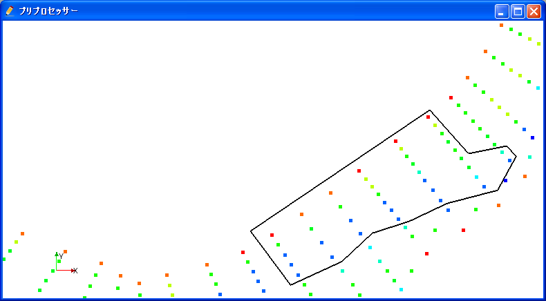
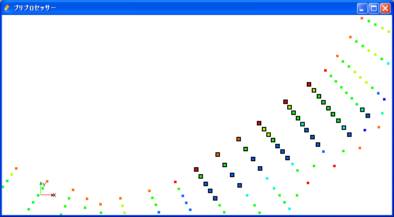
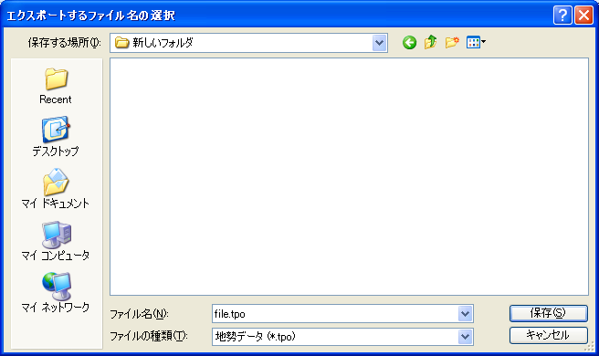
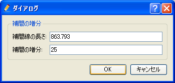
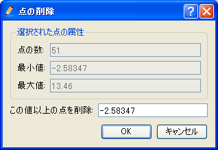
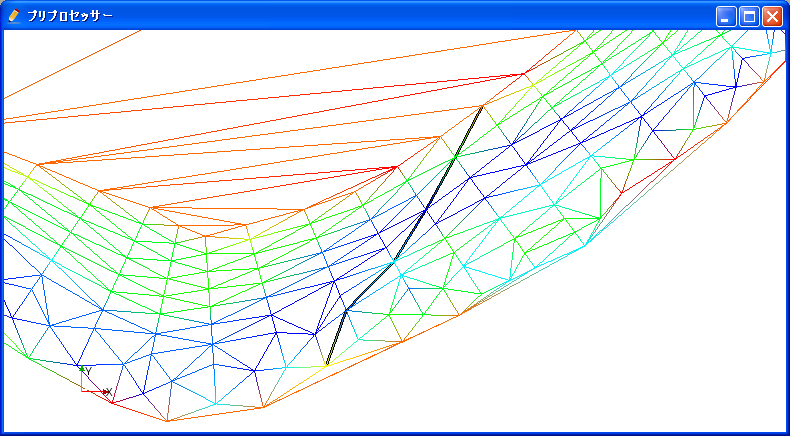
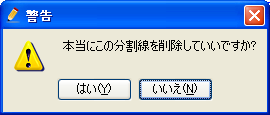

.. _sec_pointset_data:

Editing the [Pointset Data]
===========================

[Pointset Data] consist of coordinates and attribute at that point.
:numref:`image_example_pointset_data` shows an example of the [Pointset Data].

.. _image_example_pointset_data:

.. figure:: images/example_pointset_data.png

   The [Pointset Data]

Menu items
-----------

When the [Pre-processing Window] is active and [Pointset Data] is
selected in [Object Browser], you use can access menu items related to
operations on [Pointset Data] under the following:

**Menu bar**: [Geographic Data] (E) --> [Pointset Data] (O)

:numref:`geo_pointset_menuitems_table` shows the menu items
under [Pointset Data] (O).

.. _geo_pointset_menuitems_table:

.. list-table:: The menu items under [Pointset Data]
   :header-rows: 1

   * - Menu item
     - Description
   * - [Edit Name] (N)
     - Edits the name shown in [Object Browser].
   * - [Select Points With Polygon] (P)
     - Select Points inside the polygon region that user define by mouse operation.
   * - [Edit Selected Points] (E)
     - Select the value at the selected points.
   * - [Export Selected Points] (X)
     - Export the selected points to an external file.
   * - [Add New Point] (A)
     - Adds new points.
   * - [Interpolate Points] (I)
     - Interpotate new points.
   * - [Delete Selected Points] (O)
     - Delete selected points.
   * - [Delete Selected Points Less Than Value] (L)
     - Delete points that is selected and the value is less than that user specify.
   * - [Delete Selected Points Greater Than Value] (G)
     - Delete points that is selected and the value is greater than that user specify.
   * - [Add Break Line] (B)
     - Add break line.
   * - [Remove Break Line] (R)
     - Remove break line.
   * - [Remove All Break Lines] (O)
     - Remove all break lines.
   * - [Remesh TINs] (T)
     - Remesh TINs.
   * - [Display Setting] (S)
     - Edit display setting.
   * - [Delete] (D)
     - Delete the [Pointset Data].

[Select Points With Polygon] (P)
--------------------------------

**Description**: Defines a polygon region, and select points within that polygon.

Click on canvas region to specify polygon vertices positions
sequentially. By double-clicking or pressing Enter key, the polygon is
defined and the points within that polygon are selected.
:numref:`image_pre_window_defining_poly_region`
shows an example of the [Pre-processing Window] while defining a polygon
region. :numref:`image_pre_window_after_sel_poly_region` shows
an example of the [Pre-processing Window] after selecting.

.. _image_pre_window_defining_poly_region:

   The [Pre-processing Window] while defining a polygon region

.. _image_pre_window_after_sel_poly_region:

   The [Pre-processing Window] after selecting points within the polygon region

In normal status, points can be selected with left-dragging.

[Edit Selected Points] (E)
--------------------------

**Description**: Edits the selected points.

When you select [Edit Selected Points], the [Edit Points] dialog
(:numref:`image_pre_edit_points_dialog`) will open.
Input new Value at the selected points, and click on [OK].

.. _image_pre_edit_points_dialog:

.. figure:: images/pre_edit_points_dialog.png

   The [Edit Points] dialog

[Export Selected Points] (X)
----------------------------

**Description**: Exports the selected points to an external file.

When you select [Export Selected Points], the [Select file to export]
dialog (:numref:`image_pointset_select_file_to_export_dialog`) will open.
Input the file name to export and click on [Save].

.. _image_pointset_select_file_to_export_dialog:

   The [Select file to export] dialog

[Add New Point] (A)
-------------------

**Description**: Adds new points.

When you select [Add New Point], select a point that already exists
first. The value at that point will be the default value at the points
you are going to add. Then, click on the canvas where you want to add
new points. Finish by double-clicking or by pressing Enter key. The [Add
Points] dialog
(:numref:`image_pointset_add_points_dialog`) will open,
so input the Value at new points and click on [OK].

:numref:`image_example_adding_new_points` shows an example of
[Pre-processing Window] while adding new point.

.. _image_pointset_add_points_dialog:

.. figure:: images/pointset_add_points_dialog.png

   The [Add Points] dialog

.. @todo not yet

.. _image_example_adding_new_points:

.. figure:: images/example_adding_new_points.png

   Example of adding new points

[Interpolate Points] (I)
------------------------

**Description**: Adds new points between points that already exists.

After you select [Interpolate Points], click on multiple points that
already exists, between which you want to interpolate points. Finish by
double-clicking or pressing Enter key. The [Dialog]
(:numref:`image_pointset_interpolate_settiing_dialog`) will
open, so edit the setting and click on [OK] to interpolate points.

:numref:`image_example_pointset_interpolate_points` shows an operation
of interpolating points.

.. _image_pointset_interpolate_settiing_dialog:

   The [Dialog]

.. @todo not yet

.. _image_example_pointset_interpolate_points:

.. figure:: images/example_pointset_interpolate_points.png

   Example of interpolating points

[Delete Selected Points] (O)
----------------------------

**Description**: Deletes the selected points.
:numref:`image_example_pointset_delete_points` shows an example.

.. _image_example_pointset_delete_points:

.. figure:: images/example_pointset_delete_points.png

   Example of deleting selected points.

[Delete Selected Points Less Than Value] (L)
--------------------------------------------

**Description**: Deletes the points that are selected, and have value less
than that you specify.

When you select [Delete Selected Points Less Than Value], the [Delete
Points] dialog (:numref:`image_pointset_delete_points_dialog_less_than`)
will open. Input the value and click on [OK].
:numref:`image_pointset_example_delete_points_less_than` shows an example.

.. _image_pointset_delete_points_dialog_less_than:

.. figure:: images/pointset_delete_points_dialog_less_than.png

   The [Delete Points] dialog

.. _image_pointset_example_delete_points_less_than:

.. figure:: images/pointset_example_delete_points_less_than.png

   Example of deleting selected points less than the specified value.

[Delete Selected Points Greater Than Value] (G)
-----------------------------------------------

**Description**: Deletes the points that are selected, and have value
greater than that you specify.

When you select [Delete Selected Points Greater Than Value], the [Delete
Points] dialog
(:numref:`image_pointset_delete_points_dialog_greater_than`)
will open. Input the value and click on [OK].
:numref:`image_pointset_example_delete_points_greater_than` shows an example.

.. _image_pointset_delete_points_dialog_greater_than:

   The [Delete points] dialog

.. _image_pointset_example_delete_points_greater_than:

.. figure:: images/pointset_example_delete_points_greater_than.png

   Example of deleting selected points greater than the specified value.

[Add Break Line] (B)
--------------------

**Description**: Adds break line.

After you select [Add Break Line], click on the points sequently between
which you want to add break line. Finish by double-clicking of pressing
Enter key.

When you [Remesh TINs], break lines will be used as TIN boundary lines.
:numref:`image_pointset_example_tin_boundarys_after_add_breakline`
shows an example.

.. _image_pointset_example_tin_boundarys_after_add_breakline:

   Example of TIN boundarys after adding break line

[Remove Break Line] (R)
-----------------------

**Description**: Removes break line.

After you select [Remove Break Line], click on the break line you want
to remove. The [Warning] dialog (:numref:`image_pointset_remove_breakline_warning_dialog`)
will open, so click on [Yes] to remove the break line.

.. _image_pointset_remove_breakline_warning_dialog:

   The [Warning] dialog

[Remove All Break Lines] (O)
----------------------------

**Description**: Removes all break lines.

When you select [Remove All Break Lines], the [Warning] dialog
(:numref:`image_pointset_remove_all_breaklines_warning_dialog`) will open.
Click on [Yes].

.. _image_pointset_remove_all_breaklines_warning_dialog:

.. figure:: images/pointset_remove_all_breaklines_warning_dialog.png

   The [Warning] dialog

[Remesh TINs] (T)
-----------------

**Description**: Remesh TINs that are used for interpolation.

Remeshing TINs will be necessary when points are added or removed,
and/or break lines are added or removed.
:numref:`image_pointset_example_remesh_tin` shows an example of
remeshing TINs.

.. _image_pointset_example_remesh_tin:

.. figure:: images/pointset_example_remesh_tin.png

   Example of remeshing TINs

[Display Setting] (S)
---------------------

**Description**: Changes display setting of [Pointset Data].

[Pointset Data] can be visualized in the three methods: [Points],
[Wireframe], and [Surface].
:numref:`image_pointset_display_methods` shows the three methods.

.. _image_pointset_display_methods:

.. figure:: images/pointset_display_methods.png

   [Pointset Data] display methods

When you select [Display Setting], the [Display Setting] dialog
(:numref:`image_pointset_display_setting_dialog`) will open.
Change settings and click on [OK]. [Transparent] is
active only when you select [Surface] for [Display Method].

.. _image_pointset_display_setting_dialog:

.. figure:: images/pointset_display_setting_dialogs.png

   The [Display Setting] dialog
