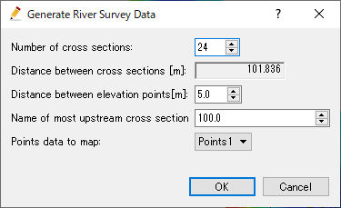
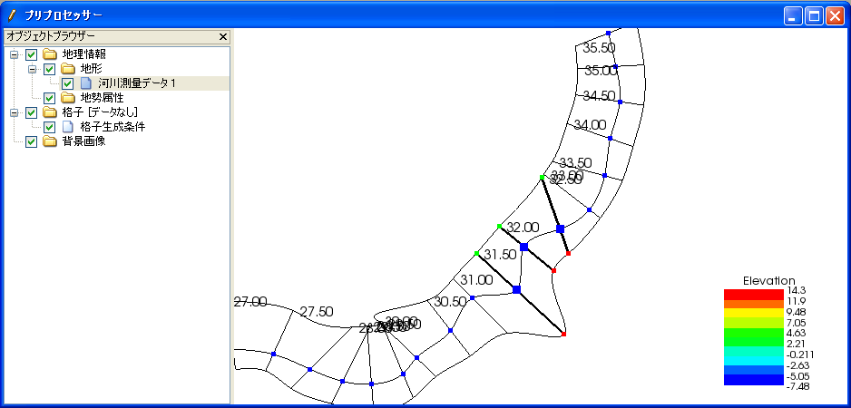
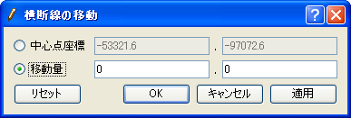
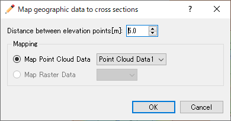
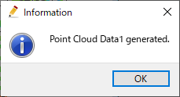
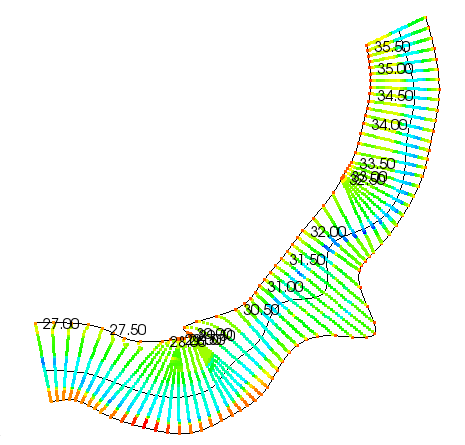
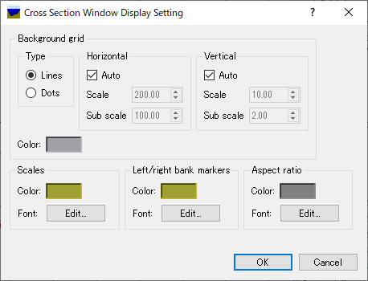

.. _sec_riv_data:

横断測量データ編集機能
##########################

横断測量データは、河川での横断測量データに基づいた地理情報です。
河川とその周辺での標高情報を取り扱うために利用します。

横断測量データの表示例を :numref:`image_riv_data` に示します。

.. _image_riv_data:

.. figure:: images/riv_data.png
   :width: 220pt

   横断測量データ

横断測量データ編集機能には、 :numref:`geo_river_data_modes`
に示す2つのモードがあります。

.. _geo_river_data_modes:

.. list-table:: 横断測量データ編集機能のモード
   :header-rows: 1

   * - モード
     - 説明
   * - 作成モード
     - 新しく横断測量データを作成するモード
   * - 編集モード
     - 既にある横断測量データを編集するモード

オブジェクトブラウザで、「追加」--> 「横断測量データ」を選択して
すると、作成モードで横断測量データが作成されます。 :ref:`sec_file_export_geo_data`
に示した機能で横断測量データをインポートした場合は、編集モードで
横断測量データが作成されます。

以下では、各モードの機能について説明します。

作成モード
============

領域を中心線・左岸線・右岸線を用いて定義して、
点群データをマッピングすることによって横断測量データを生成します。

作成モードを開始したら、まずは描画領域でのマウスクリックで、
中心線が通る点を複数指定します。ダブルクリックもしくは改行キーを押すと、
中心線の指定が完了します。中心線の指定が完了した時の画面の表示例を
:numref:`image_geo_river_after_centerline_set`
に示します。

.. _image_geo_river_after_centerline_set:

   中心線の定義例

次に、左岸線と右岸線を生成します。メニューから「左岸線・右岸線の生成」を選択します。
すると、:numref:`image_geo_river_banks_dialog` に示す岸線の生成ダイアログが
表示されます。ここで、左岸線、右岸線を中心線からどれだけ距離を離したところに生成するか
を指定して「OK」ボタンを押すと、 :numref:`image_geo_river_banks_example` に
示すように左岸線、右岸線が生成されます。

定義された左岸線、右岸線は、点をドラッグして形を変えたり、通過する点を追加・削除
したりできます。

.. _image_geo_river_banks_dialog:

   岸線の生成ダイアログ

.. _image_geo_river_banks_example:

   左岸線・右岸線の生成例

最後に、メニューから「横断測量データの生成」を選択します。すると、
:numref:`image_geo_river_generation_dialog` に示す
横断測量データの生成ダイアログが表示されます。
横断線の数などを指定して「OK」ボタンを押すと、横断測量データが生成されます。
生成される横断測量データの例を :numref:`image_geo_river_generation_example` に示します。

横断測量データが生成されると、編集モードに切り替わります。

.. _image_geo_river_generation_dialog:

   横断測量データ生成ダイアログ

.. _image_geo_river_generation_example:

   生成される横断測量データの例

メニュー構成
-------------

生成モードでのメニューの構成を
:numref:`geo_river_create_menuitems_table` に示します。

.. _geo_river_create_menuitems_table:

.. list-table:: 生成モードでのメニューの構成
   :header-rows: 1

   * - メニュー
     - 説明
   * - 横断測量データの生成
     - 横断測量データを生成します
   * - 左岸線・右岸線の生成
     - 左岸線・右岸線を生成します
   * - 頂点の追加 (A)
     - 中心線もしくは左右岸線に頂点を追加します
   * - 頂点の削除 (R)
     - 中心線もしくは左右岸線から頂点を削除します
   * - 中心線のインポート (I)
     - 中心線の頂点座標をインポートします
   * - 中心線のエクスポート (E)
     - 中心線の頂点座標をエクスポートします

横断測量データの生成
----------------------

横断測量データを生成します。

:numref:`image_geo_river_generation_dialog` に示すダイアログが表示されますので、
横断線の数などを指定して「OK」ボタンを押します。

生成される横断測量データの例を :numref:`image_geo_river_generation_example` に示します。

左岸線・右岸線の生成
---------------------------

左岸線・右岸線を生成します。

:numref:`image_geo_river_banks_dialog` に示すダイアログが表示されますので、
中心線から左岸線・右岸線までの距離を入力して「OK」ボタンを押します。

生成される左岸線と右岸線の例を :numref:`image_geo_river_banks_example` に示します。

生成した左岸線と右岸線は、頂点をマウスカーソルでドラッグすることにより、変形することができます。

頂点の追加 (A)
----------------

中心線もしくは左右岸線に頂点を追加します。

このメニューを選択した後、中心線もしくは左右岸線の上に
カーソルを移動すると、
:numref:`image_geo_river_add_vertex_cursor`
で示すカーソルに変化します。この状態でマウスの左ボタンを押してドラッグすると、
新しい頂点が追加できます。マウスの左ボタンを離すと、頂点の位置が確定します。

.. _image_geo_river_add_vertex_cursor:

.. figure:: images/geo_river_add_vertex_cursor.png
   :width: 20pt

   頂点の追加が可能な時のマウスカーソル

頂点の削除 (R)
-------------------

中心線もしくは左右岸線から頂点を削除します。

このメニューを選択した後、中心線もしくは左右岸線の上に
カーソルを移動すると、
:numref:`image_geo_river_remove_vertex_cursor`
で示すカーソルに変化します。この状態でマウスの左ボタンを押すと、
頂点が削除されます。

.. _image_geo_river_remove_vertex_cursor:

.. figure:: images/geo_river_remove_vertex_cursor.png
   :width: 20pt

   頂点の削除が可能な時のマウスカーソル

中心線のインポート (I)
------------------------

中心線を、ShapeファイルもしくはCSVファイルからインポートします

:numref:`image_geo_river_center_import_dialog` に示すダイアログが
表示されますので、インポートしたいファイルを選択して「開く」ボタンを押します。

.. _image_geo_river_center_import_dialog:

.. figure:: images/geo_river_center_import_dialog.png
   :width: 380pt

   中心線のインポートダイアログ

中心線のエクスポート (E)
------------------------

中心線を、ShapeファイルもしくはCSVファイルにエクスポートします

:numref:`image_geo_river_center_export_dialog` に示すダイアログが
表示されますので、エクスポートするファイルの名前を指定して「保存」ボタンを押します。

.. _image_geo_river_center_export_dialog:

.. figure:: images/geo_river_center_export_dialog.png
   :width: 380pt

   中心線のエクスポートダイアログ

編集モード
===========

メニュー構成
--------------

横断測量データ編集機能に関連するメニューは、プリプロセッサーがアクティブで、
オブジェクトブラウザーで横断測量データが選択されていた時、以下からアクセスできます。

**メニュー：** --> 地理情報 (E) --> 横断測量データ (R)

横断測量データ (R) 以下のサブメニューの構成を
:numref:`geo_river_data_menuitems_table` に示します。

.. _geo_river_data_menuitems_table:

.. list-table:: 横断測量データメニューの構成
   :header-rows: 1

   * - メニュー
     - 説明
   * - 名前の編集 (N)
     - オブジェクトブラウザー上に表示される名前を編集します
   * - 横断面の表示 (C)
     - 河川横断面ウィンドウを新しく開きます
   * - 上流側に挿入 (B)
     - 上流側に、新しい河川横断線を挿入します
   * - 下流側に挿入 (A)
     - 下流側に、新しい河川横断線を挿入します
   * - 移動 (M)
     - 河川横断線を移動します
   * - 回転 (R)
     - 河川横断線を回転します
   * - 中心点のシフト (H)
     - 河川横断線の中心点をシフトします
   * - 左右への伸縮 (X)
     - 河川横断線を左右に伸縮します
   * - 横断線の削除 (T)
     - 河川横断線を削除します
   * - 横断線の名前の変更 (E)
     - 河川横断線の名前を変更します
   * - 左岸延長線追加 (K)
     - 河川横断線に、左岸延長線を追加します
   * - 右岸延長線追加 (I)
     - 河川横断線に、右岸延長線を追加します
   * - 左岸延長線削除 (L)
     - 河川横断線から、左岸延長線を削除します
   * - 右岸延長線削除 (J)
     - 河川横断線から、右岸延長線を削除します
   * - 表示設定 (S)
     - 横断測量データの背景色、断面形状を設定します
   * - 補間モード
     - 横断線間の補間モードを切り替えます
   * - 点群データのマッピング
     - 河川横断線に、点群データをマッピングします
   * - このデータから点群データを生成
     - 横断測量データの背景格子のデータから、点群データを生成します
   * - 削除 (D)
     - 横断測量データを削除します

河川横断線の選択操作
---------------------

この節以降で説明する操作は、表示設定及び削除を除いて、
河川横断線の選択を行ってから行います。
ここでは、河川横断線の選択操作の方法について説明します。

河川横断線の選択は、描画領域での左ドラッグ操作によって行います。

描画領域で左ドラッグを開始すると、
:numref:`image_pre_window_left_dragging`
に示すように黒い四角が表示されます。左ボタンを離してドラッグを完了すると、
:numref:`image_pre_window_select_river_lines` に示すように、
黒い四角の中に河川中心点 (青い点)
が含まれていた河川横断線がすべて選択されます。
選択された横断線は、太い黒線で表示されます。

.. _image_pre_window_left_dragging:

.. figure:: images/pre_window_left_dragging.png
   :width: 400pt

   ドラッグ中のプリプロセッサーの表示例

.. _image_pre_window_select_river_lines:

   ドラッグ完了時のプリプロセッサーの表示例

横断面の表示 (C)
------------------

横断面ウィンドウを表示します。

この操作は、横断面ウィンドウを表示したい河川横断線を選択してから行います。

表示される河川横断面ウィンドウの表示例を :numref:`image_xsec_window`
に示します。

.. _image_xsec_window:

.. figure:: images/xsec_window.png
   :width: 420pt

   河川横断面ウィンドウ

なお、河川横断面ウィンドウでの操作については
:ref:`sec_pre_riv_crosssection_window`
を参照してください。

上流側に挿入(B) / 下流側に挿入(A)
---------------------------------

選択した河川横断線の上流側 (もしくは下流側)
に新たな河川横断線を挿入します。

河川横断線を1つ選択している時のみ可能です。

河川横断線の挿入ダイアログ (:numref:`image_riv_insert_line_dialog` 参照)
が表示されるので、河川中心点座標と断面情報を設定して「OK」ボタンを押します。

-  河川中心点座標：

  - 「マウスクリック」を選択した時は、描画領域でのクリックで座標を指定します。
  - 「座標値」を選択した時は、テキストボックスで座標を指定します。
  - 「前後との比率」を選択した時は、比率を 0 ～ 1
    の間で指定することで、前後の点を滑らかにつないだスプライン曲線上に中心点を配置します。

-  断面情報の設定：

  -  「標高 0 の点を3つ定義」を選択した時は、適当な幅となるように、
     中心点、左岸、右岸の3点からなる断面情報を設定します。

  -  「次の河川横断線の情報をコピー」を選択した時は、コンボボックスで指定した
     横断線の断面情報をコピーします。

  -  「前後の横断面を元に構成」を選択した時は、前後の横断線の断面データから補間して
     断面データを生成します。

.. _image_riv_insert_line_dialog:

.. figure:: images/riv_insert_line_dialog.png
   :width: 360pt

   横断線の挿入ダイアログ

移動 (M)
----------

選択した河川横断線を移動します。例を
:numref:`image_exampleriv_move_line` に示します。

複数の河川横断線について、同時に行えます。

.. _image_exampleriv_move_line:

.. figure:: images/exampleriv_move_line.png
   :width: 420pt

   河川横断線の移動操作例

横断線の移動ダイアログ (:numref:`image_riv_move_line_dialog` 参照)
が表示されますので、新しい中心点座標もしくは移動量を指定して「OK」ボタンを押します。

.. _image_riv_move_line_dialog:

   横断線の移動ダイアログ

なお、河川横断線の移動は、描画領域でのマウス操作によっても行えます。
選択した河川横断線の河川中心点付近にマウスカーソルを移動すると、
マウスカーソルが
:numref:`image_cursor_move_riv_line`
で示したものに変化します。この状態で左ドラッグすると選択した河川横断線を移動できます。

.. _image_cursor_move_riv_line:

   横断線の移動時のマウスカーソル

回転 (R)
---------

選択した河川横断線を回転します。

河川横断線を1つ選択した時のみ行えます。例を
:numref:`image_example_riv_rotate_line` に示します。

.. _image_example_riv_rotate_line:

.. figure:: images/example_riv_rotate_line.png
   :width: 420pt

   河川横断線の回転操作例

横断線の回転ダイアログ (:numref:`image_riv_rotate_line_dialog` 参照)
が表示されるので、河川中心線となす角または角度の変化量を指定して
「OK」ボタンを押します。(反時計回りを正。単位は弧度法)

なお、河川横断線の回転は、描画領域でのマウス操作によっても行えます。
選択した河川横断線の左岸(または右岸) にマウスカーソルを移動すると、
マウスカーソルが :numref:`image_cursor_rotate_riv_line`
で示したものに変化します。この状態で左ドラッグすると、
選択した河川横断線を回転できます。

.. _image_riv_rotate_line_dialog:

   横断線の回転ダイアログ

.. _image_cursor_rotate_riv_line:

   横断線の回転時のマウスカーソル

中心点のシフト(H)
-------------------

選択した河川横断線の中心点を、左岸側もしくは右岸側にシフトします。
この操作では中心点の位置がシフトするだけで、断面情報は変化しません。
例を
:numref:`image_example_riv_shift_center` に示します。

複数の河川横断線について、同時に行えます。

.. _image_example_riv_shift_center:

.. figure:: images/example_riv_shift_center.png
   :width: 420pt

   中心点のシフト操作例

河川中心点のシフトダイアログ (図 4‑23 参照)
が表示されるので、移動量を指定して「OK」ボタンを押します。

なお、河川中心線のシフト、描画領域でのマウス操作によっても行えます。
シフトキーを押しながら選択した河川横断線の中心点にマウスカーソルを移動すると、
マウスカーソルが
:numref:`image_cursor_shift_riv_center`
で示したものに変化します。この状態で左ドラッグすると、
選択した河川横断線の中心点をシフトできます。

河川中心点のシフトダイアログ (:numref:`image_shift_river_center_dialog` 参照)
が表示されるので、移動量を指定して「OK」ボタンを押します。

.. _image_shift_river_center_dialog:

.. figure:: images/shift_river_center_dialog.png
   :width: 220pt

   河川中心点のシフトダイアログ

.. _image_cursor_shift_riv_center:

   河川中心点のシフト時のマウスカーソル

左右への伸縮 (X)
------------------

選択した河川横断線を、左右に伸縮します。例を
:numref:`image_example_extend_riv_line` に示します。

複数の河川横断線について、同時に行えます。

.. _image_example_extend_riv_line:

.. figure:: images/example_extend_riv_line.png
   :width: 420pt

   河川横断線の左右への伸縮操作例

河川横断線の伸縮ダイアログ (図 4‑26 参照)
が表示されますので、中心点と左岸間の距離、増分、伸縮率の
いずれかを指定して「OK」ボタンを押します。

.. _image_extend_riv_line_dialog:

.. figure:: images/extend_riv_line_dialog.png
   :width: 220pt

   河川横断線の伸縮ダイアログ

横断線の削除 (T)
-----------------

選択した河川横断線を削除します。例を
:numref:`image_example_del_riv_line` に示します。

複数の河川横断線について、同時に行えます。

.. _image_example_del_riv_line:

.. figure:: images/example_del_riv_line.png
   :width: 420pt

   河川横断線の削除操作例

横断線の名前の変更 (E)
------------------------

選択した河川横断線の名前を変更します。

河川横断線を1つ選択した時のみ行えます。

横断線の名前変更ダイアログ (:numref:`image_rename_riv_line_dialog` 参照)
が表示されますので、新しい名前を入力して「OK」ボタンを押します。

.. _image_rename_riv_line_dialog:

.. figure:: images/rename_riv_line_dialog.png
   :width: 140pt

   横断線の名前変更ダイアログ

左岸延長線追加 (K) / 右岸延長線追加 (I)
---------------------------------------

選択した河川横断線に、左岸延長線 (もしくは右岸延長線) を追加します。例を
:numref:`image_example_adding_riv_extension_line` に示します。

河川横断線を1つ選択した時のみ行えます。

.. _image_example_adding_riv_extension_line:

.. figure:: images/example_adding_riv_extension_line.png
   :width: 420pt

   左岸延長線追加 操作例

延長線の追加ダイアログ (:numref:`image_riv_add_extension_line_dialog` 参照)
が表示されます。「マウスクリック」を選択した時は描画領域でのマウスクリックで、
「座標」を選択した時はテキストボックスで延長線の端点の座標を指定して、
「OK」ボタンを押します。

.. _image_riv_add_extension_line_dialog:

   左岸延長線 (もしくは右岸延長線) 追加ダイアログ

左岸延長線削除(L) / 右岸延長線削除(J)
-------------------------------------

選択した河川横断線の左岸延長線 (もしくは右岸延長線) を削除します。例を
:numref:`image_example_del_extension_line` に示します。

河川横断線を1つ選択した時のみ行えます。また、左岸延長線
(もしくは右岸延長線) を追加した横断線に対してのみ行えます。

.. _image_example_del_extension_line:

.. figure:: images/example_del_extension_line.png
   :width: 450pt

   左岸延長線削除 操作例

表示設定 (S)
--------------

背景色、断面形状の表示を設定します。

表示設定ダイアログ (:numref:`image_riv_display_setting_dialog` 参照) が表示されます。

.. _image_riv_display_setting_dialog:

.. figure:: images/riv_display_setting_dialog.png
   :width: 400pt

   表示設定ダイアログ

背景色で「表示」をチェックすると、標高に従って背景色が表示されます。「半透明」をチェックし、
数値を調整することで、カラーマップ表示を半透明にすることができます。

断面形状で「表示」をチェックすると、各河川横断線に断面形状のグラフが表示されます。

例を :numref:`image_example_riv_disp_setting` に示します。

.. _image_example_riv_disp_setting:

.. figure:: images/example_riv_disp_setting.png
   :width: 400pt

   背景色、断面形状の表示 操作例

.. note:: 
   iRIC ver4からはプリプロセッサーウィンドウで追加した地理情報は可視化ウィンドウでも確認ができるようになっています。主な仕様は以下です。

   表示設定について

   - 可視化ウィンドウでの地理情報の表示設定は、可視化ウィンドウを開いた時点でのプリプロセッサーウィンドウで設定していたものが引き継がれます。
   - 既に開かれている可視化ウィンドウでの表示設定は、プリプロセッサーウィンドウで表示設定を変更しても変更されません。
   - 可視化ウィンドウで表示設定を変更してもプリプロセッサーウィンドウでの表示設定には影響しません。

   地理情報の値、座標等について
   
   - 可視化ウィンドウ上からは地理情報の編集はできません。
   - プリプロセッサーウィンドウで地理情報を編集(値の変更、位置の変更)した場合、可視化ウィンドウにも反映されます。

補間モード
------------

補間モード（スプライン補間、線形補間）を設定します。

スプライン補間に設定した場合の表示例を
:numref:`image_example_riv_interpolation_mode_spline`
に、線形補間に設定した場合の表示例を
:numref:`image_example_riv_interpolation_mode_linear`
に示します。

.. _image_example_riv_interpolation_mode_spline:

.. figure:: images/example_riv_interpolation_mode_spline.png
   :width: 320pt

   補間モード (スプライン補間)

.. _image_example_riv_interpolation_mode_linear:

.. figure:: images/example_riv_interpolation_mode_linear.png
   :width: 320pt

   補間モード (線形補間)

.. _sec_riversurvey_map_pointcloud:

点群データのマッピング
-------------------------

選択した河川横断線に点群データをマッピングします。

点群データのマッピングダイアログ (:numref:`image_geo_riv_mapping_dialog` 参照)
が表示されます。
横断方向の分割間隔などを指定して「OK」ボタンを押すと、マッピングが実行されます。

.. _image_geo_riv_mapping_dialog:

   点群データのマッピングダイアログ

.. _sec_pre_riv_gen_pointcloud:

このデータから点群データを生成
-----------------------------------

この横断測量データの背景格子のデータから、点群データを生成します。

メニューを選択すると、点群データが生成され、
:numref:`image_geo_riv_generate_pointcloud_dialog` に示すダイアログが表示されます。
この機能で生成された点群データの例を
:numref:`image_geo_riv_generate_pointcloud_example` に示します。

.. _image_geo_riv_generate_pointcloud_dialog:

   点群データ生成のメッセージダイアログ

.. _image_geo_riv_generate_pointcloud_example:

   横断測量データから生成された点群データの例

.. note::

   この機能で生成される点群の点の密度は、背景格子に関する設定を変更することで
   変更できます。背景格子の設定の変更方法については :ref:`sec_pref_background_grid` を
   参照してください。

.. note::

   横断測量データから、点群データを生成する方法には、まず横断測量データから格子を生成し、
   生成した格子の属性から点群データを生成する方法もあります。詳細は、
   :ref:`sec_gridgen_riv_data_2d` を参照してください。

.. _sec_pre_riv_crosssection_window:

河川横断面ウィンドウでの操作
-------------------------------

河川横断面ウィンドウは、河川横断線の横断面を表示し、
標高情報を編集するための画面です。
河川横断面ウィンドウの表示例を
:numref:`image_example_riv_xsec_window`
に示します。

.. _image_example_riv_xsec_window:

.. figure:: images/example_riv_xsec_window.png
   :width: 320pt

   河川横断面ウィンドウ

メニュー構成
~~~~~~~~~~~~~~~

河川横断面ウィンドウ固有のメニュー構成を、
:ref:`geo_river_data_xsec_window_menuitems_table`
に示します。
:ref:`geo_river_data_xsec_window_menuitems_table`
に示すメニューは、河川横断面ウィンドウがアクティブな時、
「インポート」メニューと「計算」メニューの間に表示されます。

.. _geo_river_data_xsec_window_menuitems_table:

.. list-table:: 河川横断面ウィンドウ固有のメニューの構成
   :header-rows: 1

   * - メニュー
     -
     - 説明
   * - 標高点 (A)
     - 有効化 (A)
     - 選択した標高点を有効にします
   * -
     - 無効化 (I)
     - 選択した標高点を無効にします
   * -
     - 水位に基づいて無効化 (W)
     - 河川中心点から左岸、右岸方向に見て、初めて水位を超えた点から先の標高点を無効にします
   * -
     - 選択した点を起点に編集 (E)
     - 選択した点を起点に、横断線の形状を編集します
   * -
     - 移動 (M)
     - 選択した標高点を移動します
   * -
     - 削除 (D)
     - 選択した標高点を削除します

ツールバーの機能
~~~~~~~~~~~~~~~~

河川横断面ウィンドウの上部に表示されるツールバーの機能を :numref:`geo_river_data_xsec_window_toolbaritems_table` に示します。

.. _geo_river_data_xsec_window_toolbaritems_table:

.. list-table:: 河川横断面ウィンドウのツールバーの機能
   :header-rows: 1

   * - 項目
     - 説明
   * - 断面
     - 表示する断面を切り替えます
   * - 参照
     - 「断面」で選択した以外の断面を、参照用情報として表示します。コンボボックスで、表示する断面を選びます。
   * - 自動フィット
     - チェックされていると、「断面」で表示断面を切り替えた時、新しい断面が画面中央に表示されるよう自動で表示範囲が変更されます。
   * - 縦横比
     - 現在の縦横比が表示されます。編集して画面の縦横比を変更することもできます。
   * - 縦横比を固定
     - チェックすると、 Ctrl + マウス中ボタンの操作が、縦横比を固定したままでの拡大・縮小操作になります。
   * - 領域を固定
     - チェックすると、 Ctrl + マウス中ボタン、Ctrl + マウス左ボタンでの表示範囲変更操作が無効になります。
   * - 背景格子
     - 背景格子の ON/OFF を切り替えます。
   * - 目盛り
     - 画面の左端、上端の目盛りの ON/OFF を切り替えます。
   * - 左右岸
     - 画面上部の「左岸側」と「右岸側」の ON/OFF を切り替えます。
   * - 縦横比
     - 画面右下の縦横比の ON/OFF を切り替えます。
   * - 表示設定
     - 河川横断面ウィンドウの表示設定ダイアログ (:numref:`image_xsec_window_setting_dialog` 参照) を表示します。

.. _image_xsec_window_setting_dialog:

   断面ウィンドウ表示設定ダイアログ

有効化(A)
~~~~~~~~~~~

選択した標高点を有効にします。操作例を
:numref:`image_example_activating_xsec_point` に示します。

.. _image_example_activating_xsec_point:

.. figure:: images/example_activating_xsec_point.png
   :width: 420pt

   標高点の有効化 操作例

無効化 (I)
~~~~~~~~~~~

選択した標高点を無効にします。操作例を
:numref:`image_example_inactivating_xsec_point`
に示します。

.. _image_example_inactivating_xsec_point:

.. figure:: images/example_inactivating_xsec_point.png
   :width: 420pt

   標高点の無効化 操作例

水位に基づいて無効化 (W)
~~~~~~~~~~~~~~~~~~~~~~~~~~

河川中心点から左岸、右岸方向に見て、初めて水位を超えた点から先の
標高点を無効にします。操作例を
:numref:`image_example_inactivating_xsec_point_with_wse`
に示します。

水位データが複数読み込まれている時は、使用する水位データを選択する
ダイアログが表示されます。

.. _image_example_inactivating_xsec_point_with_wse:

.. figure:: images/example_inactivating_xsec_point_with_wse.png
   :width: 420pt

   水位に基づいて無効化 操作例

.. _sec_geodata_rivdata_edit_from_point:

選択した点を起点に編集 (E)
~~~~~~~~~~~~~~~~~~~~~~~~~~~~~~

選択した点を起点に、横断線の形状を編集します。

この機能を使用する時は、河川横断線の点を一つだけ選択してください。

この機能を有効にした後マウスカーソルを移動すると、編集後の地形を表す
線が :numref:`image_example_xsec_edit_with_mouse` に示すように表示されます。
編集操作中は、編集により生成される線の水平・垂直方向の長さと法勾配が表示されます。

マウスカーソルの移動により編集の終了点の座標を指定し、左クリックすると編集が実行されます。

最後にダブルクリックするか、リターンキーを押すと、編集操作を終了します。

この機能で利用される法勾配は、
:ref:`sec_option_pref_riversurvey` で定義された値から選択されます。

.. _image_example_xsec_edit_with_mouse:

.. figure:: images/example_xsec_edit_with_mouse.png
   :width: 200pt

   マウス操作による横断線の編集 操作例

この機能の実行中に描画領域で右クリックすると、「ダイアログから編集」メニューが
表示されます。このメニューを選択すると、 :numref:`image_example_xsec_edit_with_dialog`
に示すダイアログが表示されます。

このダイアログでは、距離などを数値で入力して横断線の形状を編集することができます。

「適用」ボタンを押すと、編集後の横断線の形状をプレビューすることができます。

「連続編集」ボタンを押すと、編集操作を実行した後、新しく作成された点を選択し直し、
編集操作を継続することができます。複数の編集操作を同じ横断線に連続して行う際は
この機能を利用してください。

.. _image_example_xsec_edit_with_dialog:

   横断線の編集ダイアログ 表示例

この機能を利用することで、直線から構成される断面形状を簡単に作成することができます。
編集例を :numref:`image_example_xsec_edit_multi` に示します。

.. _image_example_xsec_edit_multi:

.. figure:: images/example_xsec_edit_multi.png
   :width: 350pt

   横断線の編集例

移動 (M)
~~~~~~~~~

選択した標高点を移動します。操作例を
:numref:`image_example_moving_xsec_point`
に示します。

標高点の移動ダイアログ
(:numref:`image_move_elevation_point_dialog` 参照)
が表示されますので、移動量を入力して「OK」ボタンを押します。

.. _image_example_moving_xsec_point:

.. figure:: images/example_moving_xsec_point.png
   :width: 420pt

   標高点の移動 操作例

.. _image_move_elevation_point_dialog:

.. figure:: images/move_elevation_point_dialog.png
   :width: 180pt

   標高点の移動ダイアログ

なお、標高点の移動はマウス操作によっても行えます。
選択した標高点の上にマウスカーソルを移動すると開いた
手の形のカーソルに変わりますので、左ドラッグで移動します。

削除 (D)
~~~~~~~~~~

選択した標高点を削除します。操作例を
:numref:`image_example_deleting_xsec_point` に示します。

.. _image_example_deleting_xsec_point:

.. figure:: images/example_deleting_xsec_point.png
   :width: 420pt

   標高点の削除 操作例
