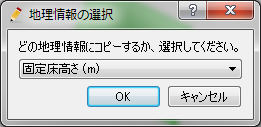
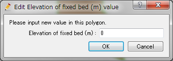
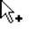
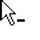

.. _sec_polygon_data:

ポリゴン編集機能
=====================

ポリゴンで囲まれた領域内について、地理情報の値を設定します。

ポリゴンの表示例を
:numref:`image_example_polygon_data` に示します。

.. _image_example_polygon_data:

.. figure:: images/example_polygon_data.png
   :width: 140pt

   ポリゴン 表示例

メニュー構成
--------------

ポリゴン編集機能に関連するメニューは、プリプロセッサーがアクティブで、
オブジェクトブラウザーでポリゴンが選択されていた時、
以下からアクセスできます。

**メニューバー**: 地理情報 (E) --> ポリゴン (P)

ポリゴン(P) 以下のサブメニューの構成を
:numref:`geo_polygon_menuitems_table` に示します。

.. _geo_polygon_menuitems_table:

.. list-table:: ポリゴンメニューの構成
   :header-rows: 1

   * - メニュー
     - 説明
   * - 新しいポリゴンを追加 (A)
     - 新しいポリゴンを追加します
   * - 名前の編集 (N)
     - オブジェクトブラウザー上に表示される名前を編集します
   * - 値の編集 (V)
     - ポリゴン内での地理情報の値を編集します
   * - コピー
     - ポリゴンを他の地理情報にコピーします
   * - 頂点の追加 (A)
     - 頂点を追加します
   * - 頂点の削除 (R)
     - 頂点を削除します
   * - 座標の編集 (C)
     - 頂点の座標を編集します
   * - 穴領域の追加
     - 穴領域を追加します
   * - 穴領域の削除
     - 穴領域を削除します
   * - 表示色設定 (S)
     - 表示色を設定します
   * - 削除 (D)
     - ポリゴンを削除します

新しいポリゴンを追加
---------------------

新しいポリゴンを追加するには、以下の手順を行います。

1. オブジェクトブラウザーで、ポリゴンを追加したい地理情報の種類を
   選択します (:numref:`image_polygon_object_browser_disp` 参照)。
   なお、地理情報の種類のリストは、利用するソルバーによって異なります。

2. メニューから以下の操作を行います。するとオブジェクトブラウザーで
   新しいポリゴンが追加され、選択された状態になります。

**メニューバー**: 地理情報 (E) --> ポリゴン(P) --> 新しいポリゴンを追加(A)

1. 描画領域で、左クリックによってポリゴンの頂点を順に指定します
   (:numref:`image_prewindow_polygon_being_defined` 参照)。

2. ダブルクリックするか改行キーを押して、ポリゴンの定義が完了します。
   定義したポリゴンでの地理情報の値を指定するダイアログ
   (:numref:`image_edit_elevation_value_dialog` 参照)
   が表示されますので、値を指定して「OK」ボタンを押します。
   なお、表示されるダイアログは、ポリゴンを追加する地理情報の
   種類によって異なります。

.. _image_polygon_object_browser_disp:

.. figure:: images/polygon_object_browser_disp.png
   :width: 150pt

   オブジェクトブラウザー 表示例

.. _image_prewindow_polygon_being_defined:

.. figure:: images/prewindow_polygon_being_defined.png
   :width: 350pt

   ポリゴン定義中のプリプロセッサー

.. _image_edit_elevation_value_dialog:

.. figure:: images/edit_elevation_value_dialog.png
   :width: 130pt

   ポリゴン内での地理情報値 編集ダイアログ

値の編集 (V)
--------------

ポリゴン領域内での地理情報の値を編集します。

地理情報の値を編集するダイアログ
(:numref:`image_edit_elevation_value_dialog2` 参照)
が表示されますので、新しい値を設定して「OK」ボタンを押します。

.. _image_edit_elevation_value_dialog2:

.. figure:: images/edit_elevation_value_dialog.png
   :width: 130pt

   ポリゴン内での地理情報値 編集ダイアログ

コピー
----------

ポリゴンを、他の地理情報にコピーします。

地理情報の選択ダイアログ 
(:numref:`image_polygon_copy_selectgroup_dialog` 参照)
が表示されますので、コピー先の地理情報を選択して「OK」ボタンを押します。

すると、ポリゴンの値を指定するダイアログ
(:numref:`image_polygon_copy_editvalue_dialog` 参照)
が表示されますので、値を指定し「OK」ボタンを押します。すると、ポリゴンの
コピーが完了します。

.. _image_polygon_copy_selectgroup_dialog:

   地理情報の選択ダイアログ

.. _image_polygon_copy_editvalue_dialog:

   値の編集ダイアログ

頂点の追加 (A)
---------------

ポリゴンに頂点を追加します。

このメニューを選択した後、ポリゴンの線の上にカーソルを移動すると、
:numref:`image_polygon_cursor_add_vertex`.
で示すカーソルに変化します。この状態でマウスの左ボタンを押してドラッグすると、
新しい頂点が追加できます。マウスの左ボタンを離すと、頂点の位置が確定します。

.. _image_polygon_cursor_add_vertex:

   頂点の追加が可能な時のマウスカーソル

頂点の削除 (R)
----------------

ポリゴンの頂点を削除します。

このメニューを選択した後、ポリゴンの頂点の上にカーソルを移動すると、
:numref:`image_polygon_cursor_remove_vertex`
で示すカーソルに変化します。この状態でマウスの左ボタンを押すと、
頂点が削除されます。

.. _image_polygon_cursor_remove_vertex:

   頂点の削除が可能な時のマウスカーソル

座標の編集 (C)
----------------------

ポリゴンの頂点の座標を編集します。

ポリゴンの頂点座標を編集するダイアログ
(:numref:`image_polygon_coordinates_dialog` 参照)
が表示されますので、座標を編集して「OK」ボタンを押します。

.. _image_polygon_coordinates_dialog:

.. figure:: images/polygon_coordinates_dialog.png
   :width: 160pt

   ポリゴンの頂点座標編集ダイアログ

穴領域の追加 (H)
-----------------

ポリゴンの穴領域を追加するには、以下の手順を行います。

1. ポリゴンの穴領域追加の情報ダイアログ
   (:numref:`image_add_hole_region_info_dialog` 参照)
   が表示されますので、「OK」ボタンを押します。

2. 描画領域で、左クリックによって穴領域の頂点を順に指定します
   (:numref:`image_polygon_example_add_hole_region` 参照)。

3. ダブルクリックするか改行キーを押して、穴領域の定義が完了します。

.. _image_add_hole_region_info_dialog:

.. figure:: images/add_hole_region_info_dialog.png
   :width: 220pt

   ポリゴンの穴領域の追加 情報ダイアログ

.. _image_polygon_example_add_hole_region:

.. figure:: images/polygon_example_add_hole_region.png
   :width: 340pt

   ポリゴンの穴領域の追加 表示例

穴領域の削除 (D)
----------------

ポリゴンの穴領域を削除するには、以下の手順を行います。

1. ポリゴンの穴領域削除の確認ダイアログ
   (:numref:`image_polygon_delete_hole_warning_dialog` 参照)
   が表示されますので、「はい」ボタンを押します。

2. 描画領域において、ポリゴンの穴領域が削除されます。
   (:numref:`image_polygon_example_delete_hole` 参照)。

.. _image_polygon_delete_hole_warning_dialog:

.. figure:: images/polygon_delete_hole_warning_dialog.png
   :width: 160pt

   ポリゴンの穴領域の削除ダイアログ

.. _image_polygon_example_delete_hole:

.. figure:: images/polygon_example_delete_hole.png
   :width: 340pt

   ポリゴンの穴領域の削除後 表示例

表示色設定 (S)
----------------

ポリゴンの表示色を編集します。

ポリゴンの表示色を設定するダイアログ
((:numref:`image_polygon_color_dialog`) 参照)
が表示されますので、表示色を設定して「OK」ボタンを押します。
「半透明」をチェックし、数値を調整することで、
表示を半透明にすることができます。

.. _image_polygon_color_dialog:

.. figure:: images/polygon_color_dialog.png
   :width: 220pt

   ポリゴンの表示色設定ダイアログ
