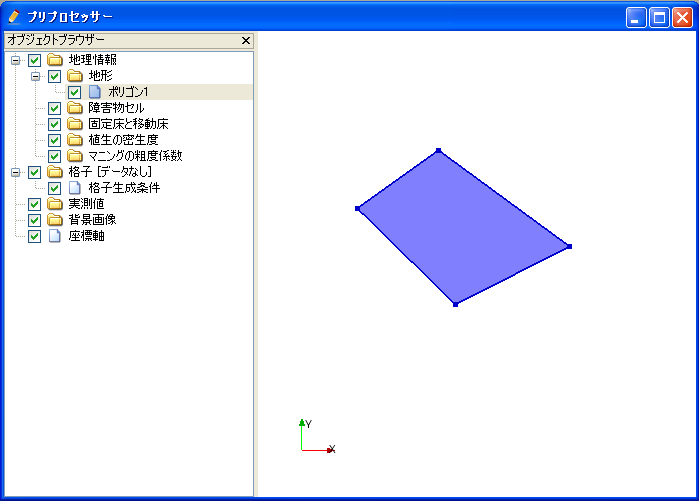

.. _sec_polygon_data:

Editing the [Polygon]
=====================

**Description**: Sets the values of geographic data within the area of the
Polygon. :numref:`image_example_polygon_data` shows an example of
the [Polygon].

.. _image_example_polygon_data:

.. figure:: images/example_polygon_data.png

   Example of the [Polygon]

Menu items
----------

When the [Pre-processing Window] is active and [Polygon] is selected in
[Object Browser], you can access menu items related to operations on
[Polygon] under the following:

**Menu bar**: [Geographic Data] (E) --> [Polygon] (P)

:numref:`geo_polygon_menuitems_table` shows the menu items under [Polygon] (P).

.. _geo_polygon_menuitems_table:

.. list-table:: Menu items of [Polygon] (P)
   :header-rows: 1

   * - Menu item
     - Description
   * - [Add Polygon] (A)
     - Adds a new Polygon.
   * - [Edit Name] (N)
     - Edits the name shown in [Object Browser].
   * - [Edit Value] (V)
     - Edits geographic data within the Polygon.
   * - [Add Vertex] (A)
     - Adds a vertex.
   * - [Remove Vertex] (R)
     - Removes a vertex.
   * - [Edit Coordinates] (C)
     - Edits the coordinates of the vertex.
   * - [Add Hole Region]
     - Adds a hole region.
   * - [Remove Hole Region]
     - Removes a hole region.
   * - [Color Setting] (S)
     - Sets the color display.
   * - [Delete] (D)
     - Deletes the Polygon.

[Add New Polygon]
-----------------

The procedure to add a new Polygon is as follows:

1. Select the type of [Geographic Data] in [Object Browser] to which you
   want to add a Polygon (:numref:`image_polygon_object_browser_disp`).
   Note that the list of types of [Geographic Data] varies
   according to the solver used.

2. The operation below adds a new Polygon to [Object Browser], and that
   Polygon is selected.

**Menu bar**: [Geographic Data] (E) --> [Polygon] (P) --> [Add New Polygon]

1. On the canvas, add vertexes to the Polygon by left clicking
   (:numref:`image_prewindow_polygon_being_defined`).

2. Double click or press the Enter key to complete defining the Polygon.
   As soon as you have double clicked or pressed the Enter key, the
   [Edit Elevation value] dialog will open(:numref:`image_edit_elevation_value_dialog`).
   Set the geographic data of the Polygon and click on [OK].
   The dialog varies depending on the type of [Geographic Data]
   to which a Polygon is added.

.. _image_polygon_object_browser_disp:

.. figure:: images/polygon_object_browser_disp.png

   Example of the [Object Browser] display

.. _image_prewindow_polygon_being_defined:

   [Pre-processing Window] when the [Polygon] is being defined

.. _image_edit_elevation_value_dialog:

.. figure:: images/edit_elevation_value_dialog.png

   [Edit Elevation Value] dialog

[Edit Value] (V)
----------------

**Description**: Edits data value within the Polygon.

When you select [Edit Value],, the [Edit Elevation value] dialog
(:numref:`image_edit_elevation_value_dialog2`) will open.
Set a new value and click on [OK].

.. _image_edit_elevation_value_dialog2:

.. figure:: images/edit_elevation_value_dialog.png

   The [Edit Elevation value] dialog

[Add Vertex] (A)
----------------

**Description**: Adds a vertex to the [Polygon].

When you select [Add Vertex] and move the cursor to the edge of
[Polygon], the cursor changes to that shown in
:numref:`image_polylgon_cursor_add_vertex`. Left click
on the line and drag it to add a new vertex. The vertex is placed where
you release the left button.

.. _image_polylgon_cursor_add_vertex:

   Mouse cursor when possible to add a vertex

[Remove Vertex] (R)
-------------------

**Description**: Deletes a vertex from the [Polygon].

When you select [Remove Vertex] and move the cursor onto the vertex you
want to remove, the cursor changes to that shown in
:numref:`image_polylgon_cursor_remove_vertex`.
Left clicking will remove the vertex.

.. _image_polylgon_cursor_remove_vertex:

.. figure:: images/polylgon_cursor_remove_vertex.png

   Mouse cursor when possible to removing the vertex

[Edit Coordinates] (C)
----------------------

**Description**: Edits the coordinates of the vertices of the [Polygon].

When you select [Edit Coordinates], the [Polygon Coordinates] dialog
(:numref:`image_polygon_coordinates_dialog`) will open.
Edit the coordinates and click on [OK].

.. _image_polygon_coordinates_dialog:

.. figure:: images/polygon_coordinates_dialog.png

   The [Polygon Coordinates] dialog

[Add Hole Region] (H)
---------------------

**Description**: Adds the Hole Region to the [Polygon].

1. When you select [Add Hole Region], the [Information] dialog
   (:numref:`image_add_hole_region_info_dialog`) will open. Click on [OK].

2. On the canvas, add vertexes to the Hole Region by left clicking
   (:numref:`image_polygon_example_add_hole_region`).

3. Double click or press the Enter key to complete defining the Hole
   Region.

.. _image_add_hole_region_info_dialog:

.. figure:: images/add_hole_region_info_dialog.png

   The [Add Hole Region] Information dialog

.. _image_polygon_example_add_hole_region:

.. figure:: images/polygon_example_add_hole_region.png

   Example of the [Add Hole Region] Result

[Delete Hole Region] (D)
------------------------

**Description**: Deletes the Hole Region from the [Polygon].

1. When you select [Delete Hole Region], the [Warning] dialog
   (:numref:`image_polygon_delete_hole_warning_dialog`) will open.
   Click on [Yes].

2. On the canvas, the Hole Region will be deleted.
   (:numref:`image_polygon_example_delete_hole`).

.. _image_polygon_delete_hole_warning_dialog:

.. figure:: images/polygon_delete_hole_warning_dialog.png

   The [Warning] dialog

.. _image_polygon_example_delete_hole:

   Example of the [Delete Hole Region] Result

[Color Setting] (S)
-------------------

**Description**: Edits the color of the [Polygon].

When you select [Color Setting], the [Polygon Color] dialog
(:numref:`image_polygon_color_dialog`) will open.
Set it and click on [OK].

.. _image_polygon_color_dialog:

.. figure:: images/polygon_color_dialog.png

   The [Polygon color] dialog
