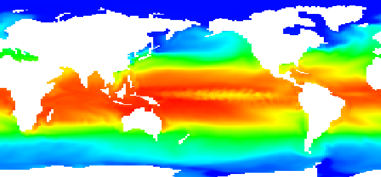

.. _sec_raster_data:

ラスターデータ・時系列ラスターデータ編集機能
================================================

ラスターデータの各セルで定義された地理情報の値を設定します。

ラスターデータのうち、水平方向の位置 (x, y) 以外に時間の次元をもつ
データを時系列ラスターデータと呼びます。

ラスターデータの表示例を
:numref:`image_example_raster_data` に示します。

.. _image_example_raster_data:

   ラスターデータ 表示例

ラスターデータについては、現在編集機能は実装されていません。

.. note:: 時系列ラスターデータのインポートの制約について

   時系列ラスターデータについては、データを1つのみインポートすることができます。
