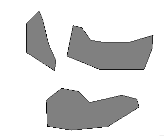
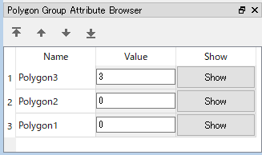
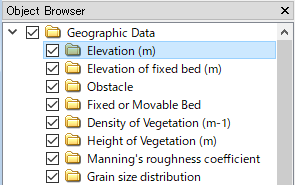
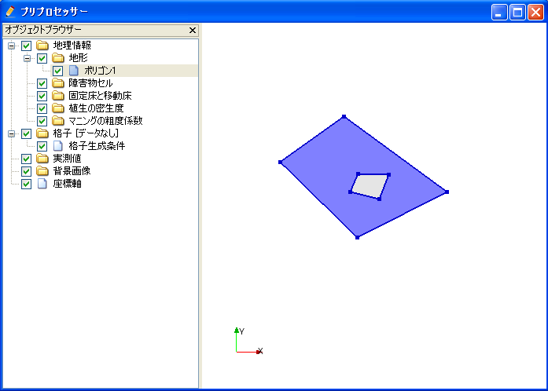
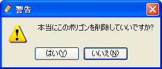
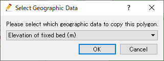
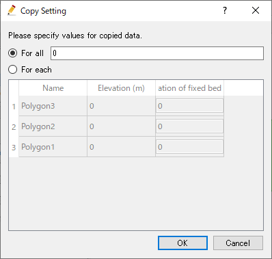

.. _sec_polygon_data:

Editing [Polygons]
=====================

**Description**: Sets the values of geographic data within the area of the
Polygon. :numref:`image_example_polygon_data` shows an example of
the [Polygon].

.. _image_example_polygon_data:

   Example of [Polygons]

[Polygons Attribute Browser]
-------------------------------

When [Polygons] data is selected in the [Object Browser], [Polygons Attribute Browser] is shown.
:numref:`image_polygon_att_browser` shows an example of [Polygons Attribute Browser].
The list of columns in [Polygons Attribute Browser] is shown in 
:numref:`geo_polygon_att_browser_col_table` .

.. _image_polygon_att_browser:

   Example of [Polygons Attribute Browser]

.. _geo_polygon_att_browser_col_table:

.. list-table:: The list of columns in [Polygons Attribute Browser]
   :header-rows: 1

   * - Column name
     - Description
   * - Name
     - The name of polygons. You can edit the values.
   * - Value
     - the valud of polygons. You can edit the values.
   * - Show
     - When clicked, the clicked polygon is shown in the center of the drawing area.

Selecting operation
-----------------------

For [Polygons], user can select multiple polygons at the same time.
the selected polygons can be deleted or sorted with one operation.

User can select polygons with the two ways below:

* **Mouse operation**: Draw boundary box by left-dragging, and all polygons sorrounded by the box are selected.
* **Attribute browser operation**: Click on items in [Polygons Attribute Browser], and the clicked item is selected. You can select multiple items, by clicking with pressing Ctrl key.

Menu items
----------

When the [Pre-processing Window] is active and [Polygon] is selected in
[Object Browser], you can access menu items related to operations on
[Polygon] under the following:

**Menu bar**: [Geographic Data] (E) --> [Polygon] (P)

:numref:`geo_polygon_menuitems_table` shows the menu items under [Polygon] (P).

.. _geo_polygon_menuitems_table:

.. list-table:: Menu items of [Polygon] (P)
   :header-rows: 1

   * - Menu item
     - Description
   * - [Add New Polygons]
     - Adds a new [Polygons] data.
   * - [Edit Name] (N)
     - Edits the name shown in [Object Browser].
   * - [Add New Polygon] (A)
     - Adds a new Polygon to [Polygons] data.
   * - [Edit Value] (V)
     - Edits data value within the Polygon.
   * - [Add Vertex] (A)
     - Adds a vertex.
   * - [Remove Vertex] (R)
     - Removes a vertex.
   * - [Edit Coordinates] (C)
     - Edits the coordinates of the vertex.
   * - [Add Hole Region]
     - Adds a hole region.
   * - [Remove Hole Region]
     - Removes a hole region.
   * - [Sort]
     - Sort polygons.
   * - [Merge]
     - Merge polygons in other [Polygons] to this data.
   * - [Copy]
     - Copy the data to other [Geographic Data] group.
   * - [Color Setting] (S)
     - Sets the color display.
   * - [Delete] (D)
     - Deletes the Polygon.

.. _sec_polygon_add_new_polygondata:

[Add New Polygons]
------------------------------------

The procedure to add a new [Polygons] is as follows:

1. In [Object Browser] ,select the group of [Geographic data] to which
   you want to add [Polygons] data (:numref:`image_polygon_object_browser_disp`)
   Please note that the list of groups of [Geographic Data] differs depending on 
   the solver you are using.

2. Do the following operation. Then, a new [Polygons] data is added and selected in 
   the object browser.

**Menu bar**: Geographic Data (E) --> Polygons (P) --> Add New Polygons

1. In the drawing area, define the nodes of the polygon, by left-clicking.
   (:numref:`image_prewindow_polygon_being_defined`)

2. Finish defining the shape of polygon, by double-clicking or pressing Enter key.
   Then the dialog to specify the value at the defined polygon is shown
   (:numref:`image_edit_elevation_value_dialog`), so input the value and click on [OK].
   Please note that the widget to edit value differs depending on the type of [Geographic Data].

.. _image_polygon_object_browser_disp:

   Example of [Object Browser]

.. _image_prewindow_polygon_being_defined:

.. figure:: images/prewindow_polygon_being_defined.png
   :width: 350pt

   Example of [Pre-processing Window] while defining a polygon

.. _image_edit_elevation_value_dialog:

.. figure:: images/edit_elevation_value_dialog.png
   :width: 160pt

   Example of dialog to edit value of polygon

[Add New Polygon]
-----------------

**Description**: Adds a new Polygon to [Polygons] data.

:ref:`sec_polygon_add_new_polygondata` adds a new [Polygons] data.
On the other hand, this function add an new Polygon to the [Polygons] data that
already exists.

The steps to define a polygon is the same to :ref:`sec_polygon_add_new_polygondata`.

[Edit Value] (V)
-----------------

**Description**: Edits data value within the Polygon.

When you select [Edit Value], the [Edit Elevation value] dialog
(:numref:`image_edit_elevation_value_dialog2`) will open.
Input a new value and click on [OK].

.. _image_edit_elevation_value_dialog2:

.. figure:: images/edit_elevation_value_dialog.png
   :width: 160pt

   The [Edit Elevation value] dialog

[Add Vertex] (A)
----------------

**Description**: Adds a vertex to the [Polygon].

When you select [Add Vertex] and move the cursor to the edge of
[Polygon], the cursor changes to that shown in
:numref:`image_polygon_cursor_add_vertex`. Left click
on the line and drag it to add a new vertex. The vertex is placed where
you release the left button.

.. _image_polygon_cursor_add_vertex:

.. figure:: images/polygon_cursor_add_vertex.png
   :width: 20pt

   Mouse cursor when possible to add a vertex

[Remove Vertex] (R)
-------------------

**Description**: Deletes a vertex from the [Polygon].

When you select [Remove Vertex] and move the cursor onto the vertex you
want to remove, the cursor changes to that shown in
:numref:`image_polygon_cursor_remove_vertex`.
Left clicking will remove the vertex.

.. _image_polygon_cursor_remove_vertex:

.. figure:: images/polygon_cursor_remove_vertex.png
   :width: 20pt

   Mouse cursor when possible to removing the vertex

[Edit Coordinates] (C)
----------------------

**Description**: Edits the coordinates of the vertices of the [Polygon].

When you select [Edit Coordinates], the [Polygon Coordinates] dialog
(:numref:`image_polygon_coordinates_dialog`) will open.
Edit the coordinates and click on [OK].

.. _image_polygon_coordinates_dialog:

.. figure:: images/polygon_coordinates_dialog.png
   :width: 160pt

   The [Polygon Coordinates] dialog

[Add Hole Region] (H)
---------------------

**Description**: Adds the Hole Region to the [Polygon].

1. When you select [Add Hole Region], the [Information] dialog
   (:numref:`image_add_hole_region_info_dialog`) will open. Click on [OK].

2. On the canvas, add vertexes to the Hole Region by left clicking
   (:numref:`image_polygon_example_add_hole_region`).

3. Double click or press the Enter key to complete defining the Hole
   Region.

.. _image_add_hole_region_info_dialog:

.. figure:: images/add_hole_region_info_dialog.png
   :width: 220pt

   The [Add Hole Region] Information dialog

.. _image_polygon_example_add_hole_region:

   Example of the [Add Hole Region] Result

[Delete Hole Region] (D)
------------------------

**Description**: Deletes the Hole Region from the [Polygon].

1. When you select [Delete Hole Region], the [Warning] dialog
   (:numref:`image_polygon_delete_hole_warning_dialog`) will open.
   Click on [Yes].

2. On the canvas, the Hole Region will be deleted.
   (:numref:`image_polygon_example_delete_hole`).

.. _image_polygon_delete_hole_warning_dialog:

   The [Warning] dialog

.. _image_polygon_example_delete_hole:

.. figure:: images/polygon_example_delete_hole.png
   :width: 340pt

   Example of the [Delete Hole Region] Result

[Merge]
------------

**Description**: Merge polygons in other [Polygons] to this data.

[Select data to merge] dialog
(:numref:`image_polygon_merge_dialog`) is shown. Select the data to merge, and click on [OK] button.

.. _image_polygon_merge_dialog:

   [Select data to merge] dialog

[Copy]
----------

**Description**: Copy the data to other [Geographic Data] group.

[Select Graographic Data] dialog 
(:numref:`image_polygon_copy_selectgroup_dialog`) is shown.
Select the [Geographic Data] group to which you want to copy the data.

Then, [Copy Setting] dialog
(:numref:`image_polygon_copy_editvalue_dialog`) is shown.
Specify the values of the polygons, and click on [OK] button, to finish 
copying the [Polygons] data.

.. _image_polygon_copy_selectgroup_dialog:

   [Select Geographic Data] dialog

.. _image_polygon_copy_editvalue_dialog:

   [Copy Setting] dialog

[Color Setting] (S)
-------------------

**Description**: Edits the color of the [Polygon].

When you select [Color Setting], the [Polygon Color] dialog
(:numref:`image_polygon_color_dialog`) will open.
Set it and click on [OK].

.. _image_polygon_color_dialog:

.. figure:: images/polygon_color_dialog.png
   :width: 160pt

   The [Polygon color] dialog
