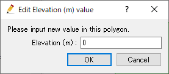
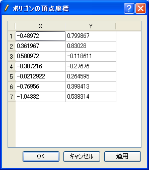
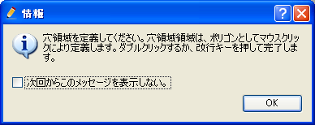
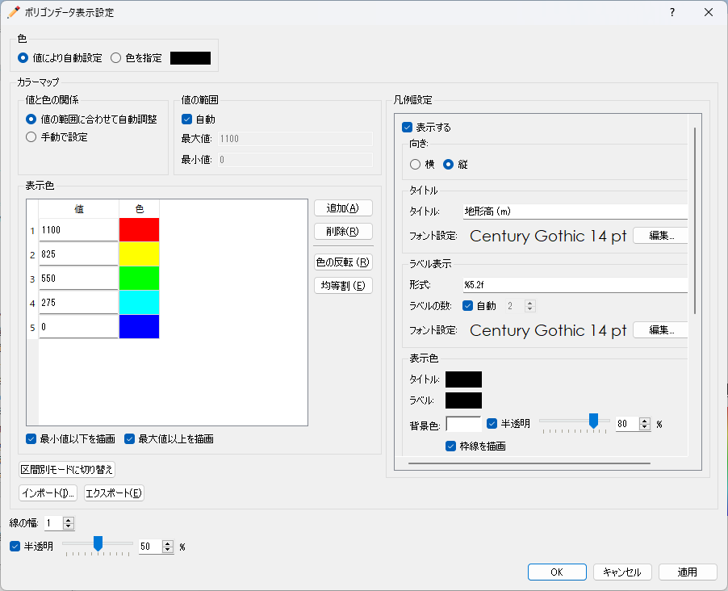

.. _sec_polygon_data:

ポリゴンデータ編集機能
=========================

ポリゴンで囲まれた領域内について、地理情報の値を設定します。

ポリゴンデータの表示例を
:numref:`image_example_polygon_data` に示します。

.. _image_example_polygon_data:

.. figure:: images/example_polygon_data.png
   :width: 140pt

   ポリゴンデータ 表示例

ポリゴンデータ属性ブラウザ
------------------------------

ポリゴンデータを選択している時は、ポリゴンデータ属性ブラウザが表示されます。
ポリゴンデータ属性ブラウザの表示例を :numref:`image_polygon_att_browser` に示します。
ポリゴンデータ属性ブラウザの列の一覧を :numref:`geo_polygon_att_browser_col_table` に示します。

.. _image_polygon_att_browser:

.. figure:: images/polygon_att_browser.png
   :width: 240pt

   ポリゴンデータ属性ブラウザ 表示例

.. _geo_polygon_att_browser_col_table:

.. list-table:: ポリゴンデータ属性ブラウザ 列一覧
   :header-rows: 1

   * - 列名
     - 説明
   * - 名前
     - ポリゴンの名前を表示します。編集もできます。
   * - 値
     - ポリゴンの値を表示します。編集もできます。
   * - 表示
     - クリックすると選択され、描画領域の中央に表示されます。

選択操作
-------------

ポリゴンデータでは、複数のポリゴンを選択することができます。これにより、
複数のポリゴンを同時に削除したり、並べ替えたりできます。

ポリゴンの選択は以下の2つの方法で行なえます。

* **マウス操作**: 描画領域で左ドラッグして矩形領域を囲むと、囲んだ領域に含まれるポリゴンをすべて選択できます。
* **属性ブラウザ操作**: ポリゴンデータ属性ブラウザで項目をクリックすると、項目が選択されます。 Ctrl キーを押しながらクリックすることで、複数のポリゴンを選択できます。

メニュー構成
--------------

ポリゴンデータ編集機能に関連するメニューは、プリプロセッサーがアクティブで、
オブジェクトブラウザーでポリゴンデータが選択されていた時、
以下からアクセスできます。

**メニューバー**: 地理情報 (E) --> ポリゴンデータ (P)

ポリゴンデータ(P) 以下のサブメニューの構成を
:numref:`geo_polygon_menuitems_table` に示します。

.. _geo_polygon_menuitems_table:

.. list-table:: ポリゴンデータ メニュー構成
   :header-rows: 1

   * - メニュー
     - 説明
   * - 新しいポリゴンデータを追加 (A)
     - 新しいポリゴンデータを追加します
   * - 名前の編集 (N)
     - オブジェクトブラウザー上に表示される名前を編集します
   * - 新しいポリゴンの追加
     - ポリゴンデータに新しいポリゴンを追加します。
   * - 値の編集 (V)
     - ポリゴン内での地理情報の値を編集します
   * - 頂点の追加 (A)
     - 頂点を追加します
   * - 頂点の削除 (R)
     - 頂点を削除します
   * - 座標の編集 (C)
     - 頂点の座標を編集します
   * - 穴領域の追加 (H)
     - 穴領域を追加します
   * - 穴領域の削除 (D)
     - 穴領域を削除します
   * - 並べ替え (S)
     - 選択したポリゴンを並べ替えます
   * - マージ (M)
     - 他のポリゴンデータを、このデータにマージします。
   * - コピー (C)
     - このポリゴンデータを、他の地理情報にコピーします。
   * - 色の設定 (S)
     - 表示色を設定します
   * - 削除 (D)
     - ポリゴンを削除します

.. _sec_polygon_add_new_polygondata:

新しいポリゴンデータを追加
------------------------------------
新しいポリゴンデータを追加するには、以下の手順を行います。

1. オブジェクトブラウザーで、ポリゴンデータを追加したい地理情報の種類を
   選択します (:numref:`image_polygon_object_browser_disp` 参照)。
   なお、地理情報の種類のリストは、利用するソルバーによって異なります。

2. メニューから以下の操作を行います。するとオブジェクトブラウザーで
   新しいポリゴンが追加され、選択された状態になります。

**メニューバー**: 地理情報 (E) --> ポリゴンデータ(P) --> 新しいポリゴンデータを追加(A)

1. 描画領域で、左クリックによってポリゴンの頂点を順に指定します
   (:numref:`image_prewindow_polygon_being_defined` 参照)。

2. ダブルクリックするか改行キーを押して、ポリゴンの定義が完了します。
   定義したポリゴンでの地理情報の値を指定するダイアログ
   (:numref:`image_edit_elevation_value_dialog` 参照)
   が表示されますので、値を指定して「OK」ボタンを押します。
   なお、表示されるダイアログは、ポリゴンを追加する地理情報の
   種類によって異なります。

.. _image_polygon_object_browser_disp:

.. figure:: images/polygon_object_browser_disp.png
   :width: 200pt

   オブジェクトブラウザー 表示例

.. _image_prewindow_polygon_being_defined:

.. figure:: images/prewindow_polygon_being_defined.png
   :width: 350pt

   ポリゴン定義中のプリプロセッサー

.. _image_edit_elevation_value_dialog:

   ポリゴン内での地理情報値 編集ダイアログ

新しいポリゴンの追加
-----------------------

ポリゴンデータに新しいポリゴンを追加します。

:ref:`sec_polygon_add_new_polygondata` が新しいポリゴンデータを作成する機能
であるのに対し、この機能では既にあるポリゴンデータに新しいポリゴンを追加します。

ポリゴンを定義する手順は :ref:`sec_polygon_add_new_polygondata` と同じです。

値の編集 (V)
--------------

ポリゴン領域内での地理情報の値を編集します。

地理情報の値を編集するダイアログ
(:numref:`image_edit_elevation_value_dialog2` 参照)
が表示されますので、新しい値を設定して「OK」ボタンを押します。

.. _image_edit_elevation_value_dialog2:

   ポリゴン内での地理情報値 編集ダイアログ

頂点の追加 (A)
---------------

ポリゴンに頂点を追加します。

このメニューを選択した後、ポリゴンの線の上にカーソルを移動すると、
:numref:`image_polygon_cursor_add_vertex`.
で示すカーソルに変化します。この状態でマウスの左ボタンを押してドラッグすると、
新しい頂点が追加できます。マウスの左ボタンを離すと、頂点の位置が確定します。

.. _image_polygon_cursor_add_vertex:

.. figure:: images/polygon_cursor_add_vertex.png
   :width: 20pt

   頂点の追加が可能な時のマウスカーソル

頂点の削除 (R)
----------------

ポリゴンの頂点を削除します。

このメニューを選択した後、ポリゴンの頂点の上にカーソルを移動すると、
:numref:`image_polygon_cursor_remove_vertex`
で示すカーソルに変化します。この状態でマウスの左ボタンを押すと、
頂点が削除されます。

.. _image_polygon_cursor_remove_vertex:

.. figure:: images/polygon_cursor_remove_vertex.png
   :width: 20pt

   頂点の削除が可能な時のマウスカーソル

座標の編集 (C)
----------------------

ポリゴンの頂点の座標を編集します。

ポリゴンの頂点座標を編集するダイアログ
(:numref:`image_polygon_coordinates_dialog` 参照)
が表示されますので、座標を編集して「OK」ボタンを押します。

.. _image_polygon_coordinates_dialog:

   ポリゴンの頂点座標編集ダイアログ

穴領域の追加 (H)
-----------------

ポリゴンの穴領域を追加するには、以下の手順を行います。

1. ポリゴンの穴領域追加の情報ダイアログ
   (:numref:`image_add_hole_region_info_dialog` 参照)
   が表示されますので、「OK」ボタンを押します。

2. 描画領域で、左クリックによって穴領域の頂点を順に指定します
   (:numref:`image_polygon_example_add_hole_region` 参照)。

3. ダブルクリックするか改行キーを押して、穴領域の定義が完了します。

.. _image_add_hole_region_info_dialog:

   ポリゴンの穴領域の追加 情報ダイアログ

.. _image_polygon_example_add_hole_region:

.. figure:: images/polygon_example_add_hole_region.png
   :width: 340pt

   ポリゴンの穴領域の追加 表示例

穴領域の削除 (D)
----------------

ポリゴンの穴領域を削除するには、以下の手順を行います。

1. ポリゴンの穴領域削除の確認ダイアログ
   (:numref:`image_polygon_delete_hole_warning_dialog` 参照)
   が表示されますので、「はい」ボタンを押します。

2. 描画領域において、ポリゴンの穴領域が削除されます。
   (:numref:`image_polygon_example_delete_hole` 参照)。

.. _image_polygon_delete_hole_warning_dialog:

.. figure:: images/polygon_delete_hole_warning_dialog.png
   :width: 160pt

   ポリゴンの穴領域の削除ダイアログ

.. _image_polygon_example_delete_hole:

.. figure:: images/polygon_example_delete_hole.png
   :width: 340pt

   ポリゴンの穴領域の削除後 表示例

マージ
------------

他のポリゴンデータを、このデータにマージします。

マージするデータの選択ダイアログ 
(:numref:`image_polygon_merge_dialog` 参照)
が表示されます。マージするデータを選択して「OK」ボタンを押します。

.. _image_polygon_merge_dialog:

.. figure:: images/polygon_merge_dialog.png
   :width: 260pt

   マージするデータの選択ダイアログ

コピー
----------

ポリゴンデータを、他の地理情報にコピーします。

地理情報の選択ダイアログ 
(:numref:`image_polygon_copy_selectgroup_dialog` 参照)
が表示されます。コピー先の地理情報を選択して「OK」ボタンを押します。

すると、ポリゴンの値を指定するダイアログ
(:numref:`image_polygon_copy_editvalue_dialog` 参照)
が表示されます。値を指定し「OK」ボタンを押します。すると、ポリゴンデータの
コピーが完了します。

.. _image_polygon_copy_selectgroup_dialog:

.. figure:: images/polygon_copy_selectgroup_dialog.png
   :width: 200pt

   地理情報の選択ダイアログ

.. _image_polygon_copy_editvalue_dialog:

.. figure:: images/polygon_copy_editvalue_dialog.png
   :width: 260pt

   値の編集ダイアログ

表示設定 (S)
----------------

ポリゴンの表示色を設定します。

ポリゴンの表示色を設定するダイアログ
(:numref:`image_polygon_color_dialog` 参照)
が表示されます。

.. _image_polygon_color_dialog:

   ポリゴンデータ表示設定ダイアログ

.. note:: 
   iRIC ver4からはプリプロセッサーウィンドウで追加した地理情報は可視化ウィンドウでも確認ができるようになっています。表示設定の主な仕様は以下です。

   - 可視化ウィンドウでの地理情報の表示設定は、可視化ウィンドウを開いた時点でのプリプロセッサーウィンドウで設定していたものが引き継がれます。
   - 既に開かれている可視化ウィンドウでの表示設定は、プリプロセッサーウィンドウで表示設定を変更しても変更されません。
   - 可視化ウィンドウで表示設定を変更してもプリプロセッサーウィンドウでの表示設定には影響しません。
   

Tips
----------------

.. note:: 
   
   | 編集モードのオブジェクトについて。
   | プリプロセッサーウィンドウで編集モードになっているポリゴンは可視化ウィンドウ上で表示されません。

   .. figure:: images/polygon_edit_mode_specification.gif
      :width: 600pt