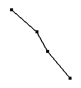
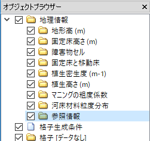
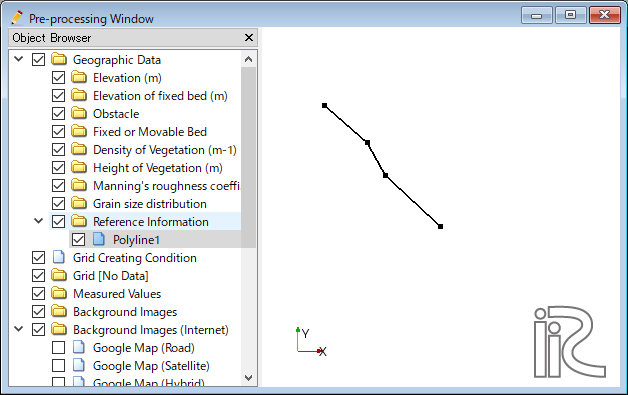
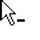
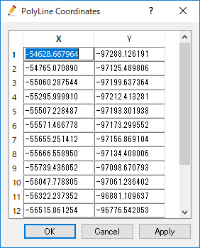
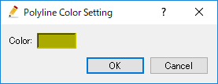

.. _sec_polyline_data:

Editing the [Polyline]
==========================

**Description**: Define geographic data defined as Polyline.
:numref:`image_example_polyline_data` shows an example of the [Polyline].

.. _image_example_polyline_data:

   Example of the [Polyline]

.. note:: Geographic data group in which [Polyline] can be defined

   [Polyline] can be added only to Geographic Data group
   [Reference Information].

.. note:: [Polyline] on [River Cross-section Window]

   On [River Cross-section Window], the intersection points between
   [Cross-section] and [Polyline] are displayed. 

   Using this function, you can add [Polyline] as reference information
   on [Pre-Processing Window] first, and you can edit the cross-section shape,
   considering the [Polylines] that corresponds to roads, for example.

   :numref:`image_polyline_crosssection_view` shows an example of [Polyline]
   shown on [River Cross-section Windo].

   Please refer to :ref:`sec_pre_riv_crosssection_window` for the detail of
   [River Cross-section Window].

   .. _image_polyline_crosssection_view:

   .. figure:: images/polyline_crosssection_view.png
      :width: 400pt

      Example of the [Polyline] displayed on [River Cross-section Window]

Menu items
--------------

When the [Pre-processing Window] is active and [Polyline] is selected in
[Object Browser], you can access menu items related to operations on
[Polyline] under the following:

**Menu bar**: [Geographic Data] (E) --> [Polyline] (L)

:numref:`geo_polyline_menuitems_table` shows the menu items under [Polyline] (L).

.. _geo_polyline_menuitems_table:

.. list-table:: Menu items of [Polyline] (L)
   :header-rows: 1

   * - Menu item
     - Description
   * - [Add Polyline] (A)
     - Adds a new Polyline.
   * - [Edit Name] (N)
     - Edits the name shown in [Object Browser].
   * - [Add Vertex] (A)
     - Adds a vertex.
   * - [Remove Vertex] (R)
     - Removes a vertex.
   * - [Edit Coordinates] (C)
     - Edits the coordinates of the vertex.
   * - [Color Setting] (S)
     - Sets the color display.
   * - [Delete] (D)
     - Deletes the Polyline.

[Add New Polyline]
---------------------

The procedure to add a new Polyline is as follows:

1. Select the [Reference Information] under [Geographic Data] in [Object Browser]
   (:numref:`image_polyline_object_browser_disp`).

2. The operation below adds a new Polyline to [Object Browser], and that
   Polyline is selected.

**Menu bar**: [Geographic Data] (E) --> [Polyline] (L) --> [Add New Polyline]

1. On the canvas, add vertexes to the Polyline by left clicking
   (:numref:`image_prewindow_polyline_being_defined`).

2. Double click or press the Enter key to complete defining the Polyline.

.. _image_polyline_object_browser_disp:

   Example of the [Object Browser] display

.. _image_prewindow_polyline_being_defined:

   [Pre-processing Window] when the [Polyline] is being defined

[Add Vertex] (A)
----------------

**Description**: Adds a vertex to the [Polyline].

When you select [Add Vertex] and move the cursor to the edge of
[Polyline], the cursor changes to that shown in
:numref:`image_polyline_cursor_add_vertex`. Left click
on the line and drag it to add a new vertex. The vertex is placed where
you release the left button.

.. _image_polyline_cursor_add_vertex:

.. figure:: images/polyline_cursor_add_vertex.png
   :width: 20pt

   Mouse cursor when possible to add a vertex

[Remove Vertex] (R)
-------------------

**Description**: Deletes a vertex from the [Polyline].

When you select [Remove Vertex] and move the cursor onto the vertex you
want to remove, the cursor changes to that shown in
:numref:`image_polyline_cursor_remove_vertex`.
Left clicking will remove the vertex.

.. _image_polyline_cursor_remove_vertex:

   Mouse cursor when possible to removing the vertex

[Edit Coordinates] (C)
----------------------

**Description**: Edits the coordinates of the vertices of the [Polyline].

When you select [Edit Coordinates], the [Polyline Coordinates] dialog
(:numref:`image_polyline_coordinates_dialog`) will open.
Edit the coordinates and click on [OK].

.. _image_polyline_coordinates_dialog:

   The [Polyline Coordinates] dialog

[Color Setting] (S)
-------------------

**Description**: Edits the color of the [Polyline].

When you select [Color Setting], the [Polyline Color] dialog
(:numref:`image_polyline_color_dialog`) will open.
Set it and click on [OK].

.. _image_polyline_color_dialog:

   The [Polyline color] dialog
