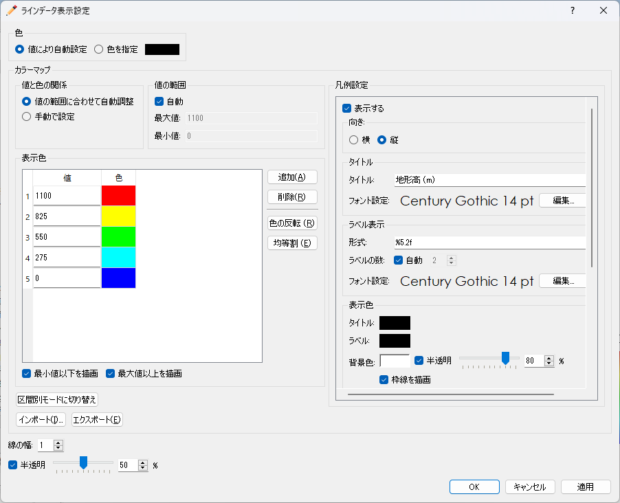

.. _sec_polyline_data:

ラインデータ編集機能
================================

ラインとして定義された地理情報を設定します。

ラインデータの表示例を
:numref:`image_example_polyline_data` に示します。

.. _image_example_polyline_data:

.. figure:: images/example_polyline_data.png
   :width: 100pt

   ラインデータ 表示例

.. note:: 河川横断面ウィンドウでの表示

   河川測量データの河川横断面ウィンドウには、ラインデータと河川測量データの横断線の
   交点が表示されます。
   
   この機能を利用することで、プリプロセッサーであらかじめ参照情報としてラインデータを
   作成しておくことで、道路などの位置を考慮して河川横断線の編集を行うことができます。

   河川横断面ウィンドウでのラインデータの表示例を :numref:`image_polyline_crosssection_view`
   に示します。

   河川横断面ウィンドウの詳細については :ref:`sec_pre_riv_crosssection_window`
   を参照してください。

   .. _image_polyline_crosssection_view:

   .. figure:: images/polyline_crosssection_view.png
      :width: 400pt

      河川横断面ウィンドウでのラインデータの表示例

.. note:: ラインデータ上に補間した計算結果によるグラフの描画

   iRIC 3.0.14 以降では、ラインデータ上に補間した計算結果によりグラフを描画
   できるようになりました。詳細は :ref:`sec_graph_window`
   を参照してください。

ラインデータ属性ブラウザ
------------------------------

ラインデータを選択している時は、ラインデータ属性ブラウザが表示されます。
ラインデータ属性ブラウザの表示例を :numref:`image_polyline_att_browser` に示します。
ラインデータ属性ブラウザの列の一覧を :numref:`geo_polyline_att_browser_col_table` に示します。

.. _image_polyline_att_browser:

.. figure:: images/polyline_att_browser.png
   :width: 240pt

   ラインデータ属性ブラウザ 表示例

.. _geo_polyline_att_browser_col_table:

.. list-table:: ラインデータ属性ブラウザ 列一覧
   :header-rows: 1

   * - 列名
     - 説明
   * - 名前
     - ラインの名前を表示します。編集もできます。
   * - 値
     - ラインの値を表示します。編集もできます。
   * - 表示
     - クリックすると選択され、描画領域の中央に表示されます。

選択操作
-------------

ラインデータでは、複数のラインを同時に選択することができます。これにより、
複数のラインを同時に削除したり、並べ替えたりできます。

ラインの選択は以下の2つの方法で行なえます。

* **マウス操作**: 描画領域で左ドラッグして矩形領域を囲むと、囲んだ領域に含まれるラインをすべて選択できます。
* **属性ブラウザ操作**: ラインデータ属性ブラウザで項目をクリックすると、項目が選択されます。 Ctrl キーを押しながらクリックすることで、複数のラインを選択できます。

メニュー構成
--------------

ラインデータ編集機能に関連するメニューは、プリプロセッサーがアクティブで、
オブジェクトブラウザーでラインデータが選択されていた時、
以下からアクセスできます。

**メニューバー**: 地理情報 (E) --> ラインデータ (L)

ラインデータ(L) 以下のサブメニューの構成を
:numref:`geo_polyline_menuitems_table` に示します。

.. _geo_polyline_menuitems_table:

.. list-table:: ラインデータメニューの構成
   :header-rows: 1

   * - メニュー
     - 説明
   * - 新しいラインデータを追加 (A)
     - 新しいラインデータを追加します
   * - 名前の編集 (N)
     - オブジェクトブラウザー上に表示される名前を編集します
   * - 新しいラインの追加
     - ラインデータに新しいラインを追加します。
   * - 頂点の追加 (A)
     - 頂点を追加します
   * - 頂点の削除 (R)
     - 頂点を削除します
   * - 座標の編集 (C)
     - 頂点の座標を編集します
   * - 並べ替え (S)
     - 選択したラインを並べ替えます
   * - マージ (M)
     - 他のラインデータを、このデータにマージします。
   * - コピー (C)
     - このラインデータを、他の地理情報にコピーします。
   * - 表示色設定 (S)
     - 表示色を設定します
   * - 削除 (D)
     - ラインデータを削除します

.. _sec_polyline_add_new_polylinedata:

新しいラインデータを追加
-------------------------------

新しいラインデータを追加するには、以下の手順を行います。

1. オブジェクトブラウザーで、ラインデータを追加したい地理情報の種類を
   選択します (:numref:`image_polyline_object_browser_disp` 参照)。

2. メニューから以下の操作を行います。するとオブジェクトブラウザーで
   新しいラインデータが追加され、選択された状態になります。

**メニューバー**: 地理情報 (E) --> ラインデータ(L) --> 新しいラインデータを追加(A)

1. 描画領域で、左クリックによってラインデータの頂点を順に指定します
   (:numref:`image_prewindow_polyline_being_defined` 参照)。

2. ダブルクリックするか改行キーを押して、ラインデータの定義を完了します。

.. _image_polyline_object_browser_disp:

.. figure:: images/polyline_object_browser_disp.png
   :width: 150pt

   オブジェクトブラウザー 表示例

.. _image_prewindow_polyline_being_defined:

.. figure:: images/prewindow_polyline_being_defined.png
   :width: 350pt

   ラインデータ定義中のプリプロセッサー

新しいラインの追加
-----------------------

ラインデータに新しいラインを追加します。

:ref:`sec_polygon_add_new_polygondata` が新しいラインデータを作成する機能
であるのに対し、この機能では既にあるラインデータに新しいラインを追加します。

ラインを定義する手順は :ref:`sec_polyline_add_new_polylinedata` と同じです。

値の編集 (V)
--------------

ラインで定義された地理情報の値を編集します。

地理情報の値を編集するダイアログ
(:numref:`image_edit_elevation_value_dialog3` 参照)
が表示されますので、新しい値を設定して「OK」ボタンを押します。

.. _image_edit_elevation_value_dialog3:

.. figure:: images/edit_polyline_value_dialog.png
   :width: 160pt

   ラインでの地理情報値 編集ダイアログ

頂点の追加 (A)
---------------

ラインデータに頂点を追加します。

このメニューを選択した後、ラインデータの上にカーソルを移動すると、
:numref:`image_polyline_cursor_add_vertex`
で示すカーソルに変化します。この状態でマウスの左ボタンを押してドラッグすると、
新しい頂点が追加できます。マウスの左ボタンを離すと、頂点の位置が確定します。

.. _image_polyline_cursor_add_vertex:

.. figure:: images/polyline_cursor_add_vertex.png
   :width: 20pt

   頂点の追加が可能な時のマウスカーソル

頂点の削除 (R)
----------------

ラインデータの頂点を削除します。

このメニューを選択した後、ラインデータの頂点の上にカーソルを移動すると、
:numref:`image_polyline_cursor_remove_vertex`
で示すカーソルに変化します。この状態でマウスの左ボタンを押すと、
頂点が削除されます。

.. _image_polyline_cursor_remove_vertex:

.. figure:: images/polyline_cursor_remove_vertex.png
   :width: 20pt

   頂点の削除が可能な時のマウスカーソル

座標の編集 (C)
----------------------

ラインデータの頂点の座標を編集します。

ラインデータの頂点座標を編集するダイアログ
(:numref:`image_polyline_coordinates_dialog` 参照)
が表示されますので、座標を編集して「OK」ボタンを押します。

.. _image_polyline_coordinates_dialog:

.. figure:: images/polyline_coordinates_dialog.png
   :width: 160pt

   ラインデータの頂点座標編集ダイアログ

マージ
------------

他のラインデータを、このデータにマージします。

マージするデータの選択ダイアログ 
(:numref:`image_polyline_merge_dialog` 参照)
が表示されます。マージするデータを選択して「OK」ボタンを押します。

.. _image_polyline_merge_dialog:

.. figure:: images/polyline_merge_dialog.png
   :width: 260pt

   マージするデータの選択ダイアログ

コピー
----------

ラインデータを、他の地理情報にコピーします。

地理情報の選択ダイアログ 
(:numref:`image_polyline_copy_selectgroup_dialog` 参照)
が表示されます。コピー先の地理情報を選択して「OK」ボタンを押します。

すると、ラインの値を指定するダイアログ
(:numref:`image_polyline_copy_editvalue_dialog` 参照)
が表示されます。値を指定し「OK」ボタンを押します。すると、ラインデータの
コピーが完了します。

.. _image_polyline_copy_selectgroup_dialog:

   地理情報の選択ダイアログ

.. _image_polyline_copy_editvalue_dialog:

   値の編集ダイアログ

色の設定 (S)
----------------

ラインデータの表示色を編集します。

ラインデータの表示色を設定するダイアログ
((:numref:`image_polyline_color_dialog`) 参照)
が表示されますので、表示色を設定して「OK」ボタンを押します。

.. _image_polyline_color_dialog:

   ラインデータの表示色設定ダイアログ
