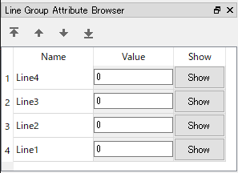
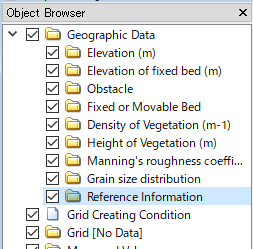
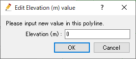

.. _sec_polyline_data:

Editing [Lines]
==========================

**Description**: Define geographic data defined as Lines.
:numref:`image_example_polyline_data` shows an example of [Lines].

.. _image_example_polyline_data:

.. figure:: images/example_polyline_data.png
   :width: 100pt

   Example of the [Lines]

.. note:: Geographic data group in which [Polyline] can be defined

   [Polyline] can be added only to Geographic Data group
   [Reference Information].

.. note:: [Polyline] on [River Cross-section Window]

   On [River Cross-section Window], the intersection points between
   [Cross-section] and [Polyline] are displayed. 

   Using this function, you can add [Polyline] as reference information
   on [Pre-Processing Window] first, and you can edit the cross-section shape,
   considering the [Polylines] that corresponds to roads, for example.

   :numref:`image_polyline_crosssection_view` shows an example of [Polyline]
   shown on [River Cross-section Windo].

   Please refer to :ref:`sec_pre_riv_crosssection_window` for the detail of
   [River Cross-section Window].

   .. _image_polyline_crosssection_view:

   .. figure:: images/polyline_crosssection_view.png
      :width: 400pt

      Example of the [Polyline] displayed on [River Cross-section Window]

.. note:: Drawing charts with calculation result interpolated on polylines

   iRIC 1.0.14 and later can draw charts with calculation result interpolated
   on polylines. Please refer to :ref:`sec_graph_window` for detail.

[Lines Attribute Browser]
------------------------------

When [Lines] data is selected in the [Object Browser], [Lines Attribute Browser] is shown.
:numref:`image_polyline_att_browser` shows an example of [Lines Attribute Browser].
The list of columns in [Lines Attribute Browser] is shown in 
:numref:`geo_polyline_att_browser_col_table`.

.. _image_polyline_att_browser:

   Example of [Lines Attribute Browser]

.. _geo_polyline_att_browser_col_table:

.. list-table:: The list of columns in [Lines Attribute Browser]
   :header-rows: 1

   * - Column name
     - Description
   * - Name
     - The name of lines. You can edit the values.
   * - Value
     - the valud of lines. You can edit the values.
   * - Show
     - When clicked, the clicked line is shown in the center of the drawing area.

Selecting operation
--------------------

For [Lines], user can select multiple lines at the same time.
the selected lines can be deleted or sorted with one operation.

User can select line with the two ways below:

* **Mouse operation**: Draw boundary box by left-dragging, and all lines sorrounded by the box are selected.
* **Attribute browser operation**: Click on items in [Lines Attribute Browser], and the clicked item is selected. You can select multiple items, by clicking with pressing Ctrl key.

Menu items
--------------

When the [Pre-processing Window] is active and [Lines] is selected in
[Object Browser], you can access menu items related to operations on
[Lines] under the following:

**Menu bar**: [Geographic Data] (E) --> [Lines] (L)

:numref:`geo_polyline_menuitems_table` shows the menu items under [Lines] (L).

.. _geo_polyline_menuitems_table:

.. list-table:: Menu items of [Lines] (L)
   :header-rows: 1

   * - Menu item
     - Description
   * - [Add New Lines]
     - Adds a new [Lines] data.
   * - [Edit Name] (N)
     - Edits the name shown in [Object Browser].
   * - [Add New Line] (A)
     - Adds a new Line to [Lines] data.
   * - [Edit Value] (V)
     - Edits geographic data within the Polygon.
   * - [Add Vertex] (A)
     - Adds a vertex.
   * - [Remove Vertex] (R)
     - Removes a vertex.
   * - [Edit Coordinates] (C)
     - Edits the coordinates of the vertices.
   * - [Sort]
     - Sort lines.
   * - [Merge]
     - Merge lines in other [Lines] to this data.
   * - [Copy]
     - Copy the data to other [Geographic Data] group.
   * - [Color Setting] (S)
     - Sets the color display.
   * - [Delete] (D)
     - Deletes the Polyline.

.. _sec_polyline_add_new_polylinedata:

[Add New Polyline]
---------------------

The procedure to add a new Polyline is as follows:

1. Select the [Reference Information] under [Geographic Data] in [Object Browser]
   (:numref:`image_polyline_object_browser_disp`).

2. The operation below adds a new Polyline to [Object Browser], and that
   Polyline is selected.

**Menu bar**: [Geographic Data] (E) --> [Polyline] (L) --> [Add New Lines]

1. On the canvas, add vertices to the line by left clicking
   (:numref:`image_prewindow_polyline_being_defined`).

2. Double click or press the Enter key to complete defining the Polyline.

.. _image_polyline_object_browser_disp:

   Example of the [Object Browser] display

.. _image_prewindow_polyline_being_defined:

.. figure:: images/prewindow_polyline_being_defined.png
   :width: 350pt

   [Pre-processing Window] when the [Polyline] is being defined

[Add New Line]
-----------------

**Description**: Adds a new line to [Lines] data.

:ref:`sec_polyline_add_new_polylinedata` adds a new [Lines] data.
On the other hand, this function add an new Line to the [Lines] data that
already exists.

The steps to define a line is the same to :ref:`sec_polyline_add_new_polylinedata`.

[Edit Value] (V)
------------------

**Description**: Edits data value on the Line.

When you select [Edit Value], the [Edit Elevation value] dialog
(:numref:`image_edit_polyline_value_dialog`) will open.
Input a new value and click on [OK].

.. _image_edit_polyline_value_dialog:

   The [Edit Elevation value] dialog

[Add Vertex] (A)
----------------

**Description**: Adds a vertex to the [Polyline].

When you select [Add Vertex] and move the cursor to the edge of
[Polyline], the cursor changes to that shown in
:numref:`image_polyline_cursor_add_vertex`. Left click
on the line and drag it to add a new vertex. The vertex is placed where
you release the left button.

.. _image_polyline_cursor_add_vertex:

.. figure:: images/polyline_cursor_add_vertex.png
   :width: 20pt

   Mouse cursor when possible to add a vertex

[Remove Vertex] (R)
-------------------

**Description**: Deletes a vertex from the [Polyline].

When you select [Remove Vertex] and move the cursor onto the vertex you
want to remove, the cursor changes to that shown in
:numref:`image_polyline_cursor_remove_vertex`.
Left clicking will remove the vertex.

.. _image_polyline_cursor_remove_vertex:

.. figure:: images/polyline_cursor_remove_vertex.png
   :width: 20pt

   Mouse cursor when possible to removing the vertex

[Edit Coordinates] (C)
----------------------

**Description**: Edits the coordinates of the vertices of the [Lines].

When you select [Edit Coordinates], the [Polyline Coordinates] dialog
(:numref:`image_polyline_coordinates_dialog`) will open.
Edit the coordinates and click on [OK].

.. _image_polyline_coordinates_dialog:

.. figure:: images/polyline_coordinates_dialog.png
   :width: 160pt

   The [Polyline Coordinates] dialog

[Merge]
------------

**Description**: Merge lines in other [Lines] to this data.

[Select data to merge] dialog
(:numref:`image_polyline_merge_dialog`) is shown. Select the data to merge, and click on [OK] button.

.. _image_polyline_merge_dialog:

   [Select data to merge] dialog

[Copy]
----------

**Description**: Copy the data to other [Geographic Data] group.

[Select Graographic Data] dialog 
(:numref:`image_polyline_copy_selectgroup_dialog`) is shown.
Select the [Geographic Data] group to which you want to copy the data.

Then, [Copy Setting] dialog
(:numref:`image_polyline_copy_editvalue_dialog`) is shown.
Specify the values of the lines, and click on [OK] button, to finish 
copying the [Lines] data.

.. _image_polyline_copy_selectgroup_dialog:

.. figure:: images/polyline_copy_selectgroup_dialog.png
   :width: 200pt

   [Select Geographic Data] dialog

.. _image_polyline_copy_editvalue_dialog:

.. figure:: images/polyline_copy_editvalue_dialog.png
   :width: 260pt

   [Copy Setting] dialog

[Color Setting] (S)
-------------------

**Description**: Edits the color of the [Polyline].

When you select [Color Setting], the [Polyline Color] dialog
(:numref:`image_polyline_color_dialog`) will open.
Set it and click on [OK].

.. _image_polyline_color_dialog:

.. figure:: images/polyline_color_dialog.png
   :width: 180pt

   The [Polyline color] dialog
