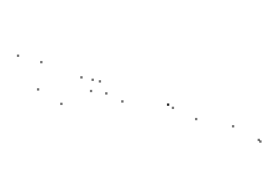
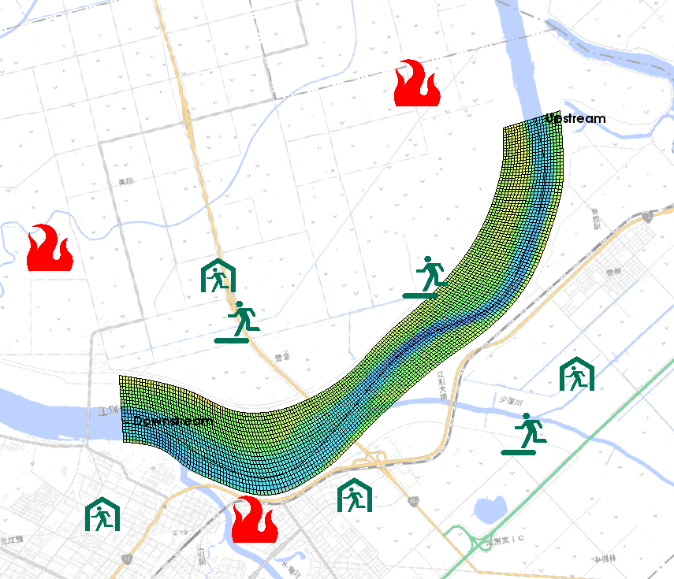
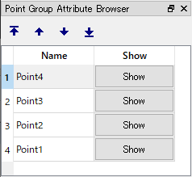
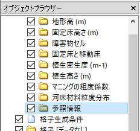
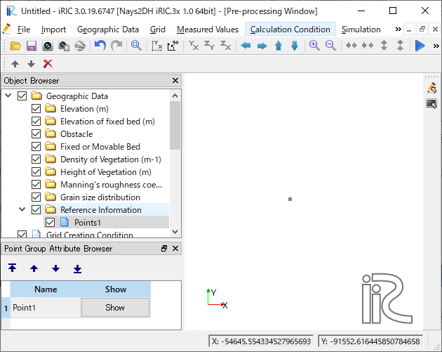
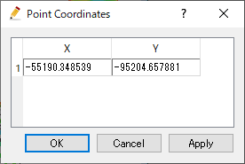
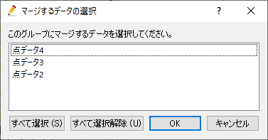
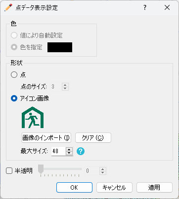

.. _sec_point_data:

点データ編集機能
================================

点として定義された地理情報を設定します。

点データの表示例を
:numref:`image_example_point_data` 、:numref:`image_example_point_icons` に示します。

点データでは、点の位置にアイコンを表示することもできます。アイコンの表示機能は、
避難所、ダム、ポンプなどの場所を表示する際に便利です。

.. _image_example_point_data:

   点データ 表示例

.. _image_example_point_icons:

   点データ 表示例 (アイコンを表示)

.. note::

   点データは、参照情報にのみ作成できます。

点データ属性ブラウザ
------------------------------

点データを選択している時は、点データ属性ブラウザが表示されます。
点データ属性ブラウザの表示例を :numref:`image_point_att_browser` に示します。
点データ属性ブラウザの列の一覧を :numref:`geo_point_att_browser_col_table` に示します。

.. _image_point_att_browser:

   点データ属性ブラウザ 表示例

.. _geo_point_att_browser_col_table:

.. list-table:: 点データ属性ブラウザ 列一覧
   :header-rows: 1

   * - 列名
     - 説明
   * - 名前
     - 点の名前を表示します。編集もできます。
   * - 表示
     - クリックすると選択され、描画領域の中央に表示されます。

選択操作
-------------

点データでは、複数の点を同時に選択することができます。これにより、
複数の点を同時に削除したり、並べ替えたりできます。

点の選択は以下の2つの方法で行なえます。

* **マウス操作**: 描画領域で左ドラッグして矩形領域を囲むと、囲んだ領域に含まれる点をすべて選択できます。
* **属性ブラウザ操作**: 点データ属性ブラウザで項目をクリックすると、項目が選択されます。 Ctrl キーを押しながらクリックすることで、複数の点を選択できます。

メニュー構成
--------------

点データ編集機能に関連するメニューは、プリプロセッサーがアクティブで、
オブジェクトブラウザーで点データが選択されていた時、
以下からアクセスできます。

**メニューバー**: 地理情報 (E) --> 点データ (P)

点データ(P) 以下のサブメニューの構成を
:numref:`geo_point_menuitems_table` に示します。

.. _geo_point_menuitems_table:

.. list-table:: 点データメニューの構成
   :header-rows: 1

   * - メニュー
     - 説明
   * - 新しい点データを追加 (A)
     - 新しい点データを追加します
   * - 名前の編集 (N)
     - オブジェクトブラウザー上に表示される名前を編集します
   * - 新しい点の追加
     - 点データに新しい点を追加します。
   * - 座標の編集 (C)
     - 点の座標を編集します
   * - 並べ替え (S)
     - 選択した点を並べ替えます
   * - マージ (M)
     - 他の点データを、このデータにマージします。
   * - コピー (C)
     - この点データを、他の地理情報にコピーします。
   * - 表示設定 (S)
     - 表示方法を設定します
   * - 削除 (D)
     - 点データを削除します

.. _sec_polygon_add_new_pointdata:

新しい点データを追加
-------------------------------

新しい点データを追加するには、以下の手順を行います。

1. オブジェクトブラウザーで、地理情報「参照情報」を
   選択します (:numref:`image_point_object_browser_disp` 参照)。

2. メニューから以下の操作を行います。するとオブジェクトブラウザーで
   新しい点データが追加され、選択された状態になります (:numref:`image_prewindow_pointdefined` 参照)。

**メニューバー**: 地理情報 (E) --> 点データ(L) --> 新しい点データを追加(A)

1. 描画領域で左クリックすると、点が追加されます。

.. _image_point_object_browser_disp:

   オブジェクトブラウザー 表示例

.. _image_prewindow_pointdefined:

   点データ定義後のプリプロセッサー

新しい点の追加
-----------------------

点データに新しい点を追加します。

:ref:`sec_polygon_add_new_pointdata` が新しい点データを作成する機能
であるのに対し、この機能では既にある点データに新しい点を追加します。

点を定義する手順は :ref:`sec_polygon_add_new_pointdata` と同じです。

座標の編集 (C)
----------------------

点データの頂点の座標を編集します。

点データの頂点座標を編集するダイアログ
(:numref:`image_point_coordinates_dialog` 参照)
が表示されますので、座標を編集して「OK」ボタンを押します。

.. _image_point_coordinates_dialog:

   点データの頂点座標編集ダイアログ

マージ
------------

他の点データを、このデータにマージします。

マージするデータの選択ダイアログ 
(:numref:`image_point_merge_dialog` 参照)
が表示されます。マージするデータを選択して「OK」ボタンを押します。

.. _image_point_merge_dialog:

   マージするデータの選択ダイアログ

表示設定 (S)
----------------

点データの表示色を編集します。

点データの表示設定ダイアログ
((:numref:`image_point_color_dialog`) 参照)
が表示されますので、表示色を設定して「OK」ボタンを押します。

.. _image_point_color_dialog:

   点データの表示色設定ダイアログ
