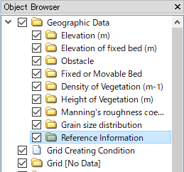
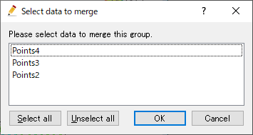

.. _sec_point_data:

Editing [Points]
================================

**Description**: Define geographic data defined as Points.
:numref:`image_example_point_data` shows an example of [Points].

.. _image_example_point_data:

   Example of the [Points]

.. note::

   [Points] data can be created only to [Reference Information] group.

[Points Attribute Browser]
------------------------------

When [Points] data is selected in the [Object Browser], [Points Attribute Browser] is shown.
:numref:`image_point_att_browser` shows an example of [Points Attribute Browser].
The list of columns in [Points Attribute Browser] is shown in 
:numref:`geo_point_att_browser_col_table`.

.. _image_point_att_browser:

   Example of [Points Attribute Browser]

.. _geo_point_att_browser_col_table:

.. list-table:: The list of columns in [Points Attribute Browser]
   :header-rows: 1

   * - Column name
     - Description
   * - Name
     - The name of points. You can edit the values.
   * - Show
     - When clicked, the clicked point is shown in the center of the drawing area.

Selecting operation
--------------------

For [Points], user can select multiple points at the same time.
the selected points can be deleted or sorted with one operation.

User can select points with the two ways below:

* **Mouse operation**: Draw boundary box by left-dragging, and all points sorrounded by the box are selected.
* **Attribute browser operation**: Click on items in [Points Attribute Browser], and the clicked item is selected. You can select multiple items, by clicking with pressing Ctrl key.

Menu items
--------------

When the [Pre-processing Window] is active and [Points] is selected in
[Object Browser], you can access menu items related to operations on
[Points] under the following:

**Menu bar**: [Geographic Data] (E) --> [Points] (P)

:numref:`geo_point_menuitems_table` shows the menu items under [Points] (P).

.. _geo_point_menuitems_table:

.. list-table:: Menu items of [Points] (P)
   :header-rows: 1

   * - Menu item
     - Description
   * - [Add New Points]
     - Adds a new [Points] data.
   * - [Edit Name] (N)
     - Edits the name shown in [Object Browser].
   * - [Add New Point] (A)
     - Adds a new point to [Points] data.
   * - [Edit Coordinates] (C)
     - Edits the coordinates of the points.
   * - [Sort]
     - Sort points.
   * - [Merge]
     - Merge points in other [Points] to this data.
   * - [Copy]
     - Copy the data to other [Geographic Data] group.
   * - [Color Setting] (S)
     - Sets the color display.
   * - [Delete] (D)
     - Deletes the points data.

.. _sec_polygon_add_new_pointdata:

[Add New Points]
-------------------

The procedure to add a new point is as follows:

1. Select the [Reference Information] under [Geographic Data] in [Object Browser]
   (:numref:`image_point_object_browser_disp`).

2. The operation below adds a new [Points] to [Object Browser], and that
   data is selected. (:numref:`image_prewindow_pointdefined`)

**Menu bar**: [Geographic Data] (E) --> [Points] (I) --> [Add New Points]

1. On the canvas, define a point by left clicking.

.. _image_point_object_browser_disp:

   Example of the [Object Browser] display

.. _image_prewindow_pointdefined:

.. figure:: images/prewindow_pointdefined.png
   :width: 350pt

   [Pre-processing Window] when the [Point] is defined

[Add New Point]
-----------------------

**Description**: Adds a new point to [Points] data.

:ref:`sec_polygon_add_new_pointdata` adds a new [Points] data.
On the other hand, this function add an new point to the [Points] data that
already exists.

The step to define a point is the same to :ref:`sec_polygon_add_new_pointdata`.

[Edit Coordinates] (C)
------------------------

**Description**: Edits the coordinates of the the [Points].

When you select [Edit Coordinates], the [Point Coordinates] dialog
(:numref:`image_point_coordinates_dialog`) will open.
Edit the coordinates and click on [OK].

.. _image_point_coordinates_dialog:

.. figure:: images/point_coordinates_dialog.png
   :width: 160pt

   The [Point Coordinates] dialog

[Merge]
---------

**Description**: Merge points in other [Points] to this data.

[Select data to merge] dialog
(:numref:`image_point_merge_dialog`) is shown. Select the data to merge, and click on [OK] button.

.. _image_point_merge_dialog:

   [Select data to merge] dialog

[Color Setting] (S)
------------------------

**Description**: Edits the color of the [Points].

When you select [Color Setting], the [Points Color] dialog
(:numref:`image_point_color_dialog`) will open.
Edit setting and click on [OK].

.. _image_point_color_dialog:

.. figure:: images/point_color_dialog.png
   :width: 180pt

   The [Color Setting] dialog
