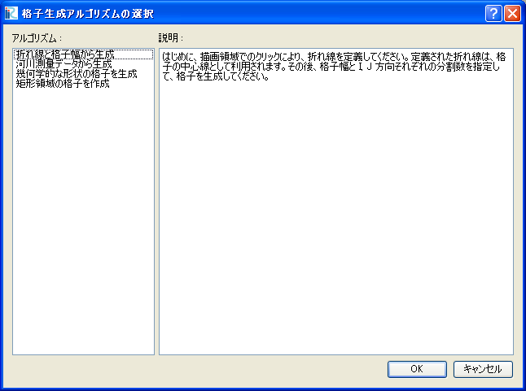

.. _sec_grid_creation_common_funcs:

メニュー構成
================

格子生成で使用するメニューについて説明します。

格子生成アルゴリズムの選択(S)
----------------------------------

格子生成アルゴリズムを選択します。

アルゴリズムの選択ダイアログ (:numref:`select_algorithm_dialog` 参照)
が表示されますので、アルゴリズムを選択して「OK」ボタンを押します。

.. _select_algorithm_dialog:

   格子生成アルゴリズムの選択ダイアログ

なお、すでにアルゴリズムを選択して格子生成条件を設定した上で
アルゴリズムを選択しなおした場合、前のアルゴリズムで設定した格子生成条件を
破棄することを確認するダイアログが表示されますので、「OK」ボタンを押します。
